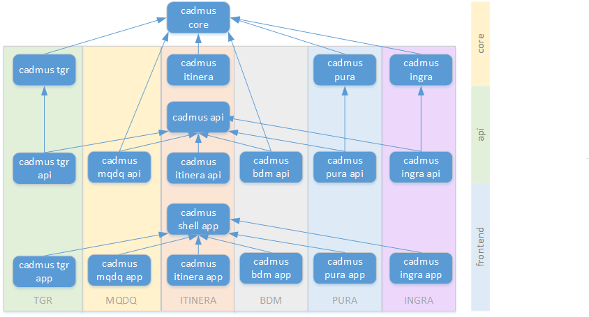

# Cadmus Documentation

- [Cadmus Documentation](#cadmus-documentation)
  - [Projects Directory](#projects-directory)
  - [Stack](#stack)
  - [Core](#core)
  - [API](#api)
  - [Web](#web)
  - [Deployment](#deployment)

Quick start:

- [setting up Docker](./deploy/docker-setup.md)
- [using dockerized Cadmus](./deploy/docker-usage.md)
- [developer's guide](./guide/overview.md)

Just like the Cadmus project itself, this documentation is work in progress. Its main purpose is highlighting some conceptual points standing behind the general architecture of the system. For a more theoric and non-technical introduction to the Cadmus system, please see:

- [my seminar presentation at VeDPH](https://www.youtube.com/watch?v=lYykjz26TCg&feature=youtu.be)
- D. Fusi, _Sailing for a Second Navigation: Paradigms in Producing Digital Content_, «SemRom» n.s. 7 (2018) 213-276.

Note: all the diagrams found in this documentation are made using [PlantUml](https://plantuml.com/). Some editors like [VSCode](https://code.visualstudio.com/) have extensions which directly support viewing them in a Markdown preview. See the [PlantUml web site](https://plantuml.com/) for more visualization options.

## Projects Directory

The picture below shows the main software packages of the projects currently based on Cadmus. Each app or api project has a corresponding Docker image hosted in the [VeDPH Docker Hub](https://hub.docker.com/orgs/vedph2020/repositories).

System core projects:

- [documentation](https://github.com/vedph/cadmus_doc) (this repository)
- [backend core](https://github.com/vedph/cadmus_core)
- [API libraries and basic API](https://github.com/vedph/cadmus_api)
- [app libraries and basic app](https://github.com/vedph/cadmus_shell)
- [CLI tool](https://github.com/vedph/cadmus_tool)

Projects using Cadmus:

- Cadmus MQDQ:
  - [app](https://github.com/vedph/cadmus_mqdq_app)
- Cadmus Itinera
  - [documentation](https://github.com/vedph/cadmus_itinera_doc)
  - [parts](https://github.com/vedph/cadmus_itinera)
  - [API](https://github.com/vedph/cadmus_itinera_api)
  - [app](https://github.com/vedph/cadmus_itinera_app)
- Cadmus TGR
  - [documentation](https://github.com/vedph/cadmus_tgr_doc)
  - [parts](https://github.com/vedph/cadmus_tgr)
  - [API](https://github.com/vedph/cadmus_tgr_api)
  - [app](https://github.com/vedph/cadmus_tgr_app)
- Cadmus BDM
  - [API](https://github.com/vedph/cadmus_bdm_api)
  - [app](https://github.com/vedph/cadmus-bdm-app)
- Cadmus PURA
  - [documentation](https://github.com/vedph/cadmus_pura_doc)
  - [parts](https://github.com/vedph/cadmus_pura)
  - [API](https://github.com/vedph/cadmus_pura_api)
  - [app](https://github.com/vedph/cadmus_pura_app)
- Cadmus Inquisition Graffiti
  - [parts](https://github.com/vedph/cadmus_ingra)
  - [API](https://github.com/vedph/cadmus_ingra_api)
  - [app](https://github.com/vedph/cadmus_ingra_app)

## Stack

- [architecture overview](./architecture/overview.md)

Cadmus essentially includes this stack of layers:

1. *database*: MongoDB for data, MySql for index.
2. *data layer*: storage repositories and their types.
3. *business layer*: core models and logic.
4. *web API layer*: REST API. A future GraphQL API is planned.
5. *web frontend*: Angular 10+ web application.

These layers are distributed across 3 projects: core (2-3), api (4), web (`cadmus-shell`, which superseded the legacy `cadmus-web`) (5).

## Core

Core data and business layers.

- [core](./core/core.md)
  - [core layers](./core/core.layers)
  - [layer reconciliation](./core/layer-reconciliation.md)
  - [core storage](./core/core.storage.md)
  - [core config](./core/core.config.md)
  - [dynamic lookup](./core/dynamic-lookup.md)
- [backend packages](./core/packages.md)
- [adding parts](./guide/adding-parts.md)
- [adding fragments](./guide/adding-fragments.md)
- [profiles](./core/profiles.md)
- [seeding](./core/seeding.md)

## API

Web REST API.

- [creating](./guide/api.md)
- [settings](./deploy/settings.md)

## Web

Web frontend.

- [creating](./web/creating.md): creating a Cadmus web app.
- [architecture](./web/architecture.md): general architecture.
- [routes](./web/routes.md): most relevant route templates.
- [editor components](./web/editor-components.md): editor components.
- [edit state](./web/edit-state.md): app's local edit state.
- [roles](./web/roles.md): user roles for authorizing operations.
- [adding parts](./web/adding-parts.md): how to add new parts.
- [adding fragments](./web/adding-fragments.md): how to add new fragments.
- [demo presets](./web/demo-presets.md): preset JSON samples for editors demo pages.
- [help home](./web/help/index.md)

## Deployment

- [hosting a Cadmus solution](./deploy/hosting.md)
- [hosting sample](./deploy/hosting-sample.md)
- [setting up Docker](./deploy/docker-setup.md)
- [building Docker images](./deploy/docker-build.md)
- [using Docker images](./deploy/docker-usage.md)
- [importing MQDQ data](./deploy/mqdq.md)
