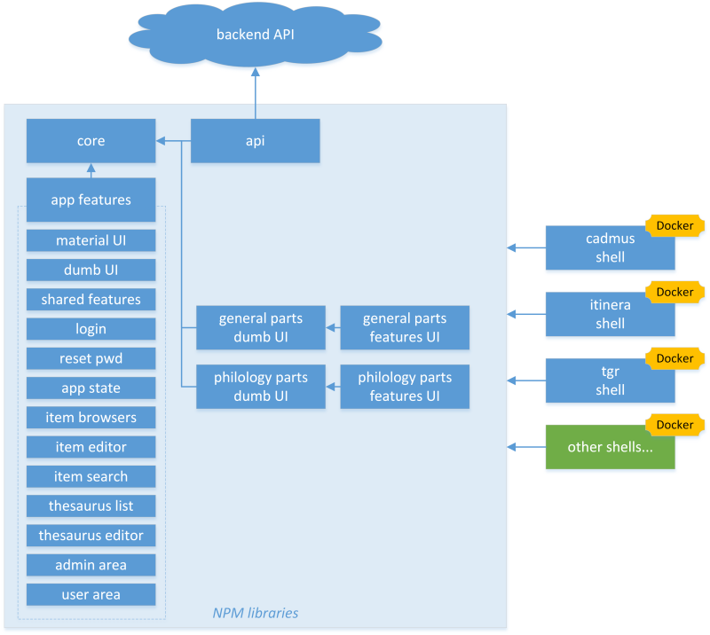

# Overview

- [Overview](#overview)
  - [Backend](#backend)
  - [Frontend](#frontend)

The Cadmus architecture is a distributed, web-based content editing system, with a _backend_ and a _frontend_ part.

The general idea is allowing developers to build their own backend and frontend, by just composing them from a set of libraries, and packing the result into Docker images. The data architecture too is composable, data models being modular and dynamic.

## Backend

As for the backend, based on the [cadmus_api](https://github.com/vedph/cadmus_api) repository, the following picture shows the most important components:

- data are stored in a MongoDB database.
- data are automatically indexed during editing, in a MySql database. This depends on the MongoDB database, and can be fully rebuilt from it.
- a set of core libraries provide core models and services; indexing abstractions; SQL-based indexing implementation; MongoDB repository; and a set of parts and fragments, grouped into two sets: general purpose and philologic. Each part/fragment has its own seeder.
- other parts and fragments can be freely added by third parties. For instance, two projects are currently adding their specialized parts and fragments (together with their seeders): _itinera_ and _tcgr_. Each project has its parts and fragments packed into a library.
- any other project can add its models by just adding new parts and fragments, packed into their libraries.
- API services provide the essential backbone for authentication, messaging, and data seeding. These are packed in a single API services library.
- the API packs all these pieces together, providing an API layer. In the case of the default API, this is a RESTful API layer. Each API gets packed into a Docker image, which is composed with all the other pieces to build a self-contained stack.
- other APIs can be [created](../api/creating.md) in the same way, each with its Docker image.

All the backend code is .NET Core C#, packed into NuGet libraries. The API is an ASP.NET Core API web app.

## Frontend

The frontend part is based on the [cadmus_shell](https://github.com/vedph/cadmus_shell) repository.

The `cadmus_shell` repository provides a full working sample shell application, whose primary purpose is providing a stock web application and a development environment for the libraries. All the important code is distributed into a set of NPM libraries (all under the `@myrmidon` group: `@myrmidon/cadmus-core`, etc.):

- core models and services.
- API services talking to the API backend.
- Cadmus web app features ("pages"): Material UI components, dumb UI components, shared UI components, login page, reset password page, application state, items browsers, item editor, item search, thesaurus list, thesaurus editor, admin area, and user area.
- parts and fragments: general and philological, each with 2 libraries, one for the dumb UI components, and another with their wrappers to provide features (=pages) to the shell application.
- shell web application, which packs all these libraries into a web application, distributed as a Docker image. The Docker composes all the backend and frontend images. This Cadmus shell is a default, generic one, mainly used for developing libraries; then, any third-party project can build its own shell by just creating another Angular application and importing the required libraries. Each of these shells will be a Docker image.

All the frontend code is Angular 11+ with Typescript, packed into [NPM Angular libraries](https://www.npmjs.com/search?q=%40myrmidon).
