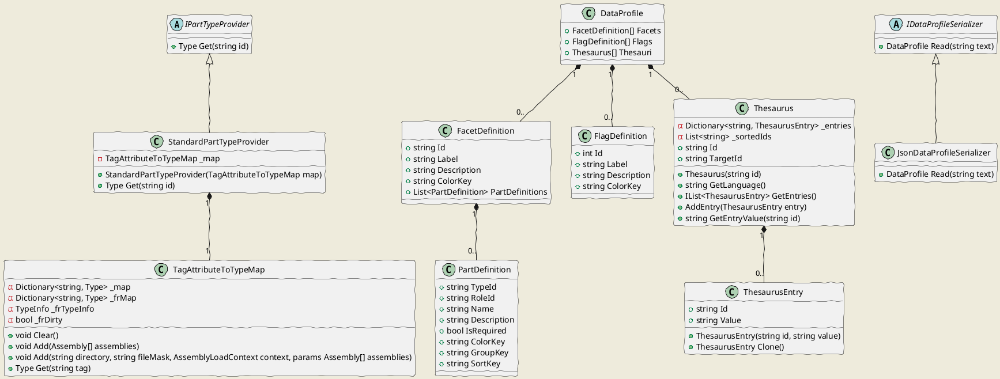

# Cadmus Core - Config

This namespace contains configuration-specific components, used to define the Cadmus data model and provide additional resources.



A Cadmus database has a data profile defined by three main components:

- items **facets** definitions: there must be at least 1 facet. Each facet is a set of parts definitions, and lists all the parts which can appear in an item of a given "type". Usually the "default" facet (=the most used one) has its ID equal to `default`; this is just a convention typically honored by frontends, so that they can pick a default facet when creating a new item.
- items **flags** definitions: the optional 32 flags assignable to each item are defined here.
- **thesauri**: a set of taxonomies, flat and/or hierarchical, used to provide closed sets of predefined values to the user.

This profile can be defined in a text file. An `IDataProfileSerializer` implementation is used to deserialize the profile from its format; its JSON implementation is `JsonDataProfileSerializer`.

For more information about profiles, see the [profiles](profiles.md) page.

## Item Facets

Items have a dynamic model, defined by the parts they contain.

Each part has its own definition (`PartDefinition`), which includes a set of metadata essentially used for presentational or editing purposes.

The **part definition** includes:

- part *type ID* and (optional) *role ID*;
- a human readable *name* and *description*;
- a flag specifying whether the part is *required*;
- further presentational aspects: a *color key*, a *group key*, a *sort key*, and an *editor key*. These are used to present parts with different colors, group them, and sort them in a UI.

## Flag Definitions

The meaning of each item's flag can be defined using `FlagDefinition`'s.

A flag being just a bit, the definition simply links its numeric value with a label and a description, plus a color key.

## Thesauri

Often, a common requirement for data is having some shared terminology and taxonomies to be used for the whole content. For instance, think of a collection of inscriptions a typical requirement would be a set of categories, which are traditionally used to group them according to their type (e.g. funerary, votive, honorary, etc.). In fact, there are a number of such sets of tags, which vary according to the content being handled categories, languages, metres, etc.

In such cases, usually we also want our editing UI to provide these entries as a closed set of lookup values, so that users can pick them from a list, rather than typing them (which would be more difficult, and error-prone).

Cadmus provides a generic solution to these scenarios in the form of **thesauri**, each including any number of entries.

A **thesaurus entry** (`ThesaurusEntry`) is a generic id/value pair used by some parts or fragments to represent a set of selectable options.

Note that each thesaurus has its own language, so that you can provide the same entries in different languages. The language can be identified with an [ISO639](https://en.wikipedia.org/wiki/ISO_639) 2-letters or 3-letters code, as needed. Of course, it is recommended to be coherent: pick either the 2-letters or the 3-letters codes, and not a mixture of the two. If the client requests an undefined language, the system falls back to the default language, which is English.

Finally, note that besides this "static" source of lookup data Cadmus allows for [dynamic lookup data](dynamic-lookup.md) via its pin-based index.

## Part Providers

Some helper components are implemented to provide a better experience in using and adding parts and fragments.

The `PartProvider` interface defines a service which can be used to instantiate any part or part fragment object from its type ID, as defined in its `TagAttribute` value. The service can then be used to materialize the part (or part fragment) data into structured objects, each with its own type.

The type ID is a simple arbitrary string, which should be unique across the system. It is not directly the class name, to provide a further level of abstraction and frendlier IDs. This ensures a more maintenable system, and does not tie it to the underpinnings of a specific implementation; also, IDs are less verbose, and more human-friendly.

A type ID, used for parts and part fragments, should include only letters `a-z`, digits, dashes and dots.

Dashes are used to represent spaces, while dots define a naming hierarchy.

As a convention, an ID should be modeled after a reversed URI domain, and prefixed with `fr.` in the case of part fragments. For instance, a note part ID might be `it.vedph.note`, and a comment layer fragment ID might be `fr.it.vedph.comment`.

These IDs are used in configuration profiles to define the parts and fragments types used in a Cadmus database.

The standard implementation of the part provider (`StandardPartProvider`) uses an implementation of `TagAttributeToTypeMap`, which defines a map between the type ID of each part/fragment to a C# class `Type`; thanks to this map, it is able to instantiate it from its ID.

This mapping can be provided from statically linking the desired parts/fragments, or by dynamically linking them (via reflection, by scanning a set of plugin assemblies). These different approaches are fit to different environments: the API layer uses static linking, as it is targeted to a Docker image, while the CLI tool uses dynamic linking.

### Note on Part Instantiation

In this discussion, for brevity I use the term *type ID* for the value of the attribute (in C#) decorating the corresponding part or fragment class, and the term *class type* for the C# class types.

The type ID is provided by the `TagAttribute` attribute.

The provider is represented by an `IPartTypeProvider` interface, which returns a class `Type` from a given type ID. In turn, the returned `Type` will be used to instantiate the part, either when deserializing it from its JSON representation (the part content as stored in the database), or when creating a new part object.

The standard implementation of this interface, `StandardPartTypeProvider`, is a simple wrapper around a `TagAttributeToTypeMap`. This represents a set of mappings between attributes of type `TagAttribute` and the types they decorate. The mappings are built via reflection from a set of preloaded assemblies, and/or by loading assemblies from a specified directory.

In this map, for those classes implementing `ITextLayerFragment` (and decorated with the `TagAttribute`), a mapping is inferred by combining the generic layer part `TokenTextLayerPartTFragment` with each of these fragment classes. This way, we have a mapping for all the closed generic types representing the various text layers.

In this case, in the map the type ID results by combining the part's type ID with the fragment's type ID, as follows:

1. part type ID (e.g. `it.vedph.token-text-layer`, decorating the part representing a text layer using token-based text coordinates);
2. colon (`:`);
3. part role ID, which for text layer parts is equal to the fragment's type ID (e.g. `fr.it.vedph.comment`), optionally followed by a role for the layer part, prefixed by colon.

For instance, `it.vedph.token-text-layerfr.it.vedph.comment` is the inferred type ID for a fragment with type ID `fr.it.vedph.comment`, combined with a layer part with type ID `it.vedph.token-text-layer`.

Should this layer part have a role, this appears at the end of the type ID, e.g. `it.vedph.token-text-layer:fr.it.vedph.comment:scholarly` for scholarly comments.

An apposite function in `PartBase`, `BuildProviderId`, is used to build the type ID to instantiate a part via a part provider, given a specified part type ID and role ID.

The result of this function is either equal to the part's type ID (e.g. `it.vedph.note`), or, for a layer part, equal to the part's type ID + `:` + the fragment's type ID (e.g. `it.vedph.token-text-layer:fr.it.vedph.comment`).

The convention underlying this method assumes that any fragment type ID starts with the `fr.` prefix (defined as a constant in `PartBase`), and that a layer part has the fragment type ID as its role ID.

For instance, a token-based text layer part for comments has type ID=`it.vedph.token-text-layer`, and role ID=`fr.it.vedph.comment`.
So, each layer part has the corresponding fragment ID as its role. Should we want to use the same fragment type with different roles, we add a new part type definition with role=fragment ID + colon + role ID, e.g. `fr.it.vedph.commentscholarly`.

A couple of unit tests should make this discussion more concrete:

```cs
[Fact]
public void Get_NotePart_Ok()
{
    Type t = GetProvider().Get("it.vedph.note");

    Assert.Equal(typeof(NotePart), t);
}

[Fact]
public void Get_CommentLayerPart_Ok()
{
    Type t = GetProvider().Get(
        "it.vedph.token-text-layer:fr.it.vedph.comment");

    Assert.Equal(typeof(TokenTextLayerPart<CommentLayerFragment>), t);
}
```

As you can see, when requesting a comment layer part we get a closed generic type, combining the generic token-based text layer part (`TokenTextLayerPart<T>`) with the comment layer fragment (`CommentLayerFragment`).

For instance, the MongoDB repository instantiates parts from a JSON text representing them (`content`) like this:

```cs
private IPart InstantiatePart(string typeId, string roleId, string content)
{
    string reqTypeId = PartBase.BuildProviderId(typeId, roleId);
    Type type = _partTypeProvider.Get(reqTypeId);
    if (type == null) return null;

    return (IPart)JsonSerializer.Deserialize(content, type, _jsonOptions);
}
```

In this function, the requested type ID is built via `PartBase.BuildProviderId` from the part's type ID and role ID. Then, the type provider is used to get the `Type` for that ID. Finally, the JSON text representing the stored part is deserialized into that `Type`.

As the part provider works also for closed generic types representing text layer parts, this allows to create a single class representing a text layer part, and reuse it with whatever type of fragment. You just need a single class for each text layer coordinates system; in our case, this is the `TokenTextLayerPart<T>` class, based on token-related coordinates.
