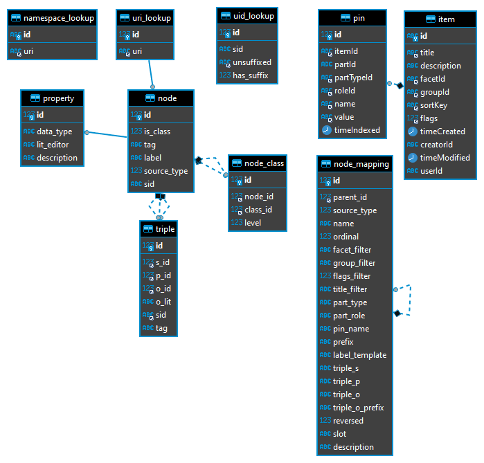
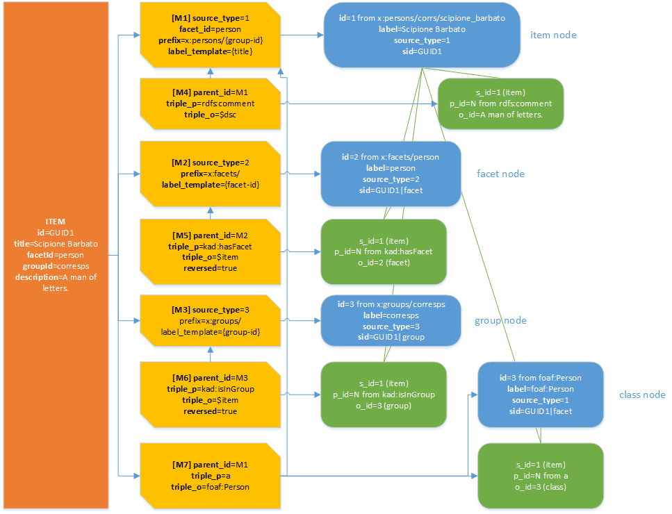
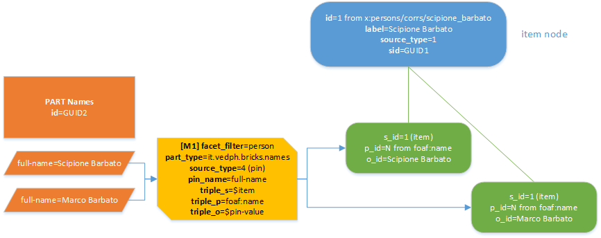
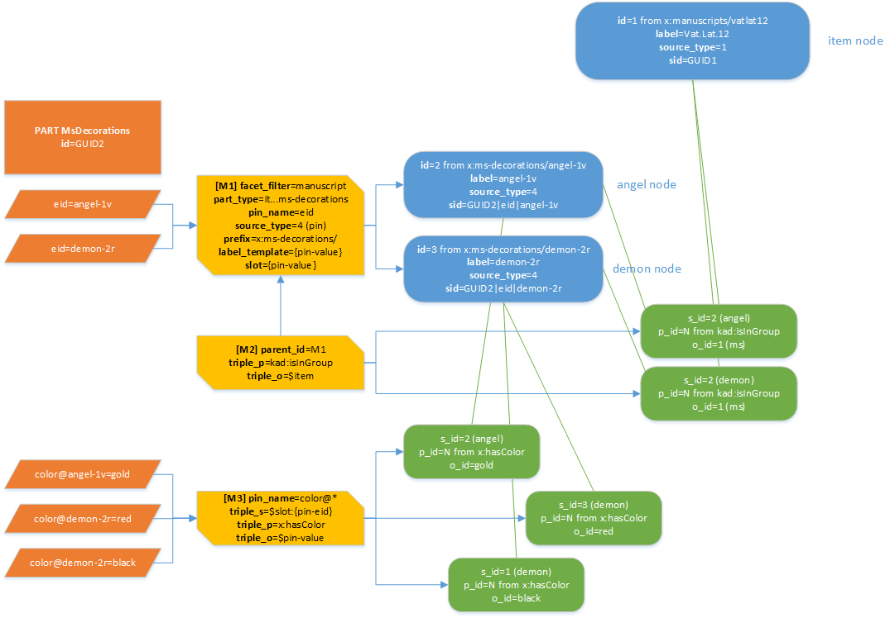
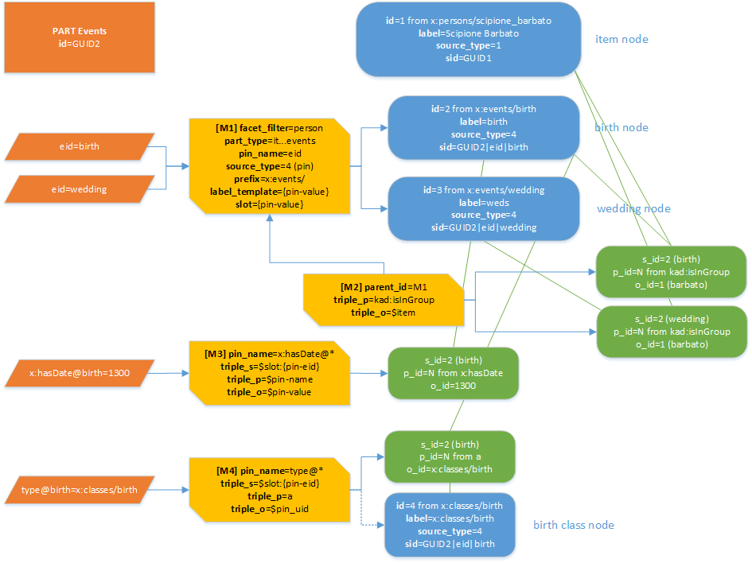
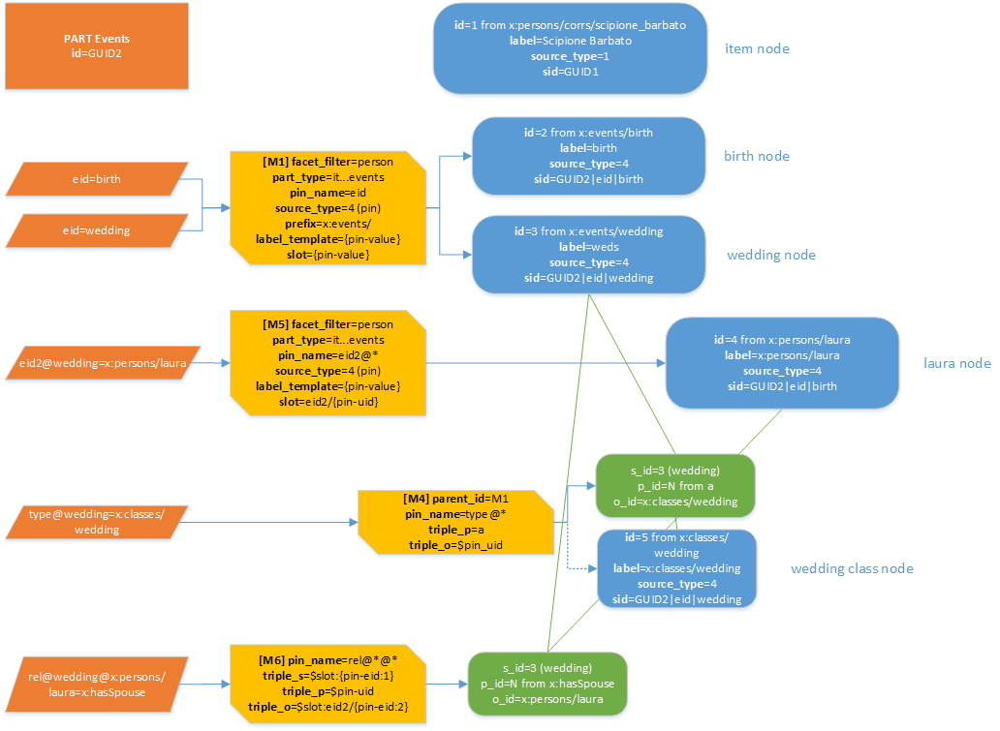
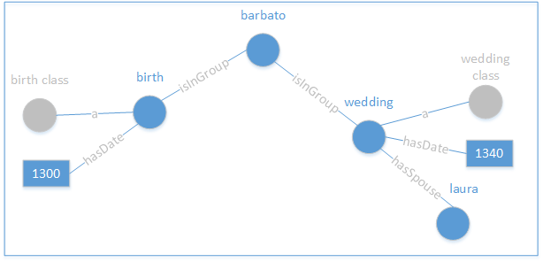
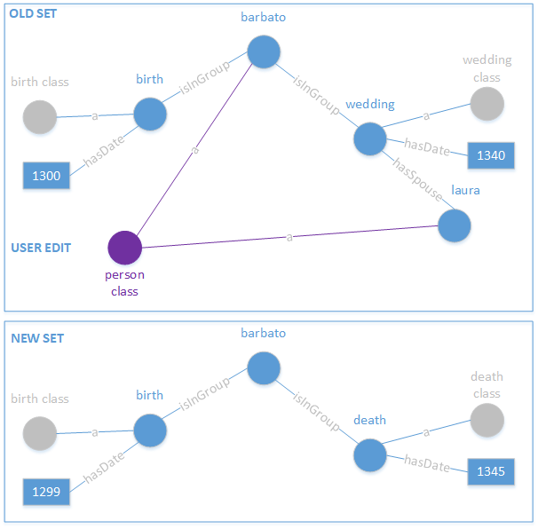
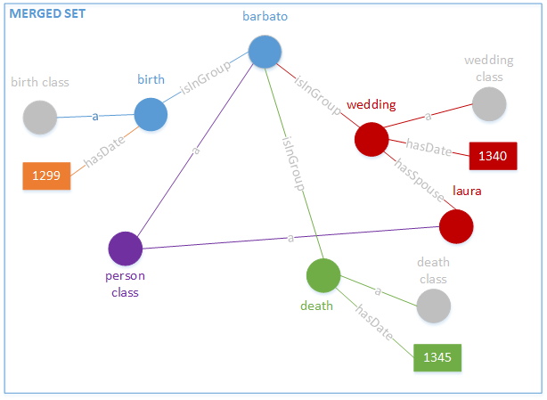
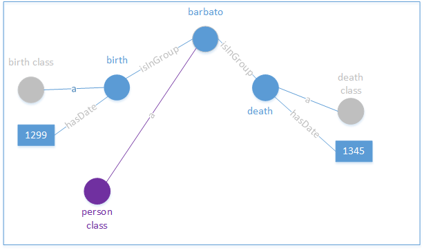

# Cadmus Core - Graph

- [Cadmus Core - Graph](#cadmus-core---graph)
  - [Data Pins](#data-pins)
    - [Scoped pins](#scoped-pins)
  - [Merging Strategies](#merging-strategies)
  - [Mappings](#mappings)
    - [Sources of Mapping](#sources-of-mapping)
    - [Source ID (SID)](#source-id-sid)
    - [Entity ID (UID)](#entity-id-uid)
    - [Entry ID (EID)](#entry-id-eid)
    - [Node Mapping](#node-mapping)
    - [Scoped Pin Matching](#scoped-pin-matching)
  - [Data Model](#data-model)
    - [Namespace Lookup Table](#namespace-lookup-table)
    - [UID Lookup Table](#uid-lookup-table)
    - [URI Lookup Table](#uri-lookup-table)
    - [Node Table](#node-table)
    - [Node Class Table](#node-class-table)
    - [Property Table](#property-table)
    - [Node Mapping Table](#node-mapping-table)
    - [Triple Table](#triple-table)
  - [Samples](#samples)
    - [Mapping Items](#mapping-items)
    - [Mapping Single-Entity Parts](#mapping-single-entity-parts)
    - [Mapping Multiple-Entity Parts](#mapping-multiple-entity-parts)
    - [Real-world Sample: Events](#real-world-sample-events)
  - [Mapping Procedure](#mapping-procedure)
    - [1. Finding Mappings](#1-finding-mappings)
    - [2. Expanding Composite Group](#2-expanding-composite-group)
    - [3. Applying Mappings](#3-applying-mappings)
      - [Variables in Mappings](#variables-in-mappings)
  - [Update Procedure](#update-procedure)
    - [Deleted Item/Part](#deleted-itempart)
  - [User Experience](#user-experience)

The graph is a semantic-web oriented subsystem of Cadmus, planned since its inception and essentially based on part's data pins.

The subsystem adds an RDF-based graph on top of the Cadmus database, integrating the edit experience so that graph nodes can be automatically created and kept in synch while editing parts, and at the same time users can add or link nodes in a visual UI, thus providing complex relationships across data at a higher abstraction level.

In a sense, just like you might be able to create a full-fledged TEI document without even knowing about XML, this subsystem allows you to create an RDF graph without even knowing about semantic web. In both cases you just edit data in GUIs; yet, the graph subsystem is not a later export, but a real-time mechanism for mapping Cadmus data models into nodes and triples, thus updating an existing graph whenever you save. Further, the graph subsystem also provides a new editing experience, where you can directly edit the graph by freely adding nodes or connecting them.

So, Cadmus data items with their parts, which represent the modules each item is built from, can be automatically mapped to RDF graph nodes in real-time, during editing. A synchronization system will ensure that every modification to the Cadmus data items will be reflected into the graph, without affecting any other additions made by directly editing it.

As a trivial sample, think of a person A writing a letter L to another person B, while dedicating it to yet another person C, and also attaching a manuscript M to be sent with the letter.

The existing system already provides all the models to fully describe any required details for persons, letters as literary works, and manuscripts. So, whenever each gets saved, the mapping mechanism will step in, and project a specified subset of their data as nodes and their relationships (triples) in an RDF graph.

The user will then be able to open the graph editor, pick the person-A node which has already been generated by mapping, and connect it to something like a "send" event, manually created as a new node. Then, the user will further connect the "send" event to the recipient (B), the dedicatee (C), and the attachment (M). Also, he will be able to attach further data to the "send" event itself by directly inserting them, like date or place. So, an RDF graph will progressively be created by just editing Cadmus data on one end, and manually establishing relations on the other. The graph will merge all the nodes, whether they come from an automated mapping process, or manual editing, with the only difference that the former will be managed by the system, and kept up to date with their source.

Alternatively, using a dedicated "events" part, the user would be even able to create most if not all of the nodes and triples by just filling a simple UI, where he adds events and edits them, with their type, date, place, participants, etc. In this case the user does not even know that the data he's entering will be automatically projected into nodes and triples; he just fills a form. As soon as he saves, the required subset of data is extracted from the part's pins and merged into the graph.

This not only provides a graph ready to be exported for the semantic web; but it also allows users to easily build it in the context of a unique, integrated interface, and _frees models from the burden of having to express complex relationships, which would fall outside their own conceptual domain_.

We can then get the best from both worlds: composable, open, and dynamically defined data models with all the details we desire, yet fully independent and self-contained, thus maximizing their reuse; on the other side, a full-fledged RDF graph which can be edited to express any sort of complex relationships and classifications for the entities coming from these data, or from external resources. This provides new grounds for deeper integrations across several projects, well beyond Cadmus boundaries.

As Cadmus is a general, open-model solution, this subsystem too must adopt the same level of generalization and openness. In fact, it all starts from data pins, and the graph itself is stored in the same database where pins are stored to allow for real-time search in the editor.

## Data Pins

The Cadmus architecture provides a generic mechanism for letting parts expose data which need to be indexed, called data pins. A data pin is just a name=value pair derived from a part. Most parts expose a number of such pairs to the outer world. For instance, a datation part might expose a numeric value representing its content. The data pin is generic enough to represent different levels of granularity: it may just be a name=value property, or a more complex entity, e.g. a semantic web triple (usually with name acting as predicate and value as object, the implicit subject being the data pin owner).

Parts thus are in charge of selecting data in the form of pins, eventually filtering their values (e.g. by removing diacritics and flattening case in text).

Each part also provides a list of metadata with all the details about each data pin: its name, how it gets filtered, and whether it's unique or multiple in that part. These metadata are consumed by the UI to provide users with a list of all the things which can be searched for each part.

Thus, whenever a part gets saved, the infrastructure queries it for all its data pins, and stores them into its index, together with the part's and item's identifiers. This way, users can search this index at any moment, and find data as soon as they get stored.

This infrastructure was mainly provided for real-time indexing, which empowers the search inside Cadmus.

Yet, it also has other usages: one is [looking up data](https://github.com/vedph/cadmus_doc/blob/master/core/dynamic-lookup.md), and is used when you have to recall some item from a part.

Another usage could be envisaged for establishing systematic relations across data stored in Cadmus, just like nodes in a graph, which is the semantic web model.

### Scoped pins

Some parts include a list of entries; for instance, a manuscript's decorations part includes a list of decorations, each representing an entry with its own properties (color, technique, etc.).

As the generated list of pins is flat, the hierarchic information, when required, can be stored by a convention dictating that:

- each entry must have a unique identifier (EID for short). Usually, this is provided by a pin for this purpose, like `eid`; but it can also be calculated from some unique property of the entry.
- this EID gets appended to the pin's name after `@`.
- for situations where an entry in turn has other entities (nested entries), EIDs get chained at the end, from topmost to bottom. For instance, say there is an events part. There, each event is an entry, having an EID, manually entered (e.g. `wedding`). In turn, an event has a list of entries involved in the event (e.g. spouse, officer, etc.); these entries are identified by their global ID (UIDs in this document's terminology): e.g. the spouse is `x:persons/laura`. So we would have 2 levels:

1. entry EID = `wedding`. All its pins are suffixed with it, like `date@wedding`=`1300`, `place@wedding`=`x:places/florence`, etc.

2. entry EID = `x:persons/laura`. All its properties are suffixed with it preceded by the upper level EID, like `sex@wedding@x:persons/laura`=`f`.

This projection of part's data into pins is done by the part's code itself. At the end, we just have a flat list of name=value pins, where by convention some pins have their name suffixed with scope EID(s), each introduced by `@`.

Note that all the entries EIDs must be unique inside the part, whatever their depth level.

## Merging Strategies

As explained above, each part whenever saved builds a list of data pins which get stored in the index database. This allows for real-time search, and data lookup. Such lookup have a limited usage scenario, i.e. they are best used when you have to recall some item from another one. For instance, this may happen for selecting the prison where graffiti are found, assumed that each prison is an item.

In some scenarios, like that of _Itinera_, we rather have the requirement of modeling a high number of complex relationships, which build a network in a graph where each node is an item or a part in it. For instance, a correspondent (item) sends a letter (item) to another correspondent (item); or takes part in a travel with another correspondent (item); or writes some work; etc.

In this case, to build a graph of relationships we need to merge two different strategies. On one side, we have the flexibility of the Cadmus data architecture, designed to be extremely open and modular, and optimized for content editing. There, data are stored as objects (parts) inside containers (items), and each part is designed to be as independent and self-contained as possible, as this maximizes reuse and composition.

Yet, when requiring to define a complex network of relationships, we'd rather need to add a huge number of connections across objects which are designed to live in isolation. This can be done without sacrificing the editor's architecture, by adopting a more abstract level of representation.

Here I'm presenting a design to include this functionality in any Cadmus editor; this is a generalized solution, even though emerging from the requirements of a specific project.

## Mappings

The mapping between Cadmus source data (items and parts) and nodes is defined by a number of node mappings.

It should be stressed that the nodes produced from mapping are not intended to fully represent all the data from each Cadmus part. This is not the purpose of the relationships editing system, but rather a publishing task. The nodes mapped here are only those which need to be connected by users while editing, together with all the linked nodes considered useful for this purpose.

### Sources of Mapping

At the input side of mappings, there are these types of sources:

1. **item**: an item. You can have mappings for the item; its group; its facet.

2. **part** with pins referred to a **single** entity (e.g. a person bio part). This usually emits nodes attached to the node mapped from the container item.

3. **part** with pins referred to **multiple** entities (a collection part, like one containing a list of decorations). In this case, if the part is to be used in relations it is assumed that the part emits data pins ending with a `/<ID>` suffix, where `<ID>` is the ID used to designate each entry in the part. For instance, should you have 2 decorations in a part, named `angel-1v` and `demon-2r`, and among the pins of each decoration is one representing its color named `color`, we expect the color pins for these two decorations to be `color/angel-1v` and `color/demon-2r`. This way, the mappings processor can know how to extract an ID for each decoration starting from the matched pin, by simply extracting the final part of the pin's name after the last dot. The mappings here usually emit 1 entity for each entry with an `eid` pin, linked to the entity derived from the container item.

Before illustrating these scenarios in more details, we must discuss the different identifiers used in the mapping process. In this document, these are referred to with SID (source ID), UID (entity's URI-based ID), and EID (entry's ID).

### Source ID (SID)

The entity source ID (SID for short) is calculated so that the same sources always point to the same entities. The SID is essential for connecting Cadmus data to the entities, as it provides the path by which data get added and updated. A SID is built with these components:

a) for **items**:

1. the GUID of the source (item).
2. if node comes from group or facet, the suffix `|group` or `|facet`. On passage, note that the group ID can be composite (e.g. `alpha/beta`); in this case, a mapping producing nodes for groups emits several nodes, one for each component. The top component is the first in the group ID, followed by its children (in the above sample, `beta` is child of `alpha`). Each of these nodes has an additional suffix for the component ordinal, preceded by `|`.

Examples: `76066733-6f81-48dd-a653-284d5be54cfb`,`76066733-6f81-48dd-a653-284d5be54cfb|group`, `76066733-6f81-48dd-a653-284d5be54cfb|group|2`.

b) for part's **pins**:

1. the _GUID_ of the source (part).
2. if the part has a role ID, the _role ID_ preceded by `:`.
3. the source _pin name_ preceded by `|`. If the pin name in the entity mapping is `eid` or starts with `eid@` (the pin name reserved to represent an entity ID, either simple or composite), then its value as it is must be appended after another `|`. For instance, say we have an `eid` pin from a decoration entry inside a decorations part. If `eid`=`angel-1v`, the SID will be e.g. `76066733-6f81-48dd-a653-284d5be54cfb|eid|angel-1v`.

The algorithm building the SID is idempotent, so you can run it any time being confident that the same input will always produce the same output. This is ensured by the fact that GUIDs are unique by definitions, and EIDs must be unique by convention, as each is defined by users to uniquely identify an entry.

The SID always starts with the container's GUID, so even though two users enter the same EID for two different entries, there will be no clashes between the resulting SIDs. In other terms, from the point of view of SIDs, users must ensure that EIDs are unique only whithin the same part, which of course is a trivial consistency rule.

### Entity ID (UID)

The entity ID is a shortened URI (where a conventional prefix replaces the namespace), calculated as defined by the entity mapping. As we want a human-friendly UID, the UID is essentially derived from the designated entity label. Further, an optional prefix is usually added to provide some more structure; and a numeric suffix can be used to disambiguate among different UIDs.

Thus, the UID is built by concatenating these elements:

(1) **prefix**: an optional prefix defined in the node mapping.

(2) **label**: the label is used as the main source to build the UID. Unless entered manually, the label is built from the label template defined in the node mapping. Once the label has been built, it is used here with filtering, i.e. the label whitespaces are normalized and replaced with underscores, the result is trimmed, only letters, digits, underscores (`_`) and dashes (`-`) are preserved, letters are all lowercased, and diacritics are removed.

In the result of 1+2, any sequence of `/` is reduced to a single `/`. This makes it easier to build templates without caring about separators: e.g. a prefix template `x:persons/{group-id}/` where there is no group would generate `x:persons//`, which becomes `x:persons/`.

(3) `#` + a numeric **suffix** is added if the result (1+2) happens to be found in `sid_lookup`.`unsuffixed`. If found, a numeric suffix is added (generated from the DB to be granted as unique).

Note that for item titles a couple of conventions dictate that:

- if the title ends with `[#...]`, then the text between `[#` and `]` is assumed as the UID. The only processing is prepending the prefix defined in the mapping, if any.
- if the title ends with `[@...]`, then the text between `[@` and `]` is prefixed to the generated UID. If the mapping already defines a prefix, it gets prepended to this one.

Once the UID gets generated, the SID/UID pair is saved in `sid_lookup`.

For instance, an item emits an entity whose label is mapped to its title. Say the title is `Barbato da Sulmona [@correspondents]`, with a `person` facet ID, and the item's mapping has:

- `source_type` = 0 (item).
- `prefix` = `persons/{title-prefix}/`, which gets resolved into `persons/correspondents/`.
- `label_template` = `{title}`, resulting in `barbato_da_sulmona` (while the final prefix `correspondents`, as defined by convention, is cut into `title-prefix`).

we would then get `persons/correspondents/barbato_da_sulmona`.

### Entry ID (EID)

A third type of identifiers is represented by the "entry" ID. A Cadmus part corresponding to a single entity is a single "entry". In this case, its ID is simply provided by the container's item. For instance, a person-information part inside a person item just adds data to the unique entity represented by the item. So, the target entity is just the one derived from the item.

Conversely, a manuscript's decorations part is a collection of decorations, each corresponding to an entry and eventually having its EID (exposed via an `eid` pin). All the entries with EIDs get mapped into entities.

Thus, here we call EIDs the identifiers provided by users for entries in a Cadmus collection-part. When present, such EIDs are used to build the final portion of part SIDs, as illustrated above.

Even though this is a remote option, EIDs can be composed using `@` to represent nesting.

### Node Mapping

A node mapping maps the source defined by SID into:

- a _single node_ (e.g. an item becomes a node).
- the _predicate + object_ of a triple whose subject is the node mapped by the parent mapping (e.g. the label of an item becomes predicate = `rdfs:label` and object = literal).

When the mapping has no object defined, it just generates a node. Otherwise, it also adds a triple connecting it to either a literal value or to another node. Node mappings can be nested. A child mapping always generates a triple.

The node mapping has this model:

- `id` (int) PK AI: the ID of the mapping.
- `parent_id` (int) FK: the parent mapping's ID, if any. This is used when the mapping emits a triple, and defines its subject as the target node of the parent mapping.
- `source_type` (int): for children mappings this value is inherited.
  - 0=user
  - 1=item
  - 2=item's facet
  - 3=item's group. This can be composite (e.g. `alpha/beta`).
  - 4=pin.
- `name` (string): a user-friendly name for this mapping.
- `ordinal` (int): usually 0. This can be set to any number to force some mappings to be executed before or after some other mappings in the context of the same depth level in the mappings hierarchy.
- `facet_filter` (string): the optional facet filter, used to match this mapping when mapping items.
- `group_filter` (string): the optional group filter, used to match this mapping when mapping items. This is a regular expression pattern which must be matched against the item's title for this mapping to apply.
- `flags_filter` (int): the optional item's flags filter, used to match this mapping when mapping items. All the flags must be matched.
- `title_filter` (string): the optional item's title filter. This is a regular expression pattern which must be matched against the item's title for this mapping to apply.
- `part_type` (string): the source part type ID.
- `part_role` (string): the optional part's role ID.
- `pin_name` (string): the optional pin's name. By convention, the name may end with 1 or more `@*` suffixes, each representing a scope (EID) for the pin. For instance, for a scoped pin `color@angel-1v` (=`color` pin assigned to an entry identified as `angel-1v`), the pin name to match is `color@*`, where `*`=any characters different from `@`. See below for more about pin name matching when suffixes are involved.
- `prefix` (string): the optional prefix to prepend to the target UID. It can have placeholders `{title-prefix}` (when the prefix is extracted from the item's title according to UID generation conventions), `{facet-id}` and `{group-id}`, all meaningful only when dealing with items.
- `label_template`: an optional template with placeholders `{title}` (=item's title, after processing conventions), `{group-id}` (=group ID), `{facet-id}` (=facet ID), `{pin-name}` (=source pin's name, without the EID `@...` suffix if any), `{pin-eid}` (=source pin's EID suffix; this can be followed by `:N` where N is a 1-based, positive or negative integer, representing the EID component to pick from the whole EID suffix when this is composite), `{pin-value}` (=the pin's value). This is used to generate a label for the target node (in turn, the label is used as a source for building the UID). It is null when the mapping just produces links. In this case, no node gets generated, and the subject of the triple is the node generated by the nearest ancestor mapping. The label mapping can use the prefix/UID conventions defined for item's titles, e.g. you can end it with `[@...]` for a prefix (to be appended to the prefix defined by the mapping itself if any), or with `[#...]` for a UID, which bypasses UID generation from the label and just picks it as it is, eventually prefixed according to the `prefix` property.
- `triple_s` (string): optional, this is used to specify a subject different from the parent mapping's node (which is the default): values are the same of `triple_o`.
- `triple_p` (string): the triple's predicate:
  - null when not used (=creating a target node only)
  - the UID of the target predicate
  - a macro:
    - `$pin-name` (as above for `label_template`). This can be used when the pin name already is a UID, e.g. `x:date@birth=1300` where `x:date` is the UID and `birth` the EID; the result of this macro would thus be `x:date`. The corresponding node must be already defined, as it's a property and we require metadata for them.
- `triple_o` (string): the object, which can be:
  - null, when just creating a single target node.
  - a constant UID. In this case the target node will be created if not existing.
  - a macro:
    - `$parent`: the UID of the node generated by the parent mapping. This is a shortcut for `$ancestor:1`.
    - `$ancestor:N`: the UID of the node generated by the ancestor mapping specified by N: 1=parent, 2=parent of parent, and so forth.
    - `$item`: the item's UID.
    - `$group`: the group's UID; for composed group IDs, this is the bottom component's UID; otherwise use `$group:N` where 1=root component, 2=child of 1, etc.
    - `$facet`: the facet's UID.
    - `$title`: the literal value got from processing the item's title. Equal to the placeholder with the same name.
    - `$dsc`: the literal value got from the item's description.
    - `$pin-value`: the literal value got from the source pin.
    - `$pin-uid`: the UID got from the source pin value, when this is an EID; in this case too, if the target node does not exist it will be created. Both `$pin-value` and `$pin-uid` draw their value from the pin's value, but this value is used either as a literal or as an UID.
    - `$slot:TEMPLATE`: resolve this into the UID of the node generated by the mapping with a corresponding `slot` property set. The argument here is a template. This property defines a virtual "slot" named after the value of the template, whose value is the UID of the target node for this mapping. For instance, if you are mapping an EID pin like `eid`=`angel-1v`, and you set slot=`{pin-value}`, then the UID of the node generated by that mapping will be saved in the temporary mapper state under a slot keyed with the value of the template, e.g. `angel-1v`. This allows other mappings to refer to this node via the same slot key, using the `$slot` macro.
- `triple_o_prefix`: the optional prefix to prepend to the newly generated node with O role in the triple. This can be used when nodes are implicitly created when setting their relation with the subject. Value and processing is the same as `prefix`.
- `reversed` (boolean): true if when the object is a node S and O as defined by this mapping should be swapped, thus reversing the generated triple.
- `slot` (string): an optional slot key specification for temporarily storing the target node UID of this mapping into the mapper's state. This can be used to later reference this UID from a triple mapping which is not child of this mapping, as it happens for pin mappings (pins are mapped one after another from a flat list, even when they use EIDs to represent a hierarchy).
- `description` (string): an optional human-readable description of this mapping.

### Scoped Pin Matching

Scoped pins are identified in mapping rules with a `@*` for each level, from the top to the bottom level. The `*` is a placeholder for the actual EID.

If the pin name matched by the mapping rule is declared as the entity ID name (usually this happens for `eid`, `eid2`, etc.), its value will provide the value for the `*` placeholder in descendant mappings. It is the "EID-designated" pin.

When matching against a pin name, each `*` placeholder is filled by the EID-designated pin value in the hierarchy.

Example: say we have events in a part; each event has an EID (`eid`), and can have a list of children EIDs (`eid2`) representing other entities variously related to the event. These pins are EID-designated pins.

The pins are:

- `eid`=`birth` (arbitrary name for the event).
- `eid`=`wedding1` (arbitrary name for the event).
- `eid`=`wedding2` (arbitrary name for the event).

- `type@birth`=`x:birth` (type for `birth` event).

- `eid2@wedding1`=`x:laura` (a related entity)
- `type@wedding1`=`x:wedding` (type for `wedding1` event)
- `rel@wedding1@x:laura`=`x:spouse` (type of relation between `wedding1` and `x:laura`, i.e. the rel pin attached to the entry `x:laura` attached to the entry `wedding1`).

- `eid2@wedding2`=`x:maria` (a related entity)
- `type@wedding2`=`x:wedding` (type for `wedding2` event)
- `rel@wedding2@x:maria`=`x:spouse`.

Mapping rules:

- M1: match pin `eid`.
  - M2 child of M1: match pin `type@*`.
  - M3 child of M1: match pin `eid2@*`.
    - M4 child of M3: match pin `rel@*@*`.

Their application history:

- **M1** : `eid=birth`: this produces a birth event node, unless already present. \*1=`birth`.

  - **M1>M2** for `type@birth` : `type@birth=x:birth`. Output: triple "S=birth ($parent); P=`a`; O=`x:birth`". Creates O node if not existing.
  - **M1>M3** for `eid2@birth`: no match (no entity involved in the birth besides the subject).

- **M1** : `eid=wedding1`. Output: wedding1 event node, unless already present; \*1=`wedding1`.

  - **M1>M2** for `type@wedding1` : `type@wedding1`=`x:wedding`. Output: triple "S=wedding1 ($parent); P=`a`; O=`x:wedding`". Creates O node if not existing.
  - **M1>M3** for `eid2@wedding1` : `eid2@wedding1=x:laura`. \*2=`x:laura`. Output: node for laura, unless already present.
  - **M1>M3>M4** for `rel@wedding1@x:laura` : `rel@wedding1@x:laura=x:spouse`. Output: triple "S=wedding1 ($ancestor:2); P=`x:spouse`; O=`x:laura` ($parent)".

- **M1** : `eid=wedding2`: this produces a wedding2 event node, unless already present. \*1=`wedding2`. This has an application path similar to that explained for wedding1.

## Data Model

The primary purpose of this system is defining relationships among some of the records defined in Cadmus items and parts.



### Namespace Lookup Table

- `namespace_lookup`: a list of prefixes and their namespaces.

  - `id` (string) PK: the namespace prefix (e.g. `rdfs`).
  - `uri` (string): the corresponding full URI (e.g. `http://www.w3.org/2000/01/rdf-schema#`).

### UID Lookup Table

`uid_lookup`: UIDs. This lookup table is filled whenever a new UID gets calculated from a SID. SID calculation is idempotent, but UID calculation is not: to ensure friendly values, UIDs are [generated](#entity-id-uid) from user-entered data, like an item's title. Thus, it might happen that two UIDs from two different sources (as identified by SIDs) clash. In this case, the new UID must receive a unique numeric suffix (in the form `#N`). This number is got from the database, which ensures it is unique, and gets forever associated to that UID and SID.

This association allows re-creating the same UID whenever adding the same entity (as identified by SID) using the same calculated UID.

Consider this example:

1. you save an entry from a pin with EID=`angel-1v` in the context given from SID `bf849795-375e-4deb-9f91-3b03630ea2fa/eid/angel-1v`. The generated UID for this entry (as specified by a node mapping) is e.g. `x:ms-decorations/angel-1v`.
2. looking up the UID table, you find out that 1 or more records already exist with an unsuffixed UID equal to the generated one (`x:ms-decorations/angel-1v`). So, you get from the database a numeric suffix, say 23, and append it to this decoration.
3. the new UID gets saved into the UID lookup table as a record corresponding to `x:ms-decorations/angel-1v#23`, connected to the SID `bf849795-375e-4deb-9f91-3b03630ea2fa/eid/angel-1v`.
4. later, you delete this decoration.
5. later again, you decide to re-enter the same decoration in the same part. This produces again the same SID (as SID are idempotents): `bf849795-375e-4deb-9f91-3b03630ea2fa/eid/angel-1v` and unsuffixed UID `x:ms-decorations/angel-1v`. Looking up the UID table, you find out that 1 or more records already exist with an unsuffixed UID equal to this value. Also, among them there is one with the same SID, too; the one saved when the angel decoration from that part was first saved. So, rather than requesting a new number for its suffix, you _reuse_ the old number, getting again `x:ms-decorations/angel-1v#23`.

This ensures that the same entity (as identified by its SID) always corresponds to the same UID. The UID lookup table model is thus designed for the purpose of completing the generation of each UID.

- `id` (int) PK AI.
- `sid` (string): the SID.
- `unsuffixed` (string): the UID as calculated without its optional final suffix (e.g. `x:ms-decorations/angel-1v`).
- `has-suffix` (bool): true if the SID should be built by adding suffix `#` + `id` to `unsuffixed` (e.g. `3` generates the complete UID `x:ms-decorations/angel-1v#3`).

### URI Lookup Table

- `uri_lookup`: this is a mapping between unique numeric IDs and URIs, used to reduce tables size and enhance performance. Internally, RDBMS records are identified by a simple numeric ID, which corresponds to a full URI.

  - `id` (int) PK AI: the numeric ID.
  - `uri` (string): the corresponding URI (where namespaces are replaced by prefixes for more readability; e.g. `rdfs:label`). It is assumed that all the prefixes used here are resolved in `namespace_lookup`.

### Node Table

- `node`: a node coming from a Cadmus record or added from any external sources (e.g. by a user, or imported from somewhere else).

  - `id` (int) PK FK. The ID got via `uri_lookup` from a string UID. The latter is calculated from mappings, or just entered from scratch by users. It should be in a URI-like form, shortened with a prefix, like e.g. `x:persons/barbato_da_sulmona`.
  - `is_class` (boolean): a value indicating whether this node is a class. This is a shortcut property for a node being the subject of a triple with S=class URI, predicate=`a` and object=`rdfs:Class` (or eventually `owl:Class` -- note that `owl:Class` is defined as a subclass of `rdfs:Class`). Given the importance of class nodes in editing, this is a performance-wise shortcut.
  - `tag`: a general purpose tag for the classification for nodes. For instance, this can be used to mark all the nodes potentially used as properties, so that a frontend can filter them accordingly.
  - `label` (string): the optional label used to designate this entity in a human-friendly way. This is defined by mapping, or manually entered by user.
  - `source_type` (int): set from the mapping which generated this node; 0 if manually created.
  - `sid` (string): the SID built from the identity of the source data record, or null if user-defined.

If you need other UIDs for the same entity, you can add them manually or import from external sources, connecting them to the original node with `owl:sameAs` predicate, ideally in the sense of "same thing as but different context" (see Halpin H., Herman I., _When owl:sameAs isn't the Same: An Analysis of Identity Links on the Semantic Web_, Conference: Proceedings of the WWW2010 Workshop on Linked Data on the Web, LDOW 2010, Raleigh, USA, April 27, 2010).

### Node Class Table

- `node_class`: this table is a performance artifact. For each saved node, it gets populated with all its classes, by walking up the sub-class hierarchy of each class. This is required because the process of collecting all the classes and super-classes of any node is recursive and expensive, while operations on node classes in the editor are frequent (e.g. filter by class, show all node's classes, compare with range/domain restrictions, etc.).

  - `id` (int) PK FK.
  - `node_id` (int) FK linked to the instance `node.id`.
  - `class_id` (int) FK linked to the class `node.id`.
  - `level` (int) the depth level at which this class was detected when walking classes starting from the instance node: 1=parent classes, 2=parent classes of parent classes, etc.

Recursively querying a MySql database (MySql is currently the RDBMS used for Cadmus indexes) implies using [recursive CTEs](https://www.mysqltutorial.org/mysql-recursive-cte). For instance, here is a recursive CTE to get all the unique classes for a specific node:

```sql
with recursive cn as (
 -- ANCHOR
 -- get object class node
 select t.o_id as id, 1 as lvl from node n
 -- of a triple having S=start node P=a O=class node
 inner join triple t on t.s_id=n.id and t.p="a"
 left join node n2 on t.o_id=n2.id and n2.is_class=true
 where n.id=1
 UNION DISTINCT
 -- RECURSIVE
 select t.o_id as id, lvl+1 as level from cn
 inner join triple t on t.s_id=cn.id and t.p='sub'
 left join node n2 on t.o_id=n2.id and n2.is_class=true
)
select cn.id,cn.lvl,node.label from cn inner join node on cn.id=node.id;
```

So, from these sample data:

```txt
NODE
id   label    is_class
----------------------
1    John     0
100  artist   1
101  person   1
102  animal   1
103  explorer 1

TRIPLE
s_id p   o_id
-------------
1    a   100 = John a artist
1    a   103 = John a explorer
100  sub 101 = artist sub person
101  sub 102 = person sub animal
```

Executing the anchor query like this:

```sql
select t.o_id as id, 1 as lvl,n2.label from node n
inner join triple t on t.s_id=n.id and t.p="a"
left join node n2 on t.o_id=n2.id and n2.is_class=true
where n.id=1
```

returns all the direct parent classes (lvl 1) of the John node:

```txt
100 1 artist
103 1 explorer
```

These are the results of the anchor query. Then, the recursive query finds all the classes which are parent of the classes found in the previous step:

```txt
100 1 artist
101 2 person
102 3 animal
103 1 explorer
```

### Property Table

- `property`: in RDF a property is an entity which _can_ be used as predicate (e.g. `dbo:birthDate`). The practical purpose of adding property-related data to a node is providing a list of predicates to pick from when building a triple, or applying some restrictions to it.

  - `id` (int) PK FK. The numeric ID got from mapping the property node UID to a number in `uri_lookup`. This establishes a 1:1 relationship between a node and its metadata as a property.
  - `data_type` (string): for literals objects, this defines the allowed data type.
  - `lit_editor` (string): an optional key representing the special literal value editor to use (when available) in the editor. This can be used to offer a special editor when editing the property's literal value. For instance, if the property is a historical date, you might want to use a historical date editor to aid users in entering it. Editing value as a string always remains the default, but an option can be offered to edit in an easier way when the value editor is specified and available in the frontend.
  - `description` (string): an optional human-readable description.

### Node Mapping Table

The model of table `node_mapping` is specified in [node mapping](#node-mapping).

### Triple Table

- `triple`: a triple.

  - `id` (int) PK AI.
  - `s_id` (int): FK. Subject, linked to a node.
  - `p_id` (int): FK. Predicate, linked to a property.
  - `o_id` (int): FK. Object, linked to a node.
  - `o_lit` (string): an optional literal value. This is alternative to `o_id`.
  - `tag`: a general purpose tag, used to tag triples for some reason. The primary purpose is marking those triples which represent restrictions, like those composed by subproperty of (`rdfs:subPropertyOf`), domain (`rdfs:domain`), range (`rdfs:range`), literal only (`owl:DataTypeProperty`), object only (`owl:ObjectProperty`), symmetric (`owl:SymmetricProperty`), asymmetric (`owl:AsymmetricProperty`). Except for domain/range/subproperty, which are used as predicates (property - has-range - node), all the other restrictions listed here are used as objects (property - is-a - object-property).

## Samples

### Mapping Items

This example assumes that we have a Cadmus **item** with these properties:

- `id`=`76066733-6f81-48dd-a653-284d5be54cfb`.
- `title`=`Scipione Barbato`. Note here that the title should be carefully chosen to represent the corresponding entity at best. This is a fairly natural process for users, just like when in a web CMS like Wordpress you enter the title of a page and its ID gets derived from it.
- `facetId`=`person`.
- `groupId`=`corresps`. This person happens to belong to the correspondents group.
- `description`=`A man of letters`.



The node **mappings** are:

(M1) _item_: this mapping applies to all items belonging to the `person` facet.

- `source_type`=1 (item)
- `facet_id`=`person`: filter by facet.
- `prefix`=`x:persons/{group-id}/`
- `label_template`=`{title}`

Result: node:

- `id`=1 from UID=`x:persons/corrs/scipione_barbato`
- `label`=`Scipione Barbato`
- `source_type`=1 (item)
- `sid`=`76066733-6f81-48dd-a653-284d5be54cfb`

(M2) _item's facet_, child of M1.

- `source_type`=2 (item's facet)
- `prefix`=`x:facets/`
- `label-template`=`{facet-id}`

Result: node:

- `id`=2 from UID=`x:facets/person`
- `label`=`person`
- `source_type`=2 (item's facet)
- `sid`=`76066733-6f81-48dd-a653-284d5be54cfb|facet`

(M3) item's group: map item's group to a node with UID `x:groups/` + group ID. Also, this type of mapping implies a triple "item kad:isGroupedIn group".

- `source_type`=3 (item's group)
- `prefix`=`x:groups/`
- `label_template`=`{group-id}`

Result:

- `id`=3 from `x:groups/corresps`
- `label`=`corresps`
- `source_type`=3
- `sid`=`76066733-6f81-48dd-a653-284d5be54cfb|group`

(M4) item's description: map item's description to a triple with S=item, P=`rdfs:comment`, O=description (literal).

- `parent_id`=M1
- `triple_p`=`rdfs:comment`
- `triple_o`=`$dsc`

Result: triple:

- s_id=1 (item)
- p_id=some ID from `rdfs:comment`
- o_id=`A man of letters.`

(M5) child of M2 to connect item and facet.

- `parent_id`=2 (M2)
- `triple_p`=`kad:hasFacet`
- `triple_o`=`$item`
- `reversed`=true: this swaps S and O. This is required because by default in the resulting triple S is the node from parent, and O is the node specified in this mapping. Here, S=facet generated by M2 and O=item, but P=has-facet, so we need to swap S and O to get S=item and O=facet.

Result: triple:

- `s_id`=1 (item)
- `p_id`=some ID from `kad:hasFacet`
- `o_id`=2 (facet)

(M6) child of M3 to connect item and group.

- `parent_id`=M3
- `triple_p`=N from `kad:isInGroup`
- `triple_o`=$item
- `reversed`=true

Result:

- `s_id`=1 (item)
- `p_id`=N from `kad:isInGroup`
- `o_id`=3 (group)

Of course, mappings are just records, so they can be added at any time. Once added, they will be applied the next time their source triggers them (e.g. when their source item or part is saved). Anyway, just like the Cadmus CLI tool allows rebuilding all the pins, it can be extended to also rebuild all the mapped nodes.

For instance, we might want to add another child mapping to the parent item mapping, telling that the node derived from the item is a subclass of foaf:Person. This can be done without issues because the item rule is filtered so that it applies only to items belonging to the person facet. So, given the mapping:

(M7) item belongs to person class.

- `parent_id`=M1
- `triple_p`=`a`
- `triple_o`=`foaf:Person`: here, if this class does not exist (as it happens in the sample picture), its node gets created with the specified UID, using the UID also for its label. Anyway, usually properties should be pre-populated, as they may carry additional metadata like editors and restrictions.

### Mapping Single-Entity Parts

Usually single entity parts do not get mapped into independent entities, but rather attach additional data to the entity derived from the container item. For instance, if you have an item representing a person, this already provides an entity for that person. All the parts inside this item rather provide more information about that person. For instance, a names part might provide all the names attested for that person. These names would thus be attached to the entity representing the person, which is already derived from the container item.

So, continuing the above example, let's assume we have a simple names part inside the item representing Scipione Barbato:



Mapping parts means mapping the pins emitted by it. In this hypothetic part, the pins we are interested in are just the full-name(s) assigned to the person. In the end, our entity representing this person will get 2 more literals for a couple of different names.

Say the pins we get from the part are:

- `full-name`=`Scipione Barbato`
- `full-name`=`Marco Barbato`

The only required mapping here is (assume that this hypothetic part type ID is `it.vedph.bricks.names`):

- `facet_filter`=`person`: we want to match only names pins attached to a person item (eventually, names might be attached to places, etc.).
- `part_type`=`it.vedph.bricks.names`: the part's type ID.
- `pin_name` = `full-name`
- `source_type`=4 (pin)
- `triple_s` = `$item`. Here we must specify an explicit subject as this is not a child mapping, where the subject can eventually be inferred from ancestor mappings.
- `triple_p`=`foaf:name`.
- `triple_o`=`$pin-value`, the macro defining the target as a literal value got from the pin.

The results are 2 triples:

- `s_id`=1 (item)
- `p_id`=some ID from `foaf:name`
- `o_id`=`Scipione Barbato`

- `s_id`=1 (item)
- `p_id`=some ID from `foaf:name`
- `o_id`=`Marco Barbato`

### Mapping Multiple-Entity Parts

Our final example refers to a multiple-entities part. As a sample, consider a manuscript's decorations part, which collects any number of decorations from a single manuscript. The item mappings here emit at least a node for the item (UID `x:manuscripts/vatlat12`).



The decorations part in this item contains a number of decorations. Each decoration with an `eid` pin will be mapped to a node. The pins emitted by the part are repeated for each entity. For instance, in the picture we have:

- 2 `eid` pins for 2 decorations: `angel-1v` and `demon-2r`.
- 3 `color.EID` pins for 2 decorations: `color/angel-1v=gold`, `color/demon-2r=red`, `color/demon-2r=black`.

A first mapping is used to create a node for each entity (having an `eid` pin):

(M1) create a node for each entity.

- `facet_filter`=`manuscript`
- `part_type`=`it.vedph.itinera.ms-decorations`
- `pin_name`=`eid`
- `source_type`=4 (pin)
- `prefix`=`x:ms-decorations/`
- `label_template`=`{pin_value}`
- `slot`=`$pin-value`: this instructs the mapper to temporarily store in its state the UID of the node generated by this mapping (=the decoration's UID), using the EID pin's value (e.g. `angel-1v`) as the key.

Results (`056c3e8e-48e5-40e2-a72f-feb42add7963` is the part's GUID): nodes:

- `id`=2 from `x:ms-decorations/angel-1v`
- `label`=`angel-1v`
- `source_type`=4
- `sid`=`056c3e8e-48e5-40e2-a72f-feb42add7963|eid|angel-1v`

- `id`=2 from `x:ms-decorations/demon-2r`
- `label`=`demon-2r`
- `source_type`=4
- `sid`=`056c3e8e-48e5-40e2-a72f-feb42add7963|eid|demon-2r`

(M2) child mapping: group each decoration under its manuscript.

- `parent_id`=M1
- `triple_p`=`kad:isGroupedIn`
- `triple_o`=`$item`

Results: triples:

- `s_id`=2 (angel)
- `p_id`=some ID from `kad:isGroupedIn`
- `o_id`=1 (manuscript)

- `s_id`=2 (demon)
- `p_id`=some ID from `kad:isGroupedIn`
- `o_id`=1 (manuscript)

(M3) pin mapping: assign colors to each decoration.

- `pin_name` = `color@*`
- `triple_s`=`$slot:{pin-eid}`: this tells the mapper to use as subject the URI stored under a slot keyed with the value of the pin's EID suffix (e.g. `angel-1v` from `color@angel-1v`). This way, we can refer to a specific decoration as the subject of the triple.
- `triple_p`=`x:hasColor`
- `triple_o`=`$pin-value`

Results: triples:

- `s_id`=2 (angel)
- `p_id`=some ID from `x:hasColor`
- `o_id`=`gold`

- `s_id`=3 (demon)
- `p_id`=some ID `from x:hasColor`
- `o_id`=`red`

- `s_id`=1 (demon)
- `p_id`=some ID `from x:hasColor`
- `o_id`=`black`

### Real-world Sample: Events

Say we have a hypothetic events part. It contains a list of events, with this model:

- `eid`: an arbitrary ID for the event (e.g. `birth`).
- `type`: the class the event belongs to (birth, death, wedding, etc.). The list comes from a thesaurus, where the ID is a UID (e.g. `x:birth`, `x:wedding`), and the name is any arbitrarily chosen human-readable text (`birth`, `wedding`).
- `date`: a date object.
- `place`: here just a string, to keep the example simple.
- `rank`: a number representing the level of certainty for this event.
- `references`: references objects.
- `related`:
  - `relation`, from a thesaurus where the ID is a UID (e.g. `x:spouse`).
  - `entity`: a UID picked via lookup from graph nodes, filtering them by the type's range when applicable.

Say we have two events: birth and wedding.

(1) _birth_ properties:

- `eid` = `birth`: the EID is arbitrarily assigned by the user, and must be unique only whithin the boundaries of the part being edited. As several events of the same type may be present, their type is not enough to provide an identifier. Letting users pick one is best for readability. For instance, two weddings might be named `wedding1` and `wedding2` following their chronological order.
- `type` = `x:birth` (an imaginary UID from some ontology).
- `date` = `1300 AD`
- `place` = `Florence`
- rank = `1`
- references:
  - `White 1987, 12-23`
  - `Doe 2012, 109`

(2) _wedding_ properties:

- `eid` = `wedding`
- `type` = `x:wedding`
- `date` = `1350 AD`
- `place` = `Rome`
- `rank` = `1`
- `related`:
  - `relation` = `x:spouse`
  - `eid` = `x:persons/laura`

The corresponding pins as generated from the part's code:

- `eid` = `birth`
- `type@birth` = `x:classes/birth`
- `x:date@birth` = `1300`
- `x:place@birth` = `Florence`
- `rank@birth` = `1`
- `doc-ref@birth` = `[paper] White 1987, 12-23`
- `doc-ref@birth` = `[paper] Doe 2012, 109`

- `eid` = `wedding`
- `type@wedding` = `x:classes/wedding`
- `x:date@wedding` = `1350`
- `x:place@wedding` = `Rome`
- `rank@wedding` = `1`
- `eid2@wedding` = `x:persons/laura`. The value connects to a node, so it's directly a UID. Note that this was named `eid2` by the part, as it's a 2nd-level entry (person related to an event: the top list of entries is the events list; each event has a list of related entries). This convention makes it easier to read the pins and define mapping rules.
- `rel@wedding@x:persons/laura` = `x:spouse`: the event is connected with an `x:spouse` relation to the person identified by `x:persons/laura`.

The picture below shows the mapping of a subset of the birth event's pins:



The picture below shows the mapping for the other event, wedding:



So, let's assume that we edit an events part, having a collection of events. Each event has an ID (EID), a type, a date, a place, and any number of participants. Each participant has an ID (EID), and a type of relation with that event.

So, these events:

- Barbato was born in 1300.
- Barbato married Laura in 1340.

in Barbato's biographic events part are like:

- event with EID `birth`:
  - type=`x:classes/birth`
  - date=1300
- event with EID `wedding`:
  - type=`x:classes/wedding`
  - date=1340
  - participants:
    - EID=`x:persons/laura`
    - relation=`x:spouse`

The pins generated by this part are:

- `eid` = `birth`
- `eid` = `wedding`
- `type@birth` = `x:classes/birth`
- `x:hasDate@birth` = `1300`
- `eid2@wedding` = `x:persons/laura`
- `type@wedding` = `x:classes/wedding`
- `x:hasDate@wedding` = `1340`
- `rel@wedding@x:persons/laura` = `x:spouse`

Here we have a flat list of pins, where hierarchy is expressed with EID suffixes (`@...`). A pin like `x:hasDate@birth` is to be read "birth has-date", as the EID suffix provides the entity ID which is the implicit subject of a triple. A pin like `eid` instead just defines an arbitrary ID for the entity (in this case, an event). Of course, should we name or EIDs like `birth`, `death`, and the like, we will soon find us in a situation where the corresponding UIDs would be duplicate; but this does not happen, because the UID generation algorithm ensures that each EID is unique, by eventually attaching a numeric suffix.

In detail, here is what the pin mappings do: first, the item gets mapped. This is required to provide context information, even though at the end the generated nodes/triples are dropped. Then, pins are processed. The first pins are EID-related.

1. item: generates node `x:persons/scipione_barbato`, which is then dropped.

2. pin `eid=birth`: there are 2 matching mappings, one child of the other, which generate node `x:events/birth` (and fills slot `birth` with this UID), and a triple `x:events/birth` `#kad:isInGroup` `x:persons/scipione_barbato`. The object of this triple (item node) gets added to the set as a user-defined node, because we don't want to update it; we just need to ensure that we can address it by its UID. So the resulting SID is null, which will not trigger any update (but would trigger an addition, should the node be missing; this will not happen, because items are saved before parts).

3. pin `eid=wedding`: as above, generating node `x:events/wedding` (with slot `wedding`=its UID) and triple `x:events/wedding` `#kad:isInGroup` `x:persons/scipione_barbato`. This time the object node is already present in the set, as it was added while creating the triple for the preceding pin.

4. pin `type@birth=x:classes/birth`: generates triple `x:events/birth` `#a` `x:classes/birth` (the object node, a class, is found among the existing nodes; otherwise it would be added without a SID).

5. pin `x:hasDate@birth=1300`: generates triple `x:events/birth` `#x:hasDate` `1300` (a literal).

6. pin `eid2@wedding=x:persons/laura`: generates node `x:persons/laura` (and a slot `eid2/x:persons/laura`=its UID). Note that this way we ensure that the node for the related person exists before adding triples about her. Should we not add this mapping, the triple would anyway introduce person Laura as its object. Yet, in this case it would be treated as user-defined, would have no SID, and thus the system would just ensure that this node exists. Instead, by mapping Laura explicitly, we get a SID linked to the source pin, and thus subject to synchronization (e.g. if we remove Laura from the related persons, her node will be deleted). This is an alternative: it's up to the scholars deciding if these persons should be excluded or not from synchronization. The sample uses an explicit mapping just to provide a more complete scenario.

7. pin `type@wedding=x:classes/wedding`: generates triple `x:events/wedding` `#a` `x:classes/wedding` (the object node, a class, is found among the existing nodes; otherwise it would be added without a SID).

8. pin `x:hasDate/wedding`: generates triple `x:events/wedding` `#x:hasDate` `1340` (a literal).

9. pin `rel@wedding@x:persons/laura=x:spouse`: generates triple `x:events/wedding` `#x:spouse` `x:persons/laura`.

Thus, the resulting graph is:



These are the nodes generated by the above sample mappings. Of course, we might have more mappings, or more nodes and links. For instance, we might say that birth and wedding are subclasses of an event class, or tell more about Laura by linking her to new nodes.

We can do all this manually when editing the graph; whenever the events part gets saved, only the SID-dependent nodes will be synchronized, so that all our edits can be preserved. Or, we can provide another part about Laura, which generates a graph on its own, then merged to the unique graph in the store, thanks to the fact that the ID used for Laura (`x:persons/laura` in our example) is globally unique. The same happens for Barbato himself: it's an item, with a number of parts; and each part generates its own graph connected to his node. All of these graphs get merged into the store, thus providing a lot of information about him by simply composing data from composed models and UIs.

## Mapping Procedure

We can now describe in more detail the procedure which applies mappings to a Cadmus data source.

This procedure is triggered whenever:

- item's metadata get saved.
- part's pins get saved.

Conversely, no mapping rule is required when just [deleting](#deleted-itempart) an item or part.

In general, each procedure builds a nodes graph. This result is then compared to the existing data to define their update strategy, which might imply adding, updating, or deleting records.

### 1. Finding Mappings

First, **find** all the _entity mappings_ having:

- `parent_id`=0.
- `source_type`=1,2,3 (in this order) for items; 4 for parts.
- `facet_filter`=null or equal to the item's facet. In case of parts this refers to the container item.
- `flags_filter`=0 or a subset of the item's facet. In case of parts this refers to the container item.
- `group_filter`=null or matching the items' group ID. In case of parts this refers to the container item.
- `title_filter`=null or matching the items' title. In case of parts this refers to the container item.

Additionally, for _parts_:

- `part_type`=part's type ID.
- `part_role`=null or equal to the part's role ID.
- `pin_name`. For parts this cannot be null, while for items it always is null. The pin_name `@*` placeholders get filled as explained [above](#data-pins).

### 2. Expanding Composite Group

For each of the collected mappings EM, sorted by `source_type`, `ordinal`, `part_type`, `part_role`, `pin_name`, `name`: if EM has `source_type`=3 (group) and the item's `groupId` is composite, then the procedure #3 must be repeated for each component extracted from the group ID (e.g. `alpha`, `beta` from `alpha/beta`, from left to right, which means from top to bottom in the groups hierarchy). This will ensure that nodes are created in an order compatible with the link between each parent-child pair (represented by a child mapping of EM).

### 3. Applying Mappings

Create an empty new graph (here NG for short) to collect all the generated nodes. Then, start processing the EM, with all its descendant rules. Each is processed like this:

1. calculate the SID as illustrated [above](#source-id-sid).
2. extract the names of all the placeholders and macros used in the mapping (the result can be cached). Sources for placeholders are `prefix`, `label_template`, `triple_o_prefix`; for macros are `triple_s`, `triple_p`, `triple_o`.
3. calculate the values for all the collected placeholders and macros.
4. if not null, build the node's label as specified by `label_template`.
5. if not null, build the prefixes from `prefix` and `triple_o_prefix`.
6. generate the UID for the node. This requires the entity's prefix and label, and looking up and eventually updating `sid_lookup` to determine the optional suffix.
7. add the node to the NG.
8. if `triple_p` is not null, we have a triple: collect S, P, O as specified (by `triple_s`, `triple_p`, `triple_o`, `triple_o_prefix`, `reversed`), generate the triple and its O if it's not a literal, adding the nodes to the NG. Note that the non-literal O in the triple is added with a source type=user and no SID, because we are just going to ensure that this node exists. If it does not exist, we want it to be added; otherwise we don't want to touch any of its data, because these are either edited manually by users, or come from other mappings.
9. for each child mapping CM, recursively follow the same procedure.

#### Variables in Mappings

Variables are placeholders (delimited within `{}` in values) and macros (whole values prefixed with `$`). Placeholders and macros with the same name (without considering the `$` prefix) target the same value.

(1) placeholders:

- `title`: the title (without eventual convention-based suffixes).
- `title-prefix`: the prefix extracted from an item's title.
- `title-uid`: the UID extracted from an item's title.
- `facet-id`: the facet ID from the item.
- `group-id:N`: the group ID from the item. The optional `:N` refers to the component (1-N) of a composite group ID. Composite group IDs have their components separated by slashes.
- `dsc`: the item's description.
- `pin-name`: the source pin's name, without the EID `@...` suffix if any.
- `pin-value`: the source pin's value.
- `pin-eid:N`: the source pin's EID suffix if any. The optional `:N` refers to the component (1-N) of a composite EID suffix. In these suffixes components are separated by `@` characters.

(2) macros:

- `$parent`: shortcut for `$ancestor:1`.
- `$ancestor:N`: the UID of the node generated by the ancestor mapping specified by N: 1=parent, 2=parent of parent, and so forth. If `:N` is not specified it defaults to 1.
- `$item`: the UID of the node generated by the item's mapping. The item is either the source item, or the item the source part belongs to.
- `$group:N`: the UID of the node generated by the item's group mapping. For composed group IDs, this is the bottom component's UID; otherwise use 1=root component, 2=child of 1, etc.
- `$facet`: the UID of the node generated by the item's facet ID mapping.
- `$pin-uid`: the pin's value, as an UID. The value is equal to `pin-value`, but the directive is different, as this refers to an object node rather than to a literal value.

Any of the placeholders can be used as a macro by prefixing its name with `$`.

## Update Procedure

This applies when an item/part has been saved.

Once the mapping procedure has completed, we have the NG where nodes/triples can be grouped under their SIDs, by extracting their first portion (which is the item's or part's GUID, according to the node's `source_type`: 1-3=item, 4=part): a single source produces nodes/triples having all the same SID GUID, except for nodes with no SID at all (=the O nodes of mapped triples). We process many sources at a time (several pins from a part, or several features from an item), so in the end we have several SIDs, even if in the context of the same GUID.

The SID is the path to updating the store, as it is used to determine which entities there have been affected by saving an item or a part's pins.

All the entities manually inserted by users have their `sid` equal to null and their `source_type`=0 (user), so they never get touched, unless their ancestors get removed.

For each SID-set (while preserving the relative order of insertion of such sets), the results of comparing the old (=store) graph (OG) with the new graph (NG) are collected into 3 containers: A (added), D (deleted), U (updated).

1. build the OG from the store, by collecting all the nodes whose SID starts with the GUID of the item/part which was saved.
2. move from NG to A any node in NG not found in OG, with all its dependencies.
3. add to D any node in OG not found in NG, with all its dependencies.
4. the nodes remaining in NG are D (=updated).

Once we have these A D U container:

1. delete D nodes from OG.
2. add A nodes to OG.
3. update U nodes in OG. Updating a node rather than deleting and reinserting it allows us to preserve all its dependent nodes.

To update a node you just have to update its `label`. All the other properties are equal (`id`, `label`, `source_type`, `sid`).

Consider the events sample above, which generates this set (gray nodes and predicates are all defined before editing, as part of the project's ontology; as such, they have no SID, and so will never be touched by the mapping process):


Now say that a user directly edits the graph, by adding a node for the `foaf:Person` class, and two triples telling that Barbato and Laura are persons:

- `x:persons/scipione_barbato a foaf:Person`
- `x:persons/laura a foaf:Person`

(BTW, this is just for the sake of simplicty; in real world, this should come from a mapping which adds this triple for each item having the `person` facet or the like).

Then, a user edits the events part for Barbato, making the following changes:

- the birth event's date is changed from 1300 to 1299.
- a death event is added, with type=death and date=1345.
- the wedding event is deleted.

So, in comparison with the previous state of the data we have here the 3 possible types of changes: update, create, delete.

When the user saves the edited part, a new set gets generated using the same mappings which generated the old set. Here are the old set (with user edits, in purple) and the new one:



The new set is now compared with the old set, retrieved from the database (via the matching SIDs for nodes and triples), and changes are applied to generate a new merged set:



Here colors represent the different operations:

- _updates_ are orange. This is the case of the birth's triple whose date changed to 1299.

- _deletions_ are red. This is the case of the wedding event, together with all its connected nodes, except for the wedding class, which was not due to mapping, but preexisted in the graph. This is typically the case for all the classes and properties in a Cadmus graph, as they define the ontology which is part of the theorical framework of a project.

- _additions_ are green. This is the case of the death event, with its triples, one for classifying the event's type, and another for its date.

- _user edits_ are purple. These were not touched, except for deleting the triple whose object whose Laura, as Laura was deleted. Note that Laura here was generated by the mappings (as the object of a wedding triple), and did not preexist them (which might happen either because a user manually added the node, or because Laura herself is an item, which as such gets mapped). So, it gets also deleted with them.

Note that when updating a set, all the nodes with null SID get added to the store if they don't exist; otherwise, nothing happens - they do not even get updated. In fact, such nodes act only as placeholders in the generated set, but are treated as externally defined nodes, which just need to be there.

At any rate, nodes representing a class or a property never get deleted by a mapping operation.

In the end, here is the new state of the database:



You can notice that once the graph has been merged, nodes and edges are all equal, as expected. The only information retained from the mapping procedure is the SID, which allows synchronizing the graph with new edits. So, here you can see that the triple added by user ("Barbato is a person") still has a different color, because it has a null SID. The same happens for classes (gray), which are part of the project's ontology. As such, these will never be modified by a mapping operation.

### Deleted Item/Part

This applies when an item/part is deleted.

Just delete all the nodes (and triples) whose SID starts with the item/part's GUID. Their connected triples will be automatically deleted by RDBMS FK constraints.

## User Experience

To start with, parts can be designed so that they can directly emit nodes via their pins, like the events part used in the [above example](#real-world-sample-events). In this case, most times they already emit all the nodes we usually want from that part, so that no user intervention is required on the graph editor side.

This is very convenient, because it allows users keep working with a simple UI (the part editor) where all the data logically connected to the edited entity are found, even though they exist as separate nodes in a more abstract graph-based representation. For instance, in describing a person's bio (item person) in a events part, you gather in that part all the events connected to that person. Then, once you save the part all these events will become nodes, and will be connected in triples, where the person (corresponding to the item) is the subject, and the events are objects. Other entities connected to each event will become nodes too, so that additional triples will stem from them.

Thus, a person with a wedding involving Laura as spouse will generate a node for the wedding and node for the spouse Laura, and connect the person with the wedding event, and the wedding event with Laura. This is simple and efficient.

In many other cases instead users want to link entities which belong to wider domains; for instance, a manuscript with a person (the person owns the manuscript, the person writes the manuscript, the person annotates the manuscript, etc.). In this case, users will represent these links by directly editing the graph, where he will already find the nodes derived from each item or part. He will just have to build triples connecting them in any desired way.

To this end, the graph editor will provide:

- a **browser** with 2 tabs:

  - _list of nodes_ (from `node`), variously filtered. You can add new nodes to the list, delete nodes from the list, or pick a node as a subject or object.
  - _list of triples_ (from `triple`), variously filtered. You can delete a triple, or edit it in the triple editor.

- a **triple editor**, with 3 sections:
  - S: the _subject section_. The node picked as subject is placed here, showing its label and all the classes it belongs to.
  - P: the _predicate section_. This has a lookup control used to pick all the properties including the typed characters, and a readonly text with the current predicate. You can use the lookup to pick a new predicate, provided that it is compatible with property restrictions (domain and range).
  - O: the _object section_. This is twofold, using 2 tabs:
    - O as an object; it works as in the S section.
    - O as a literal; it contains a textbox with a value. Next to the textbox there is a button to open a dialog with a specialized editor for that value, according to its designated literal editor, if any.

I will then provide other UI for less used editing and browsing tasks, like namespaces, URIs, SIDs, properties and their restrictions. Anyway these are usually design-time resources in a project, so editing them in the UI is less relevant.
