# Cadmus Core - Layers

See also [layers reconciliation](layer-reconciliation.md).

The *layers* namespace contains components related to the text layers. Text layers are collections of metadata, all connected to a base text, just like all the pages of a book are connected to its spine.

```plantuml
@startuml
    skinparam backgroundColor #EEEBDC
    skinparam handwritten true

    abstract class ITextPoint
    ITextPoint : Clone()
    ITextPoint : int IntegralCompareTo(ITextPoint other)
    ITextPoint : Read(string text)

    abstract class "ITextLocation<TPoint:ITextPoint>" as ITextLocation
    ITextLocation : TPoint A
    ITextLocation : TPoint B
    ITextLocation : bool IsRange
    ITextLocation : bool Overlaps(ITextLocation<TPoint> other)

    abstract class ITextLayerFragment
    IHasDataPins <|-- ITextLayerFragment
    ITextLayerFragment : +string Location

    ITextPoint <|-- TokenTextPoint
    TokenTextPoint : +int Y
    TokenTextPoint : +int X
    TokenTextPoint : +short At
    TokenTextPoint : +short Run
    TokenTextPoint : +TokenTextPoint()
    TokenTextPoint : +TokenTextPoint(int y, int x, short at = 0, short run = 0)
    TokenTextPoint : +void Clear()
    TokenTextPoint : +void Read(string text)
    TokenTextPoint : +void CopyFrom(ITextPoint point)
    TokenTextPoint : +string ToString()
    TokenTextPoint : +{static} TokenTextPoint Parse(string text)
    TokenTextPoint : +int CompareTo(ITextPoint other)
    TokenTextPoint : +int IntegralCompareTo(ITextPoint other)
    TokenTextPoint : +int CompareTo(object obj)
    TokenTextPoint : +bool Equals(ITextPoint other)
    TokenTextPoint : +ITextPoint Clone()
    TokenTextPoint : +override bool Equals(object obj)
    TokenTextPoint : +override int GetHashCode()
    TokenTextPoint : +{static} bool operator ==(TokenTextPoint left, TokenTextPoint right)
    TokenTextPoint : +{static} bool operator !=(TokenTextPoint left, TokenTextPoint right)
    TokenTextPoint : +{static} bool operator <(TokenTextPoint left, TokenTextPoint right)
    TokenTextPoint : +{static} bool operator <=(TokenTextPoint left, TokenTextPoint right)
    TokenTextPoint : +{static} bool operator >(TokenTextPoint left, TokenTextPoint right)
    TokenTextPoint : +{static} bool operator >=(TokenTextPoint left, TokenTextPoint right)

    ITextLocation <|-- TokenTextLocation
    TokenTextLocation : -TokenTextPoint _a
    TokenTextLocation : -TokenTextPoint _b
    TokenTextLocation : +TokenTextPoint A
    TokenTextLocation : +TokenTextPoint B
    TokenTextLocation : +bool IsRange
    TokenTextLocation : +bool Equals(TokenTextLocation other)
    TokenTextLocation : +bool Equals(object obj)
    TokenTextLocation : +int GetHashCode()
    TokenTextLocation : +TokenTextLocation Clone()
    TokenTextLocation : +int CompareTo(TokenTextLocation other)
    TokenTextLocation : +int CompareTo(object obj)
    TokenTextLocation : +bool Overlaps(ITextLocation<TokenTextPoint> other)
    TokenTextLocation : +bool Overlaps(int y, int x)
    TokenTextLocation : +TokenTextLocation Shift(int dy, int dx)
    TokenTextLocation : +{static} TokenTextLocation Parse(string text)
    TokenTextLocation : +string ToString()

    abstract class "IHasFragments<TFragment>" as IHasFragmentsT

    IHasFragmentsT <|-- YXLayerPartBaseT
    abstract class "YXLayerPartBase<TFragment>" as YXLayerPartBaseT
    YXLayerPartBaseT : +List<TFragment> Fragments
    YXLayerPartBaseT : +AddFragment(TFragment fragment)
    YXLayerPartBaseT : +DeleteFragmentsAtIntegral(string location)
    YXLayerPartBaseT : +IList<TFragment> GetFragmentsAtIntegral(string location)
    YXLayerPartBaseT : +IList<TFragment> GetFragmentsAt(string location)
    YXLayerPartBaseT : +string GetTextAt(IPart baseTextPart, string location)

    abstract class "IEditOperationDiffAdapter<TOperation>" as IEditOperationDiffAdapterT
    IEditOperationDiffAdapterT : +IList<TOperation> Adapt(IList<Diff> diffs)

    YXEditOperation : +string OldLocation
    YXEditOperation : +string Location
    YXEditOperation : +string Value
    YXEditOperation : +string OldValue
    YXEditOperation : +int GroupId
    YXEditOperation : +{static} string FilterTextForDisplay(string text)

    IEditOperationDiffAdapterT <|-- YXEditOperationDiffAdapter
    IEditOperationDiffAdapterT : +bool IsMoveEnabled
    IEditOperationDiffAdapterT : +bool IsReplaceEnabled
    IEditOperationDiffAdapterT : +IList<YXEditOperation> Adapt(IList<Diff> diffs)

    LayerHint : +string Location
    LayerHint : +string EditOperation
    LayerHint : +string PatchOperation
    LayerHint : +int ImpactLevel
    LayerHint : +string Description

    PartBase <|-- AnonLayerPart
    AnonLayerPart : +List<AnonFragment> Fragments
    AnonLayerPart : +string DeleteFragmentsAtIntegral(string json, string location)
    AnonLayerPart : +string ApplyPatches(string json, IList<string> patches)
    AnonLayerPart : +IList<AnonFragment> GetFragmentsAtIntegral(string location)
    AnonLayerPart : +IList<AnonFragment> GetFragmentsAt(string location)
    AnonLayerPart : +IList<LayerHint> GetFragmentHints(IList<YXEditOperation> operations)
    AnonLayerPart "1"*--"0..*" AnonFragment

    AnonFragment : +string Location
@enduml
```

For the concepts behind `IEditOperationDiffAdapter` and its artifacts (`YXEditOperation`, `YXEditOperationDiffAdapter`, `LayerHint`) see [layers reconciliation](layer-reconciliation.md).

The `IEditOperationDiffAdapter` represents an adapter used to generate editing operations from diff results for layers reconciliation. Its implementation for Y/X-based coordinates is `YXEditOperationDiffAdapter`, and its produced operations are of type `YXEditOperation`.

The adapter operations are then used to provide layer reconciliation hints (`LayerHint`'s). In turn, these hints can be the source of a number of patch operations; users pick the patches they want to apply, and apply all of them at once.

Patches get applied in a generalized way, whatever the type of the fragment involved, as far as the only patch operations are deletion or movement. In both cases, the essential information required is the fragment's location; all the other properties belonging to each fragment's model cam be ignored, even if they are of course to be moved around together with the fragment.

To this end, the `AnonLayerPart` artifact is used to represent a layer part with any type of fragments. This allows deserializing any layer part model into it, dropping all the fragments data except their location. It is then possible to compare the fragments locations with the editing operations locations. When applying patches, i.e. deleting or moving fragments, the locations are used to find them, and then the backend directly patches its JSON-serialized representation.

### Layer Parts

A part can represent any type of data. In the case of text, usually there is a base text, and any number of metatextual structures attached to it.

Think for instance of a traditional markup document like TEI, where ideally the text is just a plain text, and we then add XML tags to encode all these structures.

In Cadmus, this scenario is rather represented in terms of parts, as for any other type of data:

- the base text is a text part, including only plain text (e.g. the text of an inscription, just as it appears on the stone);
- then, any set of metatextual data is represented by a different part, like e.g. abbreviations part, paleographic description part, apparatus part, chronological part, geographical part, prosopographical part, etc.

You can imagine all these metadata as **layers** which get overlaid on the base text, just as in photo-editing tools you have the original picture in its base layer, and add any modification by adding new layers to it. This makes it possible to have a *composable editing* procedure, where the original picture is never touched, and yet we can add as many layers as we want to modify it at will.

In this metaphor, the original picture is the base text, while the layers are the parts which refer their data to any portion of it. So, all what we have here is a set of parts: one representing a text, and others representing layers.

In XML your metadata is embedded in the text as markup, and modeled after a DOM, i.e. practically into elements and attributes; in Cadmus metadata are just parts, each modeled as an independent object.

So, from a general standpoint, text layer parts are just parts. The only distinguishing feature is that their model is constant, and consists of a collection of **part fragments**.

### Part Fragments

A part fragment is an object whose class implements the `ITextLayerFragment` interface. This states that the fragment can have data pins (the interface extends `IHasDataPins`), and has a specific location inside its target text. The location is represented as a string, whatever its type.

A text location, even if serialized as a string, can be represented for manipulation purposes by a more structured object. This implements the `ITextLocation` interface, which in turn contains one or two text location points, implementing the `ITextPoint` interface.

The default implementation for text location is *token-based* (where *token* = any sequence of characters delimited by whitespaces), and thus represented by `TokenTextPoint` and `TokenTextLocation`. In token-based location, each text portion is addressed by a set of 2 or 4 coordinates:

- **Y** represents the unit number, e.g. a line in an inscription.
- **X** represents the token number inside the unit. A token is just any part of text surrounded by whitespace.

Thus, in an inscription `Y=3 X=2` addresses the second token (usually "word") of the third line.

Additionally, we can add these other two coordinates:

- **at**: the ordinal number of the first character to be addressed inside a token.
- **run**: the number of characters to include from the first one.

For instance, when mapping a translation we might require to map the token `and` in `and he` from Latin `isque` to just the last 3 characters (`que`) of the unique token `isque`. In this case, we can set `at`=3 and `run`=3.

This coordinates system has the advantage of being very simple, yet both machine- and human- readable.
