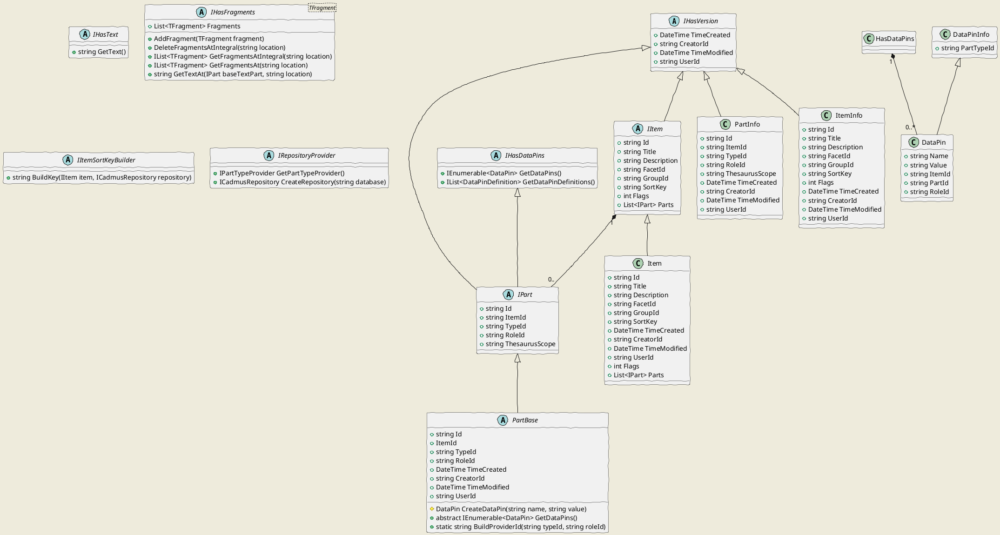

# Cadmus Core

This is the core namespace for the Cadmus system. It includes the following namespaces:

- [config](cadmus.core.config.md): components related to the system configuration.
- [layers](cadmus.core.layers.md): components related to the text layers. These are a type of parts specialized in handling metatextual data, i.e. data strictly connected to a specific portion of a base text.
- [storage](cadmus.core.storage.md): components related to the underlying storage system. These are all abstractions, virtually independent from any specific storage technology.

## Core



### A.1. General-Purpose Interfaces

A number of interfaces and classes are provided to define the attributes of their implementors.

- `IHasVersion`: implemented by objects stored with "version" information, i.e. created time and creator ID, plus last saved time and user ID. These are used for auditing and editing history.

- `IHasText`: implemented by parts which contain some sort of continuous text (e.g. a note part), which could be used as a document for text-based indexing purposes.

- `IHasDataPins`: implemented by parts exposing data pins. A data pin (`DataPin`) is just a name/value pair derived from an item's part. Most parts expose such pairs to the outer world mainly for indexing purposes. For instance, a datation part might expose a numeric value representing its content. As each part is an independent entity, with its own model, it is only the part which can know which data could be extracted from it for indexing. Thus, typically parts implement this interface. The data pin is generic enough to represent different levels of granularity: it may just be a name/value property, or a more complex entity, e.g. a semantic web triple (usually with name acting as predicate and value as object, the implicit subject being the data pin owner). Note that these pins are not stored, but calculated. The calculation is implemented in the part's own code. Of course, this does not stop us to store the snapshot results of such calculations, either elsewhere or in the same data store, should this be required for publishing purposes.

- `IHasFragments<TFragment>`: implemented by layer parts, which are collection of fragments of type `TFragment`.

- `IItemSortKeyBuilder`: used to build the item's sort key from its data. Sort keys are used to display paged (and thus ordered) lists of items in the UI. Implementors of this interface provide their own algorithm to generate a sort key given a specific item (and eventually its parts). The default implementation (`StandardItemSortKeyBuilder`) just relies on the item's title, which is normalized by flattening any whitespace to a single space, trimming the result at both ends, lowercasing all the letters and removing any diacritics from them, and keeping only letters, digits, and apostrophe. In the Cadmus profile you are free to replace this component with any other, should you need a special ordering. Whenever an item is saved, its sort key is automatically rebuilt and stored with it.

- `IRepositoryProvider`: an interface used in consumer code infrastructure to provide implementations of `ICadmusRepository` and `IPartTypeProvider`. These depend on the system's details; for instance, in the API layer they rely on static linking (as the API is targeted to a closed and ready-to-deploy Docker image), whereas in the CLI tool they rely on dynamic linking (a true "plugin" architecture).

### A.2. Tags

Every "pluggable" component, like parts or fragments, is decorated with a `TagAttribute`. This attribute has a single `Tag` value, which must be unique in the Cadmus ecosystem. This value is used to find and instantiate the component type.

To ensure uniqueness, the convention is prefixing the ID with a domain name. Also, you should use just `a-z` lowercase letters or digits, dots, and dashes. For instance, `it.vedph.categories` is the ID for the categories part.

### A.3. Data Blocks

The building blocks for the Cadmus data model are **items** and **parts**.

The item and part types are DTO interfaces and classes, essentially used to represent and transfer data between system layers, whatever the underlying data store. They correspond to database entities, at a higher abstraction level.

All the **IDs** for these blocks are client-side generated GUIDs, modeled as strings in the generic entities objects which represent the data at a higher abstraction level. These ID strings are in the conventional "dashed" format, which makes them slightly more readable, e.g. `965200f3-523a-42aa-99b1-f5cd26354e9d`.

#### A.3.1. Items

The item is what roughly corresponds to a *record* in the Cadmus database: for instance, in a collection of inscriptions it would be a single inscription; in a collection of archeological artifacts, it would be a single artifact; in a literary text document, it would be a semantically defined division in it (e.g. a poem or a paragraph); etc.

All the items have a single data model. This model is represented by the `IItem` interface. Each item has:

- an **ID**;
- a set of essential **metadata** (like title or last modified time);
- a collection of **parts**, each representing a specialized piece of data, with its own model.

Notice that, the item essentially being a data-transfer object, this does not necessarily reflect the underlying storage. In fact, *parts are stored independently of items*. Yet, at a higher level of abstraction items "contain" parts. According to the API, an `IItem` can have its parts collection filled, or just leave it empty; in both cases, this does not necessarily means that in the database the items has or has not parts; it only represents the subset of data requested by a specific API.

Among its metadata, an item also has a **sort key**, i.e. a string representing its position in a lexicographic order. This order is the default order used when retrieving items for presentation purposes, e.g. when getting a virtual page of items. As such, the sort key is algorithmically defined by an object implementing the `IItemSortKeyBuilder` interface.

Finally, an item can also have a set of 32 **flags**, whose meaning is arbitrarily defined (in the Cadmus [data profile](profiles.md)). These typically serve for specific in-house editing purposes; for instance, they might specify items marked for a revision. The flags are just bits in a 32-bits integer.

#### A.3.2. Parts

The concept of part derives from the fact that *most items share a common subset of data models*. For instance, think of a structured datation, with different levels of granularity, from day, month, and year up to centuries, and different levels of uncertainty, from a point to an interval in time (*terminus ante*, *terminus post*, between two dates, etc.). The model of a similar piece of information would be needed to be fully repeated in each item requiring to be dated, whatever its nature. Also, whenever we want to add the date to an item, we would have to change its model.

Rather, *the items model is composed by its parts*. Items contain a collection of such parts, each representing a specialized data model. This makes the abstract data model of each item totally dynamic, as far as it depends on the parts it contains.

You can think of an item as a black *box*, which can contain whatever *object* you toss into it. These objects are the parts.

This makes it possible not only to reuse data models in the context of a composable record, but also to reuse editing user interfaces in the context of a composable frontend.

A part can represent *any* type of data. If we refer to text, a part can either be *textual* (=a text), *meta-textual* (=a piece of data linked to a specific portion of a text), or *extra-textual* (=a piece of data which has no direct relationship with a text).

A part is thus the atomic data record. Each part has its own model, plus a common shape represented by the `IPart` interface, which defines a set of metadata, like the container **item ID**, the **part type ID** (an arbitrary string which uniquely identifies its type: e.g. `date` for a datation part), and eventually its **role ID**.

The role ID is used only when adding *several parts of the same type* to the same item. This happens in two cases:

- when we need *several parts of the same type*, because of the intrinsic nature of our data. For instance, two date parts may refer to the date of the original text and to that of its later copy. In this case, a role ID helps selecting the desired part from an item. The value of the role ID is an arbitrary string, as defined by content authors. It should be a very short identifier, usually a single word, like e.g. `copy`.
- when we add *text layers*. A text layer (see below under `Layers`) is a collection of data fragments linked to a specific portion of a base text. As such, the text layer is a single part type; but it may contain different types of fragments. Thus, we typically have several layer parts with different roles, one for each type of fragment: e.g. an apparatus layer and a comment layer. The role ID for layer parts always starts with the reserved `fr.` (=fragment) prefix (defined in `PartBase.FR_PREFIX`), to distinguish it from other role ID types.

The interface `IItem` is implemented by `Item`. Given that items are all created equal, as far as they share a common model, a single concrete type is enough to represent any item.

Each part instead has its own model, represented by a specific concrete type, implementing the `IPart` interface. Part implementations usually derive from a `PartBase` abstract class, which provides some common data and functionality.

See also: [adding new parts to the system](adding-parts.md).

#### A.3.3. Summary Data

Typically, the database can be queried for a single item or part, or for a set of summary information about items or parts matching some specific criteria (filters). This is the well-known "list-and-details" scenario, where the UI provides a filtered list of objects, among which users pick a single object for editing or viewing its details.

The summary information for items and parts used when browsing them is represented by classes `ItemInfo` and `PartInfo`, respectively. Currently, they represent only the essential metadata from each object. There also is a `LayerPartInfo`, a specialization of `PartInfo` used when inspecting the layers in a specific item.

#### A.3.4. Items Browsers

As this is a general-purpose UI, items are just listed in a flat table, with various filtering options. Yet, it may be the case that some databases require a more specialized items browsing experience.

For instance, consider a database representing a **documental archive**. Such archives are typically structured around a central *hierarchy*, which holds all the data in its different locations. This hierarchy can be more or less granular, thus counting a different numbers of levels.

In its maximum extent, this hierarchy would include all these standardized levels (in parentheses I add an arbitrary abbreviation used for each of these levels):

1. Super-super-archive (U1);
2. Super-archive (U2);
3. Archive (A1);
4. Sub-archive (A2);
5. Section1 (E1);
6. Section1 (E2);
7. Series (S1);
8. Sub-series (S2);
9. Sub-sub-series (S3);
10. Sub-sub-sub-series (S4);
11. File (F1);
12. Sub-file (F2);
13. Enclosure (I);
14. Document (D).

In the real world, each archive just contains some of these levels, according to its nature and to the archivists work on it. Thus, typically archive management software provide a configurable hierarchy, where a subset of this maximum hierarchy is selected and used throughout the archive.

Yet, not only the extent of this configuration is highly variable across software; it may also happen that the same archive has more than a single hierarchy. For instance, this happens when an archivist has provided one or more historical hierarchies, or any other grouping and sorting criteria, side to side with a purely descriptive hierarchy.

In this context, Cadmus is typically used as a transport data store to collect archives imported from a number of different sources, each with its own peculiarities and media, from paper to legacy databases. Thus, it adopts a very open modeling, where there is no single, data-bearing hierarchy; starting from the hierarchy chosen as the import source (often, a presentational hierarchy), *each node of its tree becomes an item*. Each semantically specialized datum inside that node becomes a *part*. Finally, the hierarchy itself is represented by a *hierarchy part*, which simply connects a parent item with a set of children items. When more than a single hierarchy is present, this just means that we will have more than a single hierarchy part for each item (with different roles).

This implies that the hierarchies which traditionally bear data are dissected into a "flat" set of items and parts. We can just browse the list of items, but it would not be very user-friendly, as archives are often modeled and always presented as hierarchical structures. So, this is a case where an additional, specialized items browser is required; we would like to browse items in a tree-shaped view, where each node can be expanded or collapsed at will, and then view or edit each item by clicking it.

To this end, we must remember that in this modeling each node is an item connected to 1 (or more) hierarchy parts. Thus, if we want to browse items in a hierarchy, we must first select the desired hierarchy, by collecting all the hierarchy parts of a specific type. Then, we must collect all the corresponding items, and present them in a tree-based view, from the root item up to the bottom leaf items.

Of course, we would not want to collect or present all these data at once, as we can have thousands of nodes. Presenting all of them at once would potentially tear down a client or even a server, and it would produce a very long, effectively useless tree.

Rather, we want to start presenting the archive from its root, and let the user walk down the tree as desired. Also, even the nodes at the same level might happen to be too many; thus, we want to combine the tree-based presentation with paging, so that each tree branch contains at maximum a specific number of nodes, representing a virtual page. To view other sibling nodes, users will have to page up or down just like in a flat list. The difference here is only that this paged list appears at each level of our tree, wherever its nodes grow beyond a predefined page size.

All this is accomplished using a specialized hierarchy-based items browser. From the standpoint of Cadmus architecture, this is a pluggable component; yet, it is not independent from the storage technology, as it happens for other modular components, like parts or fragments. This is a requirement, because such browser need to have direct access to the storage technology, to fully exploit its aggregation capabilities with a reasonable performance.

Thus, where items, parts and the like are all handled via a repository abstraction, this is not the case with items browsers. Such browsers directly connect to the database layer, so that you must implement one for each database technology.

Currently, the only database technology used for data storage is MongoDB, so that there is a MongoDB hierarchy-based items browser.

Despite this specialization, *all the item browsers implement the same interface* (`IItemBrowser`). This exposes a single `BrowseAsync` method, which gets the database name, the paging options (page number and size), and any number of additional filters. These are a generic dictionary with name/value pairs, as each browser will require its own filtering criteria.

For instance, the MongoDB-based hierarchical items browsers requires two filtering parameters: the hierarchy tag (used to select a hierarchy), and the parent item ID. This is because the browser is designed to retrieve a page of sibling items which all depend from the same parent item. Users will walk the hierarchy tree by expanding one node after the other; and whenever a node is expanded, the items browser will be invoked to retrieve a page of children nodes for it. The same will happen when paging through sibling nodes, too.

Thus, the items browser always gets paging and custom filtering options, and returns a page of information about items (`ItemInfo`). Every browser can provide additional, specific data about each item by storing it in `ItemInfo.Payload`, which is a generic object which can hold any data type.

In the case of the MongoDB hierarchy tree browser, this payload is of type `MongoHierarchyItemBrowserPayload`, including the Y and X positions in the tree, and a count of children nodes.

A factory (`ItemBrowserFactory`) is used to instantiate and configure items browsers as specified in the Cadmus [profile](profiles.md) at the `browsers` section. This includes an array of objects, each with an `id` and an eventual `options` object.

For instance, here is the configuration for the hierarchy items browser:

```json
"browsers": [
  {
    "id": "it.vedph.item-browser.mongo.hierarchy"
  }
]
```

A corresponding thesaurus in the [profile](profiles.md), with ID `item-browsers@en`, is used to provide a human-friendly list of browsers in a UI:

```json
{
  "id": "item-browsers@en",
  "entries": [
    {
      "id": "it.vedph.item-browser.mongo.hierarchy",
      "value": "items hierarchy"
    }
  ]
}
```
