# Cadmus Core

- [Cadmus Core](#cadmus-core)
  - [Storage](#storage)
    - [History](#history)

## Storage

```plantuml
@startuml
    skinparam backgroundColor #EEEBDC
    skinparam handwritten true

    abstract class IHasHistory
    IHasVersion <|-- IHasHistory
    IHasHistory : +string ReferenceId
    IHasHistory : +EditStatus Status

    VersionFilter : +string UserId
    VersionFilter : +DateTime? MinModified
    VersionFilter : +DateTime? MaxModified

    VersionFilter <|-- HistoryFilter
    HistoryFilter : +string ReferenceId
    HistoryFilter : +EditStatus? Status

    HistoryFilter <|-- HistoryItemFilter
    HistoryItemFilter : +string Title
    HistoryItemFilter : +string Description
    HistoryItemFilter : +string FacetId
    HistoryItemFilter : +string GroupId
    HistoryItemFilter : +int? Flags

    HistoryFilter <|-- HistoryPartFilter
    HistoryPartFilter : +string[] ItemIds
    HistoryPartFilter : +string TypeId
    HistoryPartFilter : +string RoleId
    HistoryPartFilter : +Tuple<string, bool>[] SortExpressions

    VersionFilter <|-- ItemFilter
    ItemFilter : +string Title
    ItemFilter : +string Description
    ItemFilter : +string FacetId
    ItemFilter : +string GroupId
    ItemFilter : +int? Flags

    VersionFilter <|-- PartFilter
    PartFilter : +string[] ItemIds
    PartFilter : +string TypeId
    PartFilter : +string RoleId
    PartFilter : +string ThesaurusScope
    PartFilter : +Tuple<string,bool>[] SortExpressions

    ThesaurusFilter <|-- PagingOptions
    ThesaurusFilter : +string Id
    ThesaurusFilter : +bool? IsAlias
    ThesaurusFilter : +string Language

    IHasVersion <|-- ItemInfo
    ItemInfo : +string Id
    ItemInfo : +string Title
    ItemInfo : +string Description
    ItemInfo : +string FacetId
    ItemInfo : +string GroupId
    ItemInfo : +string SortKey
    ItemInfo : +int Flags
    ItemInfo : +DateTime TimeCreated
    ItemInfo : +string CreatorId
    ItemInfo : +DateTime TimeModified
    ItemInfo : +string UserId

    IHasVersion <|-- PartInfo
    PartInfo : +string Id
    PartInfo : +string ItemId
    PartInfo : +string TypeId
    PartInfo : +string RoleId
    PartInfo : +DateTime TimeCreated
    PartInfo : +string CreatorId
    PartInfo : +DateTime TimeModified
    PartInfo : +string UserId

    PartInfo <|-- LayerPartInfo
    LayerPartInfo : +int FragmentCount
    LayerPartInfo : +bool IsAbsent

    IHasHistory <|-- HistoryItem
    HistoryItem : +string Id
    HistoryItem : +string Title
    HistoryItem : +string Description
    HistoryItem : +string FacetId
    HistoryItem : +string GroupId
    HistoryItem : +string SortKey
    HistoryItem : +int Flags
    HistoryItem : +DateTime TimeCreated
    HistoryItem : +string CreatorId
    HistoryItem : +DateTime TimeModified
    HistoryItem : +string UserId
    HistoryItem : +string ReferenceId
    HistoryItem : +EditStatus Status
    HistoryItem : +HistoryItem(string id, string referenceId)

    HistoryPart : +public class HistoryPart<T>
    HistoryPart : +public string Id
    HistoryPart : +public T Part
    HistoryPart : +public DateTime TimeModified
    HistoryPart : +public string UserId
    HistoryPart : +public string ReferenceId
    HistoryPart : +public EditStatus Status
    HistoryPart : +public HistoryPart(string id, T part)

    IHasHistory <|-- HistoryItemInfo
    HistoryItemInfo : +string Id
    HistoryItemInfo : +string Title
    HistoryItemInfo : +string Description
    HistoryItemInfo : +string FacetId
    HistoryItemInfo : +string GroupId
    HistoryItemInfo : +string SortKey
    HistoryItemInfo : +int Flags
    HistoryItemInfo : +DateTime TimeCreated
    HistoryItemInfo : +string CreatorId
    HistoryItemInfo : +DateTime TimeModified
    HistoryItemInfo : +string UserId
    HistoryItemInfo : +string ReferenceId
    HistoryItemInfo : +EditStatus Status
    HistoryItemInfo : +HistoryItemInfo(string id, string referenceId)

    IHasHistory <|-- HistoryPartInfo
    HistoryPartInfo : +string Id
    HistoryPartInfo : +string ItemId
    HistoryPartInfo : +string TypeId
    HistoryPartInfo : +string RoleId
    HistoryPartInfo : +DateTime TimeCreated
    HistoryPartInfo : +string CreatorId
    HistoryPartInfo : +DateTime TimeModified
    HistoryPartInfo : +string UserId
    HistoryPartInfo : +string ReferenceId
    HistoryPartInfo : +EditStatus Status

    abstract class IDatabaseManager
    IDatabaseManager : +CreateDatabase(string source, DataProfile profile)
    IDatabaseManager : +DeleteDatabase(string source)
    IDatabaseManager : +ClearDatabase(string source)
    IDatabaseManager : +bool DatabaseExists(string source)

    abstract class ICadmusRepository
    ICadmusRepository : +IList<FlagDefinition> GetFlagDefinitions()
    ICadmusRepository : +FlagDefinition GetFlagDefinition(int id)
    ICadmusRepository : +AddFlagDefinition(FlagDefinition definition)
    ICadmusRepository : +DeleteFlagDefinition(int id)
    ICadmusRepository : +IList<FacetDefinition> GetFacetDefinitions()
    ICadmusRepository : +FacetDefinition GetFacetDefinition(string id)
    ICadmusRepository : +AddFacetDefinition(FacetDefinition facet)
    ICadmusRepository : +DeleteFacetDefinition(string id)
    ICadmusRepository : +IList<string> GetThesaurusIds()
    ICadmusRepository : +DataPage<Thesaurus> GetThesauri(ThesaurusFilter filter)
    ICadmusRepository : +Thesaurus GetThesaurus(string id)
    ICadmusRepository : +AddThesaurus(Thesaurus thesaurus)
    ICadmusRepository : +DeleteThesaurus(string id)
    ICadmusRepository : +DataPage<ItemInfo> GetItems(ItemFilter filter)
    ICadmusRepository : +IItem GetItem(string id, bool includeParts = true)
    ICadmusRepository : +AddItem(IItem item, bool history = true)
    ICadmusRepository : +DeleteItem(string id, string userId, bool history = true)
    ICadmusRepository : +SetItemFlags(IList<string> ids, int flags)
    ICadmusRepository : +SetItemGroupId(IList<string> ids, string groupId)
    ICadmusRepository : +Task<DataPage<string>> GetDistinctGroupIdsAsync(PagingOptions options)
    ICadmusRepository : +Task<int> GetGroupLayersCountAsync(string groupId)
    ICadmusRepository : +DataPage<HistoryItemInfo> GetHistoryItems(HistoryItemFilter filter)
    ICadmusRepository : +HistoryItem GetHistoryItem(string id)
    ICadmusRepository : +DeleteHistoryItem(string id)
    ICadmusRepository : +DataPage<PartInfo> GetParts(PartFilter filter)
    ICadmusRepository : +IList<IPart> GetItemParts(string[] itemIds, string typeId = null, string roleId = null)
    ICadmusRepository : +List<LayerPartInfo> GetItemLayerInfo(string itemId)
    ICadmusRepository : +T GetPart<T>(string id)
    ICadmusRepository : +string GetPartContent(string id)
    ICadmusRepository : +AddPart(IPart part, bool history = true)
    ICadmusRepository : +AddPartFromContent(string content, bool history = true)
    ICadmusRepository : +DeletePart(string id, string userId, bool history = true)
    ICadmusRepository : +DataPage<HistoryPartInfo> GetHistoryParts(HistoryPartFilter filter)
    ICadmusRepository : +HistoryPart<T> GetHistoryPart<T>(string id)
    ICadmusRepository : +DeleteHistoryPart(string id)
    ICadmusRepository : +string GetPartCreatorId(string id)
    ICadmusRepository : +int GetLayerPartBreakChance(string id, int toleranceSeconds)
    ICadmusRepository : +IList<LayerHint> GetLayerPartHints(string id)
    ICadmusRepository : +string ApplyLayerPartPatches(string id, string userId, IList<string> patches)
    ICadmusRepository : +SetPartThesaurusScope(IList<string> ids, string scope)
@enduml
```

The *storage* namespace contains the components used to work with the underlying storage, like:

- **filters** for browsing items and parts (`ItemFilter`, `PartFilter`, `VersionFilter`, `HistoryItemFilter`, `HistoryPartFilter`, `ThesaurusFilter`);
- objects representing the **editing history** (`HistoryItem`, `HistoryPart`, `HistoryItemInfo`, `HistoryPartInfo`);
- a **database management** interface (`IDatabaseManager`), used to represent an admin service to create and delete databases, mainly used for testing purposes;
- a **repository** (`ICadmusRepository`), which connects any consumer code from upper layers to the lower data storage layer. The repository is the only access to data in the whole system. The implementation of this storage is found in separate packages, each related to a specific technology (e.g. MongoDB).

### History

Whenever writing data to the underlying data store, a full editing history can be activated.

As any access to the data store is mediated by the repository, any of its methods affecting the underlying data in a way which should be recorded in editing history gets a boolean `history` parameter. When this is `true`, history data will be saved.

The methods affecting history are related only to items and parts. All what refers to the database profile is excluded as configuration-related operations.

As for items and parts, creating, updating, or deleting them affects history. The only update operation which by design does not affect history is setting the flags of one or more items. This is because flags are essentially a redactional device, used to "mark" a set of items for some purpose (e.g. flag them to be revised).

Thus, there are only 4 repository methods affecting history:

- `AddItem`: adds or updates an item (not its parts).
- `DeleteItem`: deletes an item with all its parts.
- `AddPart`: adds or updates a part.
- `DeletePart`: deletes a part.

History records are just wrappers, which include a copy of the original record, plus some additional data, i.e.:

- the history record ID.
- the ID referring to the original record (reference ID).
- status: the new status of the original record: either "created", "updated", or "deleted".
- date and time of modification.
- ID of user who modified the record.
- date and time of creation.
- ID of user who created the record.

For instance, when editing items with history, this is what happens:

- if an item with the same ID *does not exist*, a new history record is added with status=created, and user ID and modification time taken from the item being stored. This way, the time refers to the creation time, and it is equal to that of the stored item. Note that this allows client code to set the items creation time, which is usually required in some scenarios, e.g. when importing a set of items in a batch. When just editing single items, the client code sets the creation time to the current time (which implicitly happens by default when creating an object with a version).

- if an item with the same ID *exists*, a new history record is added with status=updated, and user ID taken from the item being stored. The modification time instead gets automatically updated to the current time, both in the received item before storing it, and in the history item. This ensures the modification time to be correct, and reflect the actual time of the operation.

- when an item is *deleted*, a new history record is added with status=deleted, user ID received from client code, and modification time equal to the current time. This is the only case where the modification time of the operation is not in synch with that of the original record, as once deleted the original record will no more exist. Thus, deleting has the effect of creating a last, additional history record which stores the last data for the deleted record and registers its deletion. Once deleted, to get the ID of the user who edited/created the original record, and its creation or modification time, you just have to look one step behind in history: there, you will find the history record with status equal to updated or created.
