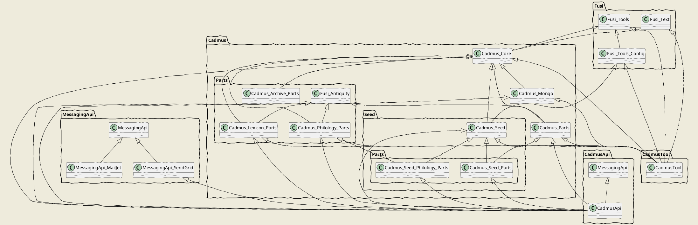

# Backend Packages

The backend is fully implemented in C# and .NET Core. Shared dependencies are packaged into NuGet packages.

We can describe Cadmus backend packages into these logical groups:

- `Fusi`: general-purpose components, preexisting the Cadmus project and created and used in several other systems. These are generic dependencies, like any other 3rd party package dependency.
- `Cadmus`: Cadmus core components.
- `Cadmus.Parts`: Cadmus parts and fragments "plugins".
- `Cadmus.Seed`: Cadmus core components for seeding mock data.
- `Cadmus.Seed.Parts`: Cadmus parts and fragments seeders "plugins".
- `Messaging.Api`: messaging-related tools for API layers. This is used to compose and send email messages, through various SMTP services. API layers use this to message users (e.g. confirm registration, reset password, etc.).
- `CadmusTool`: the CLI tool for Cadmus.
- `CadmusApi`: the Cadmus API layer.

## NuGet Dependencies

According to the above overview, these are the NuGet dependencies for Cadmus:

- `DiffMatchPatch`: the Google library for diffing.
- `Fusi.Tools`: general purpose components.
- `Fusi.Tools.Config`: configuration components.
- `Fusi.Text`: Unicode related components.
- `Fusi.Antiquity`: Classical antiquities components.
- `Fusi.Microsoft.Extensions.Configuration.InMemoryJson`: an in-memory JSON source for Microsoft configuration.
- `MessagingApi`: messaging API models and services.

Cadmus-specific:

- `Cadmus.Core`
- `Cadmus.Index`
- `Cadmus.Index.Sql`
- `Cadmus.Mongo`
- `Cadmus.Parts`
- `Cadmus.Philology.Parts`
- `Cadmus.Seed`
- `Cadmus.Seed.Parts`
- `Cadmus.Seed.Philology.Parts`
- `Cadmus.Archive.Parts`
- `Cadmus.Lexicon.Parts`
