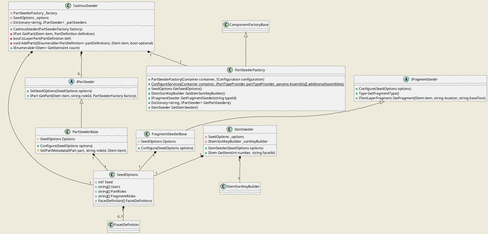

# Seeding

- [Seeding](#seeding)
  - [Cadmus.Seed Overview](#cadmusseed-overview)
  - [Configuration](#configuration)
  - [Seeder Factory](#seeder-factory)
  - [Items](#items)
  - [Parts](#parts)
  - [Fragments](#fragments)
  - [Seeder](#seeder)
  - [Seed Usage](#seed-usage)

Cadmus provides an infrastructure for seeding a database with mock data.

The core assembly for the infrastructure is `Cadmus.Seed`; then, each part/fragments assembly can have a corresponding seed assembly, conventionally named after it by adding a `.Seed` suffix.

Seeding data essentially means providing items, parts, and eventually fragments (in layer parts).

## Cadmus.Seed Overview



## Configuration

All the seeders rely on a shared configuration. This is consumed by a factory (`PartSeederFactory`) to build and configure the required seeder objects.

A factory requires the usual MS configuration infrastructure, as used e.g. in ASP.NET Core (`Microsoft.Extensions.Configuration.IConfiguration`), and an injection container (`SimpleInjector.Container`). It then uses the configuration to create objects via the container.

The configuration can have multiple sources, or just one like in this sample code, where the unique source is a JSON file named `profile.json`:

```cs
IConfigurationBuilder builder = new ConfigurationBuilder()
    .SetBasePath(dir)
    .AddJsonFile("profile.json", optional: false, reloadOnChange: false);
IConfiguration config = builder.Build();
```

As for the container, you just create one, and configure it via the seeder factory method `ConfigureServices`; this configures all the essential dependencies, plus those found in any additional assemblies you pass to it. You should pass all the assemblies containing the parts you want to use.

The seed configuration represents an extension of the regular Cadmus data profile, which defines 3 sections for `facets`, `flags`, and `thesauri`. The seed configuration requires the `facets` section, which should include at least 1 facet and contain all the definitions for the parts you want to seed. Besides these sections, a `seed` section is added, which includes:

- general options for the seed task (`options`).
- part seeders (`partSeeders`): one for each part type you want to seed.
- fragment seeders (`fragmentSeeders`): one for each fragment you want to seed.

A JSON template for the seeder configuration follows:

```json
{
  "facets": [
    {
      "typeId": "it.vedph.categories",
      "name": "categories",
      "description": "Item's categories.",
      "isRequired": true,
      "colorKey": "98F8F8",
      "groupKey": "general",
      "sortKey": "categories"
    },
    {
      "typeId": "it.vedph.historical-date",
      "name": "date",
      "description": "Historical date.",
      "isRequired": false,
      "colorKey": "F898F8",
      "groupKey": "general",
      "sortKey": "date"
    },
    {
      "typeId": "it.vedph.keywords",
      "name": "keywords",
      "description": "Item's keywords.",
      "colorKey": "90C0F8",
      "groupKey": "general",
      "sortKey": "keywords"
    },
    {
      "typeId": "it.vedph.note",
      "name": "note",
      "description": "A free text note about the document.",
      "colorKey": "B0A0F8",
      "groupKey": "general",
      "sortKey": "note"
    },
    {
      "typeId": "it.vedph.token-text",
      "name": "text",
      "description": "Item's token-based text.",
      "colorKey": "31AB54",
      "groupKey": "text",
      "sortKey": "text"
    },
    {
      "typeId": "it.vedph.token-text-layer",
      "roleId": "fr.it.vedph.comment",
      "name": "comments",
      "description": "Comments on text.",
      "colorKey": "F8D040",
      "groupKey": "text",
      "sortKey": "text-comments"
    }
  ],
  "seed": {
    "options": {
      "seed": 1,
      "users": ["zeus"],
      "partRoles": [],
      "fragmentRoles": []
    },
    "partSeeders": [
      {
        "id": "seed.it.vedph.categories",
        "options": {
          "maxCategoriesPerItem": 3,
          "categories": [
            "language.phonology",
            "language.morphology",
            "language.syntax",
            "literature",
            "geography"
          ]
        }
      },
      {
        "id": "seed.it.vedph.historical-date"
      },
      {
        "id": "seed.it.vedph.keywords",
        "options": {
          "languages": ["eng", "deu", "ita", "fra", "spa"]
        }
      },
      {
        "id": "seed.it.vedph.note",
        "options": {
          "tags": ["language", "history", "geography"]
        }
      },
      {
        "id": "seed.it.vedph.token-text"
      }
    ],
    "fragmentSeeders": [
      {
        "id": "seed.fr.it.vedph.comment",
        "options": {
          "tags": ["language", "history", "geography"]
        }
      }
    ]
  }
}
```

The main sections are:

- `facets`: the facets definitions, as in the Cadmus data profile.
- `seed/options`: this includes:
  - an optional `seed` value to seed the randomizer (set it to get repeatable results);
  - a set of user names (`users`) to pick from;
  - optional part/fragment role IDs sets (`partRoles`, `fragmentRoles`), used when you want to assign non-null roles.
- `itemSortKeyBuilder`: the optional item sort key builder. If not specified, the default is `StandardItemSortKeyBuilder`.
- `partSeeders`: an array of part seeders, one for each part type in the part definitions. Each seeder has an `id` (which must be equal to the value of the `TagAttribute` decorating the part seeder), and eventual `options` (with a free schema).
- `fragmentSeeders`: an array of fragment seeders, one for each fragment type in the layer part definitions. Each seeder has an `id` (which must be equal to the value of the `TagAttribute` decorating the fragment seeder) and eventual `options` (with a free schema).

## Seeder Factory

The configuration feeds a seeder factory (`PartSeederFactory`), which is used to get configured instances of:

- `SeedOptions`.
- `IItemSortKeyBuilder` (optional).
- `ItemSeeder`.
- dictionary of `IPartSeeder`'s, where key=part type ID and value=seeder.
- a specific `IFragmentSeeder`.

## Items

As for **items**, we handle a fixed schema, so a unique item seeder (`ItemSeeder`) is used.

The only variable data is represented here by the item's _sort key_, which can be built using any implementation of `IItemSortKeyBuilder`.

By default, the item seeder uses the `StandardItemSortKeyBuilder`, which just relies on the item's title.

You can override this key by specifying another item sort key builder in the seeder configuration. In this case, this builder gets called after all the parts have been added to the items being created. This allows the sort key builder to access data from all the item's parts.

_Note_: item sort key builders requiring access to item's parts must first look for parts in the received item object; if not set, it can use the received repository (if any) to retrieve them from the database. In the case of seeders, the item received by the builder always has all its parts.

## Parts

As each part has its own schema, each part also has its own seeder. Each part seeder implements the `IPartSeeder` interface (usually via a `PartSeederBase` parent class), which has two methods:

- `Configure`: configure the seeder with the seed options. These come from the `seedOptions` section of the configuration.
- `GetPart`: get the seeded part.

Also, each part seeder has a `TagAttribute` whose value is equal to the corresponding part's type ID, prefixed by `seed.`. For instance, the seeder ID for the part type ID `it.vedph.categories` is `seed.it.vedph.categories`.

Part seeders requiring parameters can have them specified in the `options` property in the configuration. This property has a free schema, fit to each seeder's task and part. Note that if required options are not supplied, or are invalid, the seeder will return `null` and thus no part will be added.

## Fragments

As for parts, each fragment type has its own seeder. The part seeder for the text layer part (`TextLayerPart<T>`) uses the seeder factory to get the seeder required for its layer type; it then seeds the layer with a variable number of fragments, referring to the base text part (`TokenTextPart`) for their coordinates. If such a part is missing from the item, no layer will be seeded.

The layer type is defined by the layer part's role ID, which is equal to the fragment's type ID (minus its eventual role, which when present follows it after a colon).

For instance, consider these part's IDs:

- `typeId`: `it.vedph.token-text-layer`
- `roleId`: `fr.it.vedph.comment`

This is a text layer part for comment fragments. The comment fragment ID is given by the `roleId`. Should this have a role, like e.g. `fr.it.vedph.comment:scholarly`, the role and its colon prefix would be ignored for the sake of instantiating the seeder.

Fragment seeders requiring parameters can have them specified in the `options` property in the configuration. This property has a free schema, fit to each seeder's task and fragment. Note that if required options are not supplied, or are invalid, the seeder will return `null`, and thus no fragment will be added.

## Seeder

All these pieces converge into the Cadmus seeder (`CadmusSeeder`). This is constructed with a seeder factory (`PartSeederFactory`), and provides a `GetItems` method, which gets the desired number of items and outputs all the requested items with their parts.

## Seed Usage

In the API layer, the seed infrastructure is used at startup. As the system is designed for dockerization, the provided API layer must be capable of creating and seeding all the databases it requires from the database layer. This way, we can just fire up the API layer, and let it create the required databases if not found.

These databases are 3:

- _authentication_ database: for authenticating users and defining their authorizations.
- _log_ database: for logging and auditing.
- _Cadmus_ database: for storing Cadmus data.

When the API layer starts, it checks for the existence of these databases. If they don't exist, they get created, and seeded according to these parameters:

- the authentication database is seeded with 1 or more default users. These are defined in the API configuration file (`appsettings.json`), under `StockUsers`. Note that the credentials you may find in these files are just mock values; in production, they get replaced with values coming from environment variables.
- the log database does not require seeding.
- the Cadmus database is seeded with the various collections and their indexes. If specified, a number of mock items with their parts are also created and seeded. To specify this option, you must add a `Seed` section with a `ProfilePath` and an `ItemCount` property. The former specifies the path to the JSON file containing the seed profile. The latter specifies the count of items desired. If 0, or in any case if the database was not created on startup, no item will be seeded.

To allow for some resiliency at startup, the database check and seed procedure described above is retried up to 3 times, after an increasing interval of time (10, 30, and then 60 seconds). This allows Docker composer starting all the services, including the MongoDB service, even if their start time is not synchronized. The API layer might spin up before the data layer is ready, but we don't want it to crash immediately in this case; rather, it should wait and retry.
