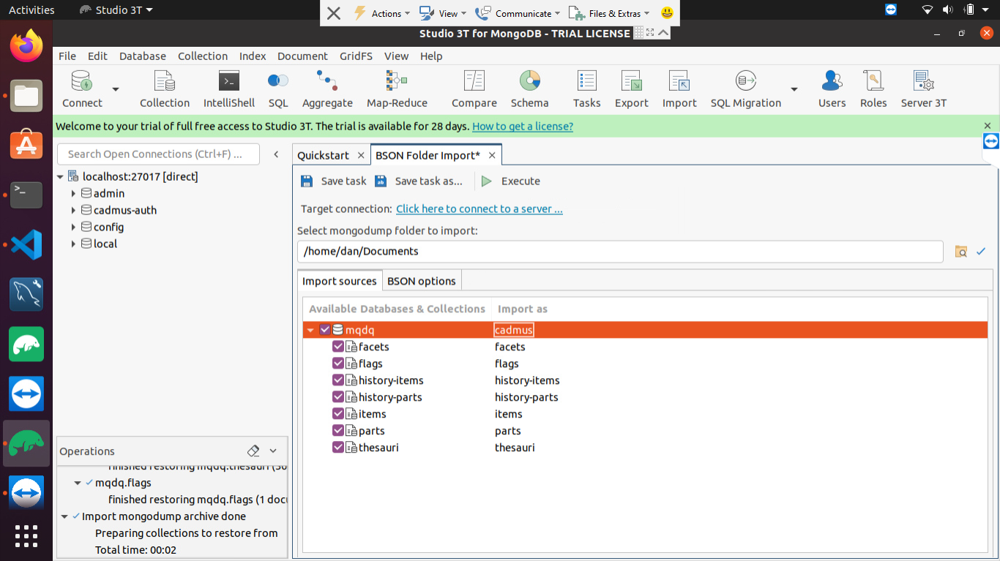
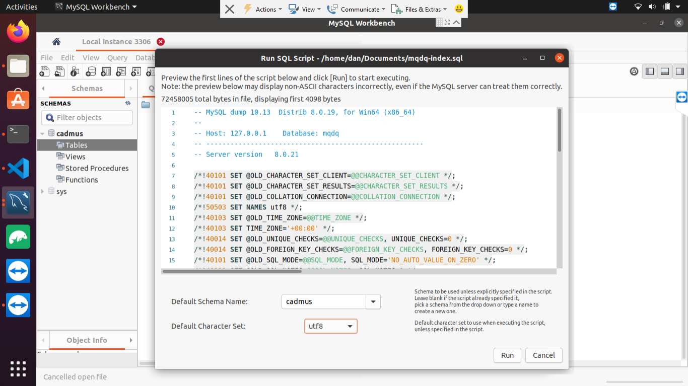

# Using MQDQ in Cadmus

Here you find a procedure for installing MQDQ database for testing in a dockerized Cadmus stack.

## Preparation

1. export the MQDQ database as a Mongodump BSON _folder_, with compressed files. Name it `mqdq` just for reference. If you have an `.agz` file to start with, this is a compressed BSON dump. The easiest way to get the format you need is importing it in Studio3T, and re-exporting it as a BSON folder. Then you will be able to use that exported folder as the import source.

2. export the MySql index database as a single SQL file, e.g. using MySql Workbench.

3. copy the exported MongoDB dump folder and MySql dump file to the target machine.

## Procedure

In the target machine you should have installed [Studio 3T](https://studio3t.com/download/) and [MySql Workbench](https://dev.mysql.com/downloads/workbench/). The following procedure refers to these two client applications, but of course other clients might be used instead.

### MongoDB (Data)

1. open a terminal where the `docker-compose.yml` script for Cadmus web is located.

2. run `docker-compose up` to start the container.

3. launch Studio3T and connect to <localhost:27017>.

4. delete the `cadmus` database. This is the mock database created by the API on startup, so you are not losing anything.

5. from `Import` pick `BSON - mongodump folder` (mind _folder_ here!); pick the target connection (click the `Click here to connect to a server...` message) as <localhost:27017>, then choose the folder with the MongoDB dump. Once chosen, in `Import as` type `cadmus`, instead of the folder's name (`mqdq` or whatever you called it): this means that you will restore the MQDQ database by naming it as `cadmus`. All the collections should be checked for import, as per default settings. Finally, click `Execute`.



6. at the left, refresh the databases list to check if `cadmus` is now present.

### MySql (Index)

1. ensure that you have MySql client software installed. This not only includes MySql Workbench, but also command line tools like `mysqldump`.

In Linux, `mysqldump` is part of the package named `mysql-client`, and can be installed with:

```bash
sudo apt-get install mysql-client
```

Usually, `mysqldump` gets installed in `usr/bin`. You can find it by using a command like `find . -name "mysqldump*" 2>/dev/null`.

For Mac, refer to [this post](https://stackoverflow.com/questions/47380458/is-it-possible-to-install-only-mysqldump-on-macos).

2. launch MySql Workbench.
3. delete the `cadmus` database.
4. create a new database named `cadmus` by executing this query:

```sql
CREATE SCHEMA `cadmus` DEFAULT CHARACTER SET utf8 ;
```

5. ensure to select cadmus as the default database (it should be displayed in bold).
6. from `File` pick `Run SQL script...` and select the MySql dump file you copied into your target machine. Enter or pick `cadmus` as the target schema, and `utf8` as its character set, then run the script.



7. check that the `cadmus` database has tables `item` and `pin` with some data.

8. browse to <localhost:4200>. You should find the MQDQ database.
