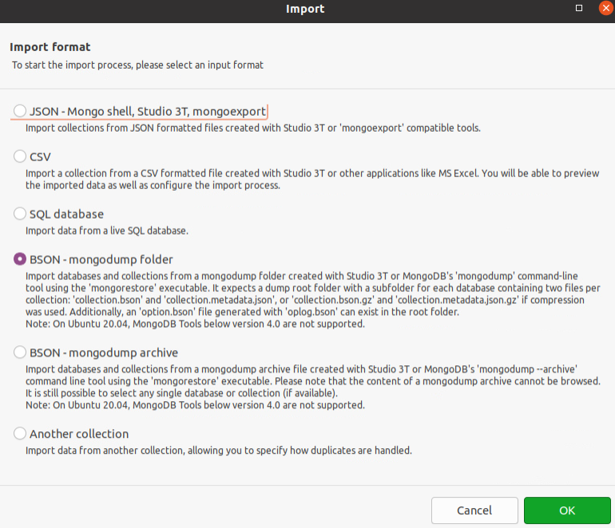
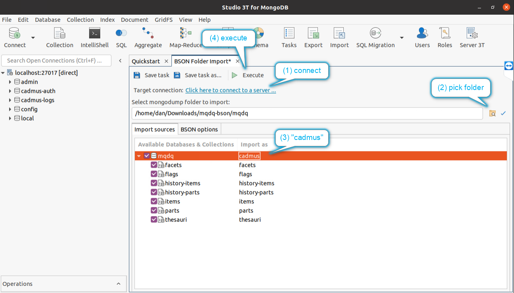
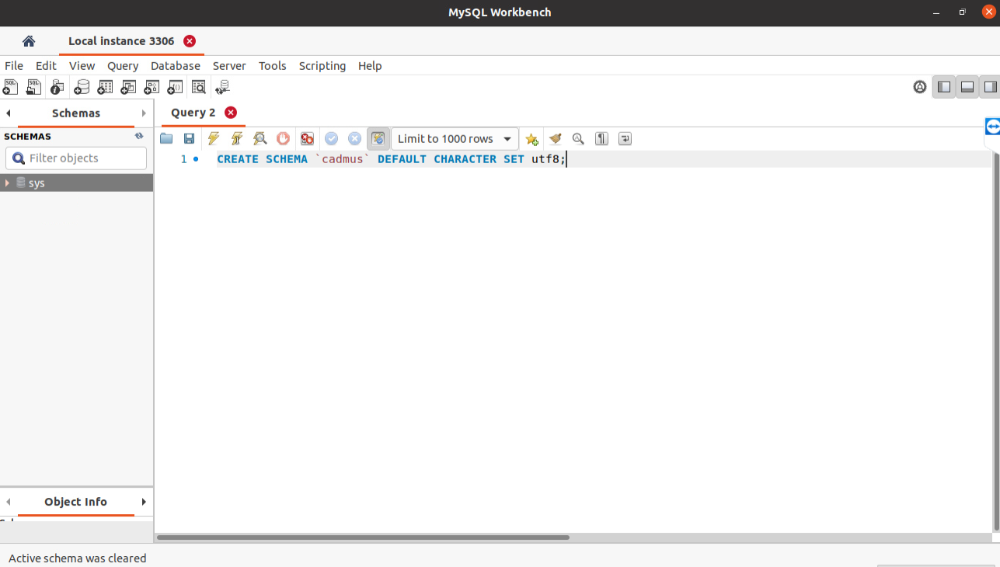
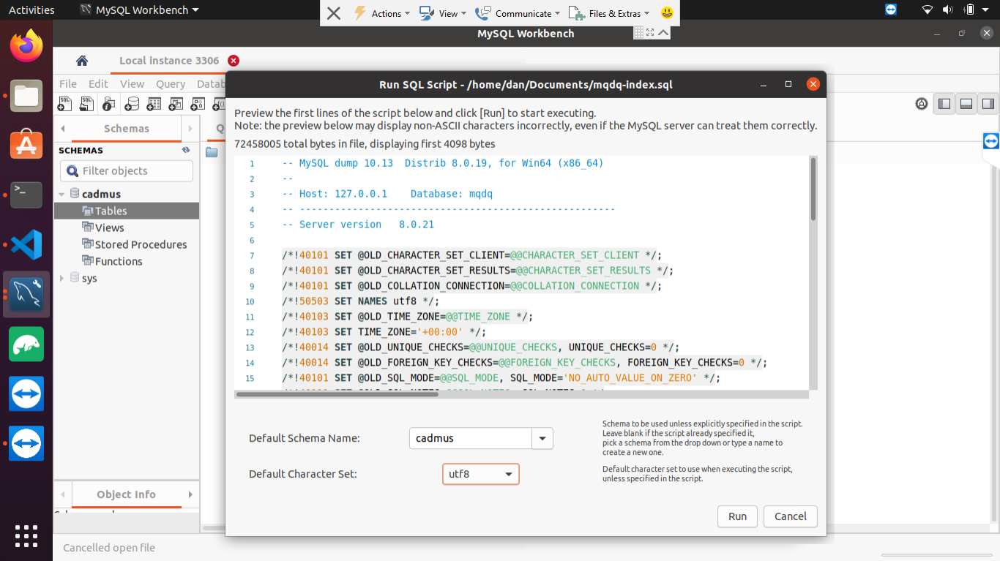

# Using MQDQ in Cadmus

- [Using MQDQ in Cadmus](#using-mqdq-in-cadmus)
  - [Explanation](#explanation)
  - [Preparation](#preparation)
  - [Procedure](#procedure)
    - [MongoDB (Data)](#mongodb-data)
    - [MySql (Index)](#mysql-index)

Here you find a procedure for installing MQDQ database for testing in a dockerized Cadmus stack.

To setup the Cadmus MQDQ editor itself, please [see here](docker-usage.md).

Note: for MQDQ, the Cadmus frontend `docker-compose.yml` file is [here](https://github.com/vedph/cadmus_mqdq_app/blob/master/docker-compose.yml).

## Explanation

Cadmus works with 2 databases for each project: one (MongoDB) contains the data; another (MySql) contains its index for the real-time search inside the editor.

When starting Cadmus without these databases, it automatically creates them, and seeds them with mock data to allow you experimenting with the editor. In our scenario, we want to replace these mock data with the real data as imported from TEI.

To this end, we must first start the Cadmus Docker container, so that data services are up and running. Then, we can connect to MongoDB and MySql to replace the corresponding databases. Once this is done, opening the Cadmus application will browse the real MQDQ data, rather than the mock data.

## Preparation

This preparation is performed by the developer and is listed here only for completeness:

1. export the MQDQ database as a Mongodump BSON _folder_, with compressed files. Name it `mqdq` just for reference. If you have an `.agz` file to start with, this is a _compressed_ BSON dump. The easiest way to get the format you need is importing it in Studio3T, and re-exporting it as a _BSON folder_. Then you will be able to use that exported folder as the import source.

2. export the MySql index database as a single SQL file, e.g. using MySql Workbench.

3. copy the exported MongoDB dump folder and MySql dump file to the target machine.

## Procedure

In the target machine you should have installed [Studio 3T](https://studio3t.com/download/) and [MySql Workbench](https://dev.mysql.com/downloads/workbench/). The following procedure refers to these two client applications; but of course other clients might be used instead.

### MongoDB (Data)

1. open a terminal where the `docker-compose.yml` script for Cadmus web is located.

2. run `docker-compose up` to start the container.

3. launch Studio3T and connect to <localhost:27017>.

4. delete the `cadmus` database. This is the mock database created by the API on startup, so you are not losing anything.

5. from `Import` pick `BSON - mongodump folder` (mind _folder_ here!)



6. pick the target connection (click the `Click here to connect to a server...` message) as <localhost:27017>, then choose the folder with the MongoDB dump. Note that this must not be the folder containing the `.gz` collections files, which should have the database name -`mqdq`-, but the folder _containing_ it; as you can see from the screenshot, in my example I selected the `Documents` folder, which in turn includes the `mqdq` folder with the `gz` files. Once chosen, in `Import as` type `cadmus`, instead of the folder's name (`mqdq` or whatever you called it): this means that you will restore the MQDQ database by naming it as `cadmus`. All the collections should be checked for import, as per default settings. Finally, click `Execute`.



7. in the left pane, refresh the databases list to check if `cadmus` is now present.

### MySql (Index)

1. ensure that you have MySql client software installed. This not only includes MySql Workbench, but also command line tools like `mysqldump`.

In Linux, `mysqldump` is part of the package named `mysql-client`, and can be installed with:

```bash
sudo apt-get install mysql-client
```

Usually, `mysqldump` gets installed in `usr/bin`. You can find it by using a command like `find . -name "mysqldump*" 2>/dev/null`.

For Mac, refer to [this post](https://stackoverflow.com/questions/47380458/is-it-possible-to-install-only-mysqldump-on-macos).

2. launch MySql Workbench.

3. delete the `cadmus` database (right click on it and pick `Drop schema`).

4. create a new database named `cadmus` by executing this query:

```sql
CREATE SCHEMA `cadmus` DEFAULT CHARACTER SET utf8;
```

You can execute the query by clicking the thunderbolt button in the query toolbar (=the 3rd button from the left in the row).



After executing this, you should refresh the `Schemas` view (right click it and select `Refresh all`) to see `cadmus` appear in the list.

5. ensure to select `cadmus` as the default database (it should be displayed in bold). Double-clicking it should do this.

6. from `File` pick `Run SQL script...` and select the MySql dump file you copied into your target machine. Enter or pick `cadmus` as the target schema, and `utf8` as its character set, then run the script.



7. check in the `Schemas` view that the `cadmus` database has tables `item` and `pin` with some data (a refresh is needed, as above).

8. browse to <localhost:4200>. You should find the MQDQ database.
