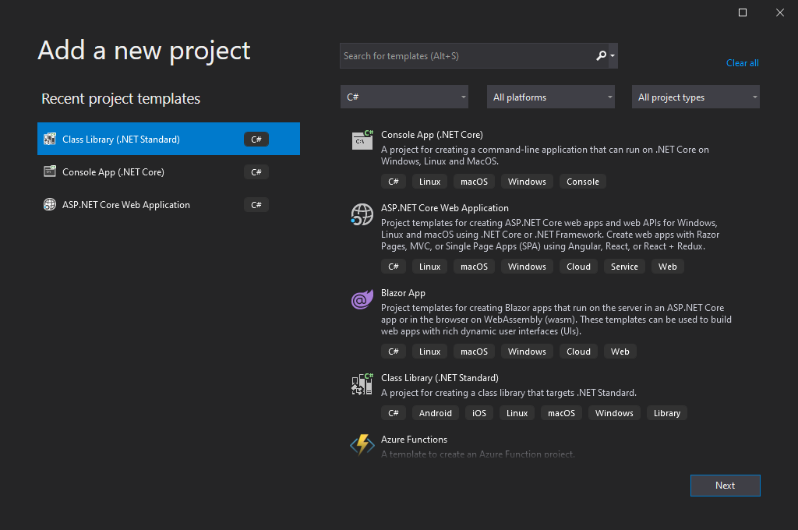
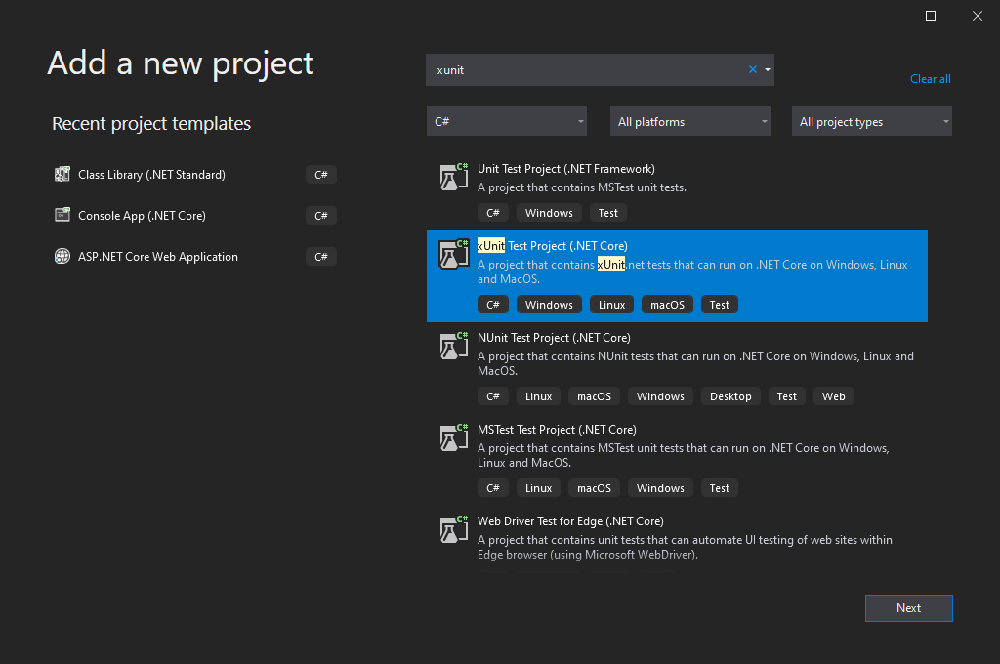
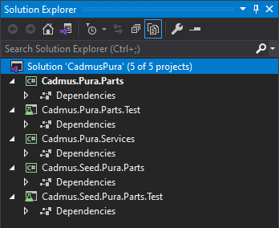
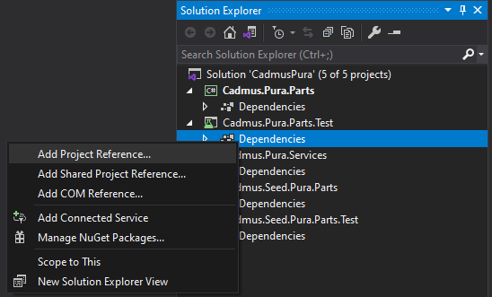
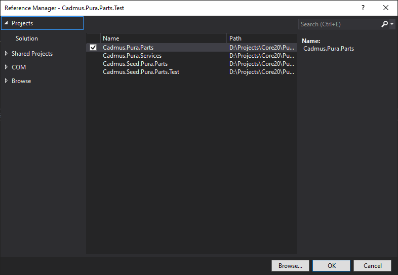

# Backend Models

- [Backend Models](#backend-models)
  - [Requirements](#requirements)
  - [Creating Solution](#creating-solution)
  - [Adding Parts or Fragments](#adding-parts-or-fragments)

The backend is a set of C# libraries, built with VS. This step is required only if you have new data models (parts or fragments) specific to your project.

The following procedure will:

- create a new Visual Studio solution for the backend components (business layer).
- add to it a library for parts/fragments (if required), another library for their mock data seeders, and a third library for API services. Also, each model-related library will have its unit tests library.

## Requirements

- Visual Studio Community Edition or higher.

## Creating Solution

1. launch VS and create a new _blank solution_ named `Cadmus<PRJ>`.

2. add to this solution a _C# .NET Standard class library_, named `Cadmus.<PRJ>.Parts`. This will hold parts and fragments specific to your projects. Usually a single library is enough, but you are free to distribute components across several libraries should you need more granularity for their reuse. Once created, delete the empty `Class1.cs` file from it.

3. add another _C# .NET Standard class library_ named `Cadmus.Seed.<PRJ>.Parts` to provide the mock data seeders for your components. This is not strictly a requirement, but it's suggested to let you play with the editor while building it. Once created, delete the empty `Class1.cs` file from it.

4. add another _C# .NET Standard class library_ named `Cadmus.<PRJ>.Services` to provide some API services to plug into your API. Once created, delete the empty `Class1.cs` file from it.

5. add a _XUnit Test Project_ named `Cadmus.<PRJ>.Parts.Test` to contain the tests for the `Cadmus.<PRJ>.Parts` library. Alternatively, any other unit test framework can be used; this just reflects my preferences, and is suggested as the test templates I provide use XUnit. Once created, delete the empty `UnitTest1.cs` class.

6. add a _XUnit Test Project_ named `Cadmus.Seed.<PRJ>.Parts.Test` to contain the tests for the `Cadmus.Seed.<PRJ>.Parts` library. Alternatively, any other unit test framework can be used; this just reflects my preferences, and is suggested as the test templates I provide use XUnit. Once created, delete the empty `UnitTest1.cs` class.

Your solution should now look like this (here `<PRJ>` is `Pura`):

7. for both the test projects created above (5-6), add a reference to their test target library. This can be done by right clicking the `Dependencies` node under the test project, selecting `Add Project Reference` from the popup menu, and checking the target project in the list which appears. Finally close the dialog with `OK`.

## Adding Parts or Fragments

You can now add as many parts and fragments as required to the `Cadmus.<PRJ>.Parts` project.

This essentially means adding a plain C# class for each part or fragment, representing its data model. Please refer to these pages for details:

- [adding parts](../core/adding-parts.md)
- [adding fragments](../core/adding-fragments.md)

TODO: complete
