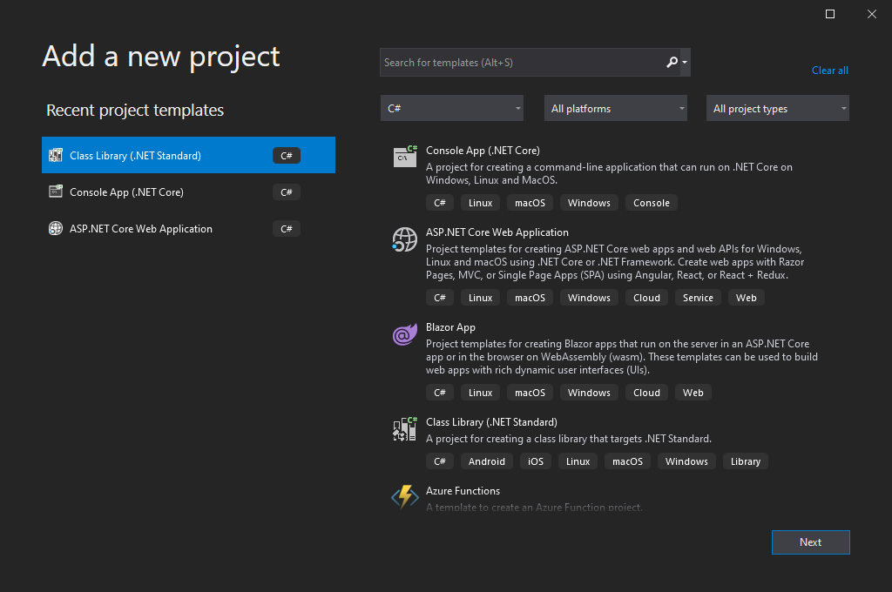

# Core

- [Core](#core)
  - [Requirements](#requirements)
  - [Creating Solution](#creating-solution)
  - [Adding Parts or Fragments](#adding-parts-or-fragments)
  - [Adding Part or Fragment Seeders](#adding-part-or-fragment-seeders)
  - [Adding Tests for Parts or Fragments](#adding-tests-for-parts-or-fragments)
  - [Adding Tests for Part or Fragment Seeders](#adding-tests-for-part-or-fragment-seeders)
  - [Adding Services](#adding-services)
  - [Publishing Packages](#publishing-packages)

The backend is a set of C# libraries, built with VS. This step is required only if you have new data models (parts or fragments) specific to your project.

The following procedure will:

- create a new Visual Studio solution for the backend components (business layer).
- add to it a library for parts/fragments (if required), another library for their mock data seeders, and a third library for API services. Also, each model-related library will have its unit tests library.

## Requirements

- Visual Studio Community Edition or higher.

## Creating Solution

1. launch VS and create a new _blank solution_ named `Cadmus<PRJ>`.

2. add to this solution a _C# .NET Standard class library_, named `Cadmus.<PRJ>.Parts`. This will hold parts and fragments specific to your projects. Usually a single library is enough, but you are free to distribute components across several libraries should you need more granularity for their reuse. Once created, delete the empty `Class1.cs` file from it.




3. add another _C# .NET Standard class library_ named `Cadmus.Seed.<PRJ>.Parts` to provide the mock data seeders for your components. This is not strictly a requirement, but it's suggested to let you play with the editor while building it. Once created, delete the empty `Class1.cs` file from it.

4. add another _C# .NET Standard class library_ named `Cadmus.<PRJ>.Services` to provide some API services to plug into your API. Once created, delete the empty `Class1.cs` file from it.

5. add a _XUnit Test Project_ named `Cadmus.<PRJ>.Parts.Test` to contain the tests for the `Cadmus.<PRJ>.Parts` library. Alternatively, any other unit test framework can be used; this just reflects my preferences, and is suggested as the test templates I provide use XUnit. Once created, delete the empty `UnitTest1.cs` class.


6. add a _XUnit Test Project_ named `Cadmus.Seed.<PRJ>.Parts.Test` to contain the tests for the `Cadmus.Seed.<PRJ>.Parts` library. Alternatively, any other unit test framework can be used; this just reflects my preferences, and is suggested as the test templates I provide use XUnit. Once created, delete the empty `UnitTest1.cs` class.

Your solution should now look like this (here `<PRJ>` is `Pura`):


7. add references across projects in the solution, according to this schema:

- Cadmus.PRJ.Parts.Test depends on:
  - Cadmus.PRJ.Parts
  - Cadmus.Seed.PRJ.Parts
- Cadmus.PRJ.Services depends on:
  - Cadmus.PRJ.Parts
  - Cadmus.Seed.PRJ.Parts
- Cadmus.Seed.PRJ.Parts depends on:
  - Cadmus.PRJ.Parts
- Cadmus.Seed.PRJ.Parts.Test depends on:
  - Cadmus.Seed.PRJ.Parts

Adding a project reference can be done by right clicking the `Dependencies` node under the test project, selecting `Add Project Reference` from the popup menu, and checking the target project in the list which appears. Finally close the dialog with `OK`.


Alternatively, just edit the `csproj` XML file and add a line in an `ItemGroup` element like in this sample (replace the path with the correct one):

```xml
<ItemGroup>
  <ProjectReference Include="..\Cadmus.Pura.Parts\Cadmus.Pura.Parts.csproj" />
</ItemGroup>
```

## Adding Parts or Fragments

You can now add as many parts and fragments as required to the `Cadmus.<PRJ>.Parts` project.

1. add a reference to the Cadmus core components to this project. This can be done in the VS UI, by adding a new NuGet package named `Cadmus.Core`, or by editing the `csproj` project XML file, and adding this line under an `<ItemGroup>` element (replace the version number with the latest available version):

```xml
<ItemGroup>
  <PackageReference Include="Cadmus.Core" Version="2.3.5" />
</ItemGroup>
```

Should you need existing components to build your own (e.g. to extend or integrate them), add their packages in the imports too.

2. add a plain C# class for each part or fragment, representing its data model. Please refer to these pages for details:

- [adding parts](./adding-parts.md)
- [adding fragments](./adding-fragments.md)

## Adding Part or Fragment Seeders

For each part or fragment you should provide a corresponding mock data seeder to the `Cadmus.Seed.<PRJ>.Parts` project. This is extremely useful to let developers and users play with the editor.

1. add a reference to the Cadmus core seed components to this project, as explained above. Also, a reference to the `Bogus` package is useful to leverage the power of this library rather than creating mock data from scratch. The package references are listed below (replace the version number with the latest available version):

```xml
<ItemGroup>
  <PackageReference Include="Bogus" Version="32.1.1" />
  <PackageReference Include="Cadmus.Core" Version="2.3.5" />
  <PackageReference Include="Cadmus.Seed" Version="1.1.7" />
</ItemGroup>
```

2. add a plain C# class for each part or fragment seeder. Please refer to these pages for details:

- [adding parts](../adding-parts.md)
- [adding fragments](../adding-fragments.md)

## Adding Tests for Parts or Fragments

For each part or fragment you should provide a corresponding set of unit tests.

Please refer to this set of [templates](../adding-parts.md#test-templates) for the tests.

## Adding Tests for Part or Fragment Seeders

For each part or fragment seeder you should provide a corresponding set of unit tests.

Please refer to this set of [templates](../adding-parts.md#adding-tests-for-part-or-fragment-seeders) for the seeder tests.

## Adding Services

1. add these packages to the services project (updating version numbers as required):

```xml
<ItemGroup>
  <PackageReference Include="Cadmus.Core" Version="2.3.5" />
  <PackageReference Include="Cadmus.Index.Sql" Version="1.1.8" />
  <PackageReference Include="Cadmus.Mongo" Version="2.3.8" />
  <PackageReference Include="Cadmus.Parts" Version="2.3.8" />
  <PackageReference Include="Cadmus.Philology.Parts" Version="2.3.6" />
  <PackageReference Include="Cadmus.Seed.Parts" Version="1.1.10" />
  <PackageReference Include="Cadmus.Seed.Philology.Parts" Version="1.1.8" />
  <PackageReference Include="Fusi.Microsoft.Extensions.Configuration.InMemoryJson" Version="1.0.3" />
</ItemGroup>
```

2. add a `<PRJ>RepositoryProvider` class, using this template (the only part which requires customization is the constructor):

```cs
using System;
using System.Reflection;
using Cadmus.Core;
using Cadmus.Core.Config;
using Cadmus.Core.Storage;
using Cadmus.Mongo;
using Cadmus.Parts.General;
using Cadmus.Philology.Parts.Layers;
using Cadmus.__PRJ__.Parts;
using Microsoft.Extensions.Configuration;
using IConfiguration = Microsoft.Extensions.Configuration.IConfiguration;

namespace Cadmus.__PRJ__.Services
{
    /// <summary>
    /// Cadmus __PRJ__ repository provider.
    /// </summary>
    /// <seealso cref="IRepositoryProvider" />
    public sealed class __PRJ__RepositoryProvider : IRepositoryProvider
    {
        private readonly IConfiguration _configuration;
        private readonly TagAttributeToTypeMap _map;
        private readonly IPartTypeProvider _partTypeProvider;

        /// <summary>
        /// Initializes a new instance of the <see cref="StandardRepositoryProvider"/>
        /// class.
        /// </summary>
        /// <param name="configuration">The configuration.</param>
        /// <exception cref="ArgumentNullException">configuration</exception>
        public __PRJ__RepositoryProvider(IConfiguration configuration)
        {
            _configuration = configuration ??
                throw new ArgumentNullException(nameof(configuration));

            _map = new TagAttributeToTypeMap();
            _map.Add(new[]
            {
                // TODO: include here all the assemblies required by your prj
                // Cadmus.Parts
                typeof(NotePart).GetTypeInfo().Assembly,
                // Cadmus.Philology.Parts
                typeof(ApparatusLayerFragment).GetTypeInfo().Assembly,
                // Cadmus.Tgr.Parts
                typeof(MsUnit).GetTypeInfo().Assembly,
                // Cadmus.__PRJ__.Parts
                typeof(WordFormsPart).GetTypeInfo().Assembly,
            });

            _partTypeProvider = new StandardPartTypeProvider(_map);
        }

        /// <summary>
        /// Gets the part type provider.
        /// </summary>
        /// <returns>part type provider</returns>
        public IPartTypeProvider GetPartTypeProvider()
        {
            return _partTypeProvider;
        }

        /// <summary>
        /// Creates a Cadmus repository.
        /// </summary>
        /// <param name="database">The database name.</param>
        /// <returns>repository</returns>
        /// <exception cref="ArgumentNullException">null database</exception>
        public ICadmusRepository CreateRepository(string database)
        {
            if (database == null)
                throw new ArgumentNullException(nameof(database));

            // create the repository (no need to use container here)
            MongoCadmusRepository repository =
                new MongoCadmusRepository(
                    _partTypeProvider,
                    new StandardItemSortKeyBuilder());

            repository.Configure(new MongoCadmusRepositoryOptions
            {
                ConnectionString = string.Format(
                    _configuration.GetConnectionString("Default"), database)
            });

            return repository;
        }
    }
}
```

3. add a `<PRJ>PartSeederFactoryProvider` class, following this template:

```cs
using Cadmus.Core.Config;
using Cadmus.Seed;
using Cadmus.Seed.Parts.General;
using Cadmus.Seed.Philology.Parts.Layers;
using Cadmus.Seed.__PRJ__.Parts;
using Cadmus.Seed.Tgr.Parts.Grammar;
using Fusi.Microsoft.Extensions.Configuration.InMemoryJson;
using Microsoft.Extensions.Configuration;
using SimpleInjector;
using System;
using System.Reflection;

namespace Cadmus.__PRJ__.Services
{
    /// <summary>
    /// __PRJ__ part seeders provider.
    /// </summary>
    /// <seealso cref="IPartSeederFactoryProvider" />
    public sealed class __PRJ__PartSeederFactoryProvider :
        IPartSeederFactoryProvider
    {
        /// <summary>
        /// Gets the part/fragment seeders factory.
        /// </summary>
        /// <param name="profile">The profile.</param>
        /// <returns>Factory.</returns>
        /// <exception cref="ArgumentNullException">profile</exception>
        public PartSeederFactory GetFactory(string profile)
        {
            if (profile == null)
                throw new ArgumentNullException(nameof(profile));

            // build the tags to types map for parts/fragments
            Assembly[] seedAssemblies = new[]
            {
                // TODO: include here all the assemblies required by your prj
                // Cadmus.Seed.Parts
                typeof(NotePartSeeder).Assembly,
                // Cadmus.Seed.Philology.Parts
                typeof(ApparatusLayerFragmentSeeder).Assembly,
                // Cadmus.Seed.Tgr.Parts
                typeof(LingTagsLayerFragmentSeeder).GetTypeInfo().Assembly,
                // Cadmus.Seed.__PRJ__.Parts
                typeof(WordFormsPartSeeder).GetTypeInfo().Assembly,
            };
            TagAttributeToTypeMap map = new TagAttributeToTypeMap();
            map.Add(seedAssemblies);

            // build the container for seeders
            Container container = new Container();
            PartSeederFactory.ConfigureServices(
                container,
                new StandardPartTypeProvider(map),
                seedAssemblies);

            container.Verify();

            // load seed configuration
            IConfigurationBuilder builder = new ConfigurationBuilder()
                .AddInMemoryJson(profile);
            var configuration = builder.Build();

            return new PartSeederFactory(container, configuration);
        }
    }
}
```

## Publishing Packages

Once your parts, seeders, and services are ready, typically you should package them and publish the package so that it is available to yourself and to the community. Alternatively, you will just add a reference to the compiled library in your consumer projects.

To package the libraries for NuGet (you must have a free account for it), you should do this just once:

1. not required, but suggested: ensure that you have added these to the PropertyGroup of each csproj to be packaged:

```xml
<IncludeSymbols>true</IncludeSymbols>
<SymbolPackageFormat>snupkg</SymbolPackageFormat>
```

This ensures that symbols are included when building the package.

2. insert the package metadata by right clicking the project and picking `Properties`: author, license, version, etc.

Once you have setup your projects in this way, just publish them like in this batch:

```bat
@echo off
echo BUILD Cadmus Pura Packages
del .\Cadmus.Pura.Parts\bin\Debug\*.nupkg

cd .\Cadmus.Pura.Parts
dotnet pack -c Debug -p:IncludeSymbols=true -p:SymbolPackageFormat=snupkg
cd..

cd .\Cadmus.Pura.Services
dotnet pack -c Debug -p:IncludeSymbols=true -p:SymbolPackageFormat=snupkg
cd..

cd .\Cadmus.Seed.Pura.Parts
dotnet pack -c Debug -p:IncludeSymbols=true -p:SymbolPackageFormat=snupkg
cd..

pause
```

(in this sample I'm publishing the Debug versions for diagnostic purposes, but you should pick the Release version once you are comfortable with it).
