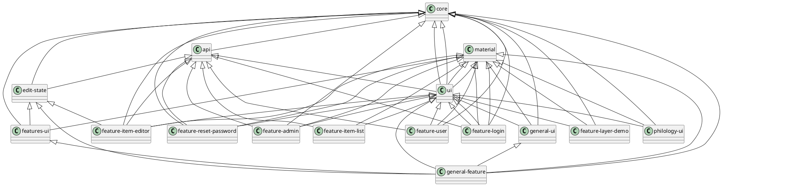

# Architecture

The general monorepo architecture is structured into the following sections.

## Application

- `apps/cadmus`: the frontend app. Presently for development purposes this app imports all the parts in the workspace, and adds their demos to a dedicated menu.

## Core Libraries

- `libs/core`: core services and models.
- `libs/api`: the API services. Dependencies: `core`.
- `libs/material`: Angular Material library. This just provides selected Angular Material modules to its consumer.
- `libs/ui`: general purpose, shared UI dumb components. Dependencies: `core`, `api`, `material`.

## Modular Libraries

- `libs/features`: this folder contains app's features libraries:
  - `libs/features/edit-state`: core components for editor state management. Dependencies: `core`, `api`.
  - `libs/features/feature-login`: login page. Dependencies: `material`, `ui`.
  - `libs/features/feature-user`: user pages: user home, change password. Dependencies: `core`, `material`, `api`, `ui`.
  - `libs/features/feature-reset-password`: reset password page. Dependencies: `core`, `material`, `api`, `ui`.
  - `libs/features/feature-item-list`: list of items page. Dependencies: `api`, `material`, `ui`.
  - `libs/features/feature-item-editor`: item editor page. Dependencies: `core`, `material`, `api`, `ui`, `edit-state`.
  - `libs/features/feature-admin`: admin section pages: admin home, user registration, users manager. Dependencies: `core`, `material`, `api`, `ui`.
  - `libs/features/features-ui`: components shared among features. Dependencies: `core`, `material`, `edit-state`.
  - `libs/features/feature-layer-demo`: layers demo page. Dependencies: `core`, `material`, `ui`.
- `libs/parts`: this folder contains Cadmus parts and fragments libraries:
  - `libs/parts/general/general-ui`: general purpose parts and fragments. Dependencies: `core`, `material`, `ui`.
  - `libs/parts/general/general-feature`: feature pages for `general-ui`. Dependencies: `core`, `material`, `ui`, `general-ui`, `edit-state`, `features-ui`.
  - `libs/parts/philology/philology-ui`: philology parts and fragments. Currently this is a catch-all library, its contents will probably be reorganized. Dependencies: `core`, `material`, `ui`.

Parts/fragments libraries follow this pattern:

- `libs/parts/<partgroup>/<partgroup>-ui`: core services and models plus dumb UI components for parts and fragments in a specific group. E.g. `libs/parts/general/general-ui`.
- `libs/parts/<partgroup>/<partgroup>-feature`: feature pages for parts and fragments in a specific group. E.g. `libs/parts/general/general-feature`.

## Editing Architecture

From the standpoint of the editing process, the architecture is hierarchical: we start from a list of items, edit an item from it, edit a part from that item, and eventually edit a fragment from that part (for layer parts).

### Items List

- store: `ItemsStore` including `ItemsState` and extending `EntityState<ItemInfo, string>`. The only edit operation here is deleting an item, via `ItemsListService`, which invokes the deletion API and removes the deleted item from the store.
- component: `ItemListComponent`.

Operations:

- *add item*: move to item editor (`/items/new`).
- *edit item*: move to item editor (`/items/<id>`).
- *delete item*: delete via `ItemsListService`.

### Add or Edit Item

- store: `EditItemStore` including `EditItemState` and extending `Store<EditItemState>`. The service handling this store is `EditItemService`, which can load an item, save an item, delete an item's part, add a new layer part, and set a part's thesaurus scope.
- component: `ItemEditorComponent`.

Operations:

- *save metadata*: via `EditItemService`.
- *add/edit a non-layer part*: move to part editor (`/items/<id>/<part-group>/<part-typeid>/<part-id>?rid=<role-id>`).
- *delete a part*: delete via `EditItemService`.
- *add a layer part*: via `EditItemService`. The part gets added with no fragments. You will then edit it.
- *edit a layer part*: move to layer part editor (same route as above for editing non-layer parts).
- *set thesauri scopes* for selected parts: via `EditItemService`.

### Edit Part

- store: `Edit<PartName>PartStore` extending `Store<EditPartState>`. The store ID is equal to the part type ID. The service `Edit<PartName>PartService` extends `EditPartServiceBase`. The query `Edit<PartName>PartQuery` extends `EditPartQueryBase`, in turn extending `Query<EditPartState>`.
- component: `<PartName>PartComponent`, `<PartName>PartFeatureComponent`.

Part editors are all found in lazily-loaded libraries, each at its own route like `/items/<id>/<part-group>/<part-typeid>/<part-id>?rid=<role-id>` (where `rid` is optional).

Each part editor is a dumb UI component extending `ModelEditorComponentBase<ModelType>`; it gets and emits the edited model serialized in a JSON string. So, its implementation consists of its own editing logic and UI, plus some plumbing for updating the UI from the model, getting the model from the UI, and getting thesauri when required.

Each of these editor components is wrapped inside a part editor feature component, which extends `EditPartFeatureBase` and corresponds to a route in the application. Its UI contains only the current item bar at the top, and the dumb editor component.

### Edit Fragment

- store: `Edit<FragmentName>FragmentStore` extending `Store<EditFragmentState>`. `Edit<FragmentName>FragmentService` extends `EditFragmentServiceBase`. `Edit<FragmentName>FragmentQuery` extends `EditFragmentQueryBase`.
- component: `<FragmentName>FragmentComponent` extending `ModelEditorComponentBase<ModelType>`, `<FragmentName>FragmentFeatureComponent` extending `EditFragmentFeatureBase`.

Fragment editors, like part editors, are all found in lazily loaded libraries, each at its own route like `/items/<id>/<part-group>/fragment/<part-id>/<fr-typeid>/<loc>?rid=<role-id>` (where `rid` is optional).

Each fragment editor is a dumb UI component extending `ModelEditorComponentBase<ModelType>`; it gets and emits the edited model serialized in a JSON string. So, its implementation consists of its own editing logic and UI, plus some plumbing for updating the UI from the model, getting the model from the UI, and getting thesauri when required.

Each of these editor components is wrapped inside a fragment editor feature component, which extends `EditFragmentFeatureBase`, and corresponds to a route in the application. Its UI contains only the current item bar, the decorated base text, and the dumb editor component.
