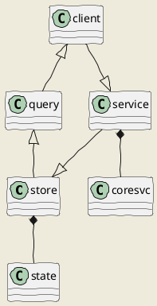
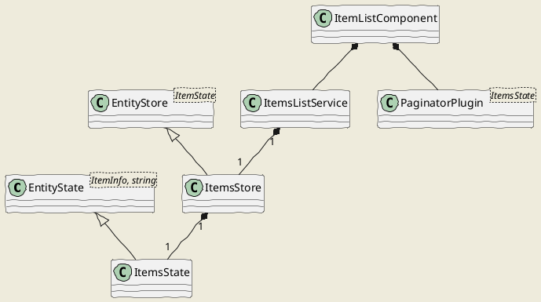
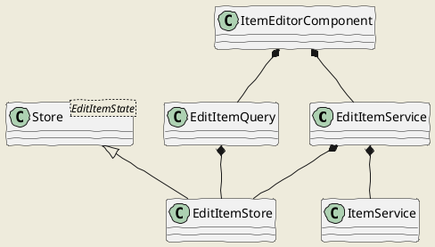

# Edit State

- [Edit State](#edit-state)
  - [Akita Overview](#akita-overview)
    - [Store](#store)
    - [Query](#query)
    - [Putting All Together](#putting-all-together)
  - [Edit Model](#edit-model)
  - [Items List](#items-list)
  - [Edit Item](#edit-item)
  - [Edit Part](#edit-part)
  - [Edit Layer Part](#edit-layer-part)
  - [Edit Thesaurus](#edit-thesaurus)
  - [App State](#app-state)

The local edit state is kept in the web app using Akita.

## Akita Overview

For the reader's commodity, this section mostly summarizes this [Akita introductory post](https://medium.com/swlh/angular-state-management-with-akita-b4c5439c1ab5).

Install: `ng add @datorama/akita`; if not applicable (e.g. in Nrwl), do:

1. `npm i @datorama/akita --save`.
2. `npm i @datorama/akita-ngdevtools --save`.
3. in `app.module` import `AkitaNgDevtools.forRoot()`.

Akita consists of 2 main modules: store and query.

### Store

A **store** is a single object which contains a **state**. You define your state in an interface; write a function which creates it with its initial values; and create a store derived from `Store<STATE_TYPE>`. For instance:

```ts
import { Store, StoreConfig } from "@datorama/akita";

// STATE
export interface UserState {
  name: string;
}

// STATE creator (or just use a const object)
export function createInitialState(): UserState {
  return {
    name: "",
  };
}

// STORE
@StoreConfig({ name: "users" })
export class UserStore extends Store<UserState> {
  constructor() {
    super(createInitialState());
  }
}
```

In real world applications, you generally work with entities such as Products, Users, etc. To simplify working with entities, Akita has a more specific store, `EntityStore`. You can think of an entity store as a table in a database, where each table represents a flat collection of entities. For instance:

```ts
import { EntityState, EntityStore, StoreConfig } from "@datorama/akita";
import { Todo } from "./todo.model";

// 1st templated arg=entity type, 2nd=type of its ID
export interface TodosState extends EntityState<Todo, number> {}

@StoreConfig({ name: "todos" })
export class TodosStore extends EntityStore<TodosState> {
  constructor() {
    super();
  }
}
```

Entity stores exposes a set of methods which you can use to update the state. These methods will generally be invoked from within Angular services.

### Query

The query is an object used to query a store. As such, it's used as a facade by components consuming it.

The query's constructor function receives a reference to its own store, and optionally other query classes, e.g.:

```ts
import { Query } from "@datorama/akita";
import { UserState } from "./session.store";

export class UserQuery extends Query<UserState> {
  constructor(protected store: UserStore) {
    super(store);
  }
}
```

For entity stores you can use `QueryEntity`, similar to the general `Query`, with additional functionality for an `EntityStore`:

```ts
import { QueryEntity } from "@datorama/akita";
import { TodosStore, TodosState } from "./todos.store";

export class TodosQuery extends QueryEntity<TodosState> {
  constructor(protected store: TodosStore) {
    super(store);
  }
}
```

### Putting All Together

In real world app you use *services* to fetch data (via API-based services) and update the store.

Angular *dumb UI components* get injected with *queries* (to get data from stores) and *services* (to put data in stores), and expose observables got from queries. Their templates are bound to such observables.

## Edit Model

The hierarchical edit model is as follows:

1. **items list** (state: `items`):

   - delete item.
   - add/edit item: move to (2) item editor.

2. **item editor** (state: `edit-item`):

   - metadata: edit and save.
   - parts: add/edit part: move to (3) part editor. For new items, no parts can be added or edited before the item is first saved.
   - layers:
     - delete layer part.
     - add layer part.
     - edit layer part: move to (3B) layer part editor.
   - thesaurus scopes: assign to selected parts.

3. part editors:

- **non-layer part editor** (state: `edit-part`):

  - save part.
  - close and return to (2) item editor.

- **layer part editor** (state: `edit-layer-part`):
  - delete fragment.
  - add/edit fragment: move to (4) fragment editor.

4. **fragments**:

   - save fragment.
   - close and return to (3B) layer part editor.

The general state-based edit pattern data flow is thus:



Data `state` is stored in a `store`. A `client` component uses a `query` to get data from a store, and a `service` to put data in a store. In most cases, this service uses a core service (`coresvc`) which talks to the backend.

## Items List



The `ItemsState` is a list of `ItemInfo` objects. It is stored by an `ItemsStore`, which gets updated by an `ItemsListService`.

## Edit Item

- `item`
- `parts`: the raw list of item's parts.
- `partGroups`: the non-layer parts, grouped.
- `layerPartInfos`: layer parts (either existing and not existing).
- `facet`: the item's facet definition.
- `facets`: all the available facets definitions.
- `flags`: all the available flags definitions.
- `typeThesaurus`: thesaurus for model types.
- `dirty`
- `saving`
- `deletingPart`
- `loading`
- `error`



The item state is stored in an `EditItemStore`, derived from `Store<EditItemState>`.

Data are queried from the store with an `EditItemQuery`, and stored in it with an `EditItemService`, which in turn uses an `ItemService` to talk to the backend.

The item editor component (`ItemEditorComponent`) uses both `EditItemQuery` to read data, and `EditItemService` to write data.

## Edit Part

- `part`
- `thesauri`
- `dirty`
- `saving`
- `loading`
- `error`

## Edit Layer Part

- `part`
- `baseText`
- `baseTextPart`
- `locations`: the token-based text locations. These coordinates can be used also for tile-based text locations.
- `breakChance`: the estimated chance of broken fragments in this layer: 0=safe, 1=potentially broken, 2=broken.
- `layerHints`: the layer fragments reconciliation hints. There is one hint for each fragment in the layer.
- `loading`
- `error`
- `deletingFragment`
- `savingFragment`
- `refreshingBreakChance`
- `patchingLayer`

## Edit Thesaurus

- `thesaurus`
- `dirty`
- `saving`
- `loading`
- `error`

## App State

There is also an app-level state consisting of readonly data, which are loaded once when the app starts. These contain lookup data of general use, which can safely be assumed never to change during a single editing session, as they depend on the backend profile.

These data are:

- `facets`: the list of all the facets definitions.
- `flags`: the list of all the flags definitions.
- `typeThesaurus`: the optional thesaurus for model-types. This (if present) is used to display human-friendly part types names from their IDs. Otherwise, the raw IDs are displayed.
- `itemBrowserThesaurus`: the optional thesaurus for items browsers. This (if present) is used to display the items browsers menu, using each thesaurus entry ID as part of the target route, and its value as the menu's label.
