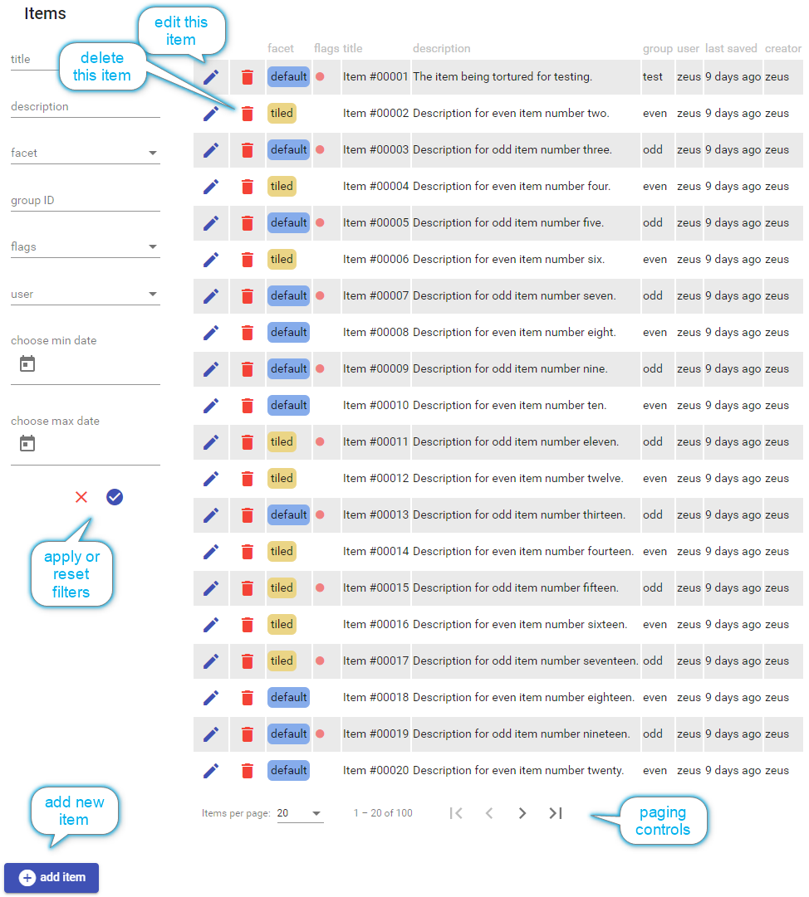

# Browsing Items

The default items browser in Cadmus is just a list of all the items in the database, sorted by each item's sort key, and paged.

You can variously filter the list by applying one or more filters:

- *title*: show only the items including the typed text in their title;
- *description*: show only the items including the typed text in their description;
- *facet*: show only the items belonging to the selected facet;
- *group ID*: show only the items with the typed group ID;
- *flags*: show only the items having the selected flags;
- *user*: show only the items saved by the selected user;
- *min/max date*: show only the items saved since a specified date, or before a specified date, or both.

All these filters can be freely combined. Paging is controlled with the buttons at the bottom of the list.

In the list, the following data are shown:

- *facet*: the item's facet ID.
- *flags*: all the item's flags. Each is represented by a colored circle. You can hover on it to get the flag's description.
- *title*: the item's title.
- *description*: the item's description.
- *group*: the item's group ID, if any.
- *user*: the user who last saved the item.
- *last saved*: the last save date and time, in human-friendly format.
- *creator*: the user who first created the item.

From the items list, you can:

- *edit* an item by clicking the pen button;
- *delete* an item by clicking the trash button. The item gets deleted with all its parts.
