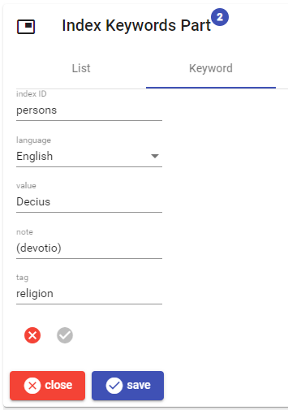

# General Parts

- [General Parts](#general-parts)
  - [Bibliography](#bibliography)
    - [Bibliography Model](#bibliography-model)
    - [Bibliography Editor](#bibliography-editor)
  - [Categories](#categories)
    - [Categories Model](#categories-model)
    - [Categories Editor](#categories-editor)
  - [Hierarchy](#hierarchy)
  - [Historical Date](#historical-date)
    - [Historical Date Model](#historical-date-model)
    - [Historical Date Editor](#historical-date-editor)
  - [Index Keywords](#index-keywords)
    - [Index Keywords Model](#index-keywords-model)
    - [Index Keywords Editor](#index-keywords-editor)
  - [Keywords](#keywords)
    - [Keywords Model](#keywords-model)
    - [Keywords Editor](#keywords-editor)
  - [Note](#note)
    - [Note Model](#note-model)
    - [Node Editor](#node-editor)
  - [Tiled Text](#tiled-text)
    - [Tiled Text Model](#tiled-text-model)
    - [Tiled Text Editor](#tiled-text-editor)
  - [Token Text](#token-text)
    - [Token Text Model](#token-text-model)
    - [Token Text Editor](#token-text-editor)
  - [Token Text Layer](#token-text-layer)
    - [Token Text Layer Editor](#token-text-layer-editor)
  - [Tiled Text Layer](#tiled-text-layer)
  - [Layer Fragments](#layer-fragments)
    - [Comment](#comment)
      - [Comment Model](#comment-model)
      - [Comment Editor](#comment-editor)

Here you find a short description of the most relevant  general-purpose part.

As for any part editor, the general part editors share a common UI at their top and bottom regions. On the top, you can find some information about the parent item; on the bottom, you find a `close` and a `save` button. The former closes the editor without saving (you will be prompted for confirmation if you have edited data); the latter saves the data and goes back to the items list. The `save` button is disabled when data are not valid, or are unchanged.

## Bibliography

- ID: `net.fusisoft.bibliography`
- thesauri: `languages` (required), `bibliography-types`, `bibliography-author-roles`.
- pins:
  - for each entry (omitting duplicates): 1 `biblio.type`=entry type ID, 1-N `biblio.author`=author last name (filtered), 1 `biblio.title`=title (filtered), 0-1 `biblio.container`=container name (filtered), 0-N `biblio.keyword`=keyword. Filtering implies preserving only letters, digits, whitespaces (normalized), and apostrophe. Letters are all lowercase and without any diacritics.

### Bibliography Model

The bibliography part contains any number of bibliographic entries, which may equally represent books, articles, ebooks, web pages, tweets, etc. Each entry has the following properties:

- `typeId`: the type identifier for the entry and its container: e.g. book, journal article, book article, proceedings article, journal review, ebook, site, magazine, newspaper, tweet, TV series, etc. Usually the ID is drawn from a thesaurus.
- `authors`: 1 or more authors, each having a first name, a last name, and an optional role ID. The role IDs are usually drawn from a thesaurus, and mostly used for contributors.
- `title`
- `language`: the ISO 639-3 letters (primary) language code of the bibliographic entry, drawn from a thesaurus.
- `container`: the optional container: a journal, a book, a collection of proceedings, etc.
- `contributors`: 0 or more contributors, with the same properties of the authors. Usually they also have some role specified, e.g. "editor" for the editor of a book collecting a number of articles from different authors, "translator", "organization", etc.
- `edition`: the optional edition number. Default is 0.
- `number`: the optional alphanumeric number (e.g. for a journal).
- `publisher`: the optional publisher name.
- `yearPub`: the optional year of publication. Default is 0.
- `placePub`: the optional place of publication.
- `location`: the location identifier for the bibliographic item, e.g. an URL or a DOI.
- `accessDate`: the optional last access date, typically used for web resources.
- `firstPage`, `lastPage`: the optional pages range. Default values are 0.
- `keywords`: any number of optional keywords assigned to the entry, each with its language and value.
- `note`: an optional free text note.

### Bibliography Editor

The bibliography editor shows a list of bibliographical entries.


To edit, delete, or move any entry just click the buttons next to it. To add a new entry, click the plus button below the list.

When you edit a new or existing entry, the entry editor is shown.

The entry editor has 3 panes: *general*, *container*, and *keywords*. Once you have done entering the entry's data, click the round buttons at its bottom to either save or discard your changes. This will bring you back to the entries list.

The *general* pane contains the bibliographic entry type and primary language, its author(s) and title, and an optional note:


You can add as many authors as you want, entering the last name and first name (and optionally the role) of each. Use the buttons next to each author to delete it, add another one below it, or move it up or down.

The *container* pane is used to specify the bibliographic entry container, like a journal, a book, etc.


Besides its name, the container has any number of contributors with various roles, which are added and edited just like the entry's authors; also, you can specify the number, place and year of publication, location (e.g. a URI or DOI), last access date, and pages range.

Finally, the *keywords* pane allows you to add as many keywords as you want to the entry. Each keyword has its language and value.


To add a keyword, select its language and type it, then click the plus button. You can then delete or move keywords in the list as desired.

## Categories

- ID: `net.fusisoft.categories`
- thesauri: `categories` (required)
- pins:
  - for each category: `name`=category, `value`=category ID, sorted by value.

### Categories Model

The categories part is a collection of 1 or more categories assigned to the parent item. For instance, you might have an epigraphic corpus with categories like funerary, honorary, decree, law, etc.

Each category is identified by a string, defined in a corresponding thesaurus. The thesaurus can be structured to represent a **hierarchy**, by using dots as level separators in the IDs. For instance, this thesaurus fragment has a `language` category including 3 children categories for phonology, morphology, and syntax:

```json
"id": "categories@en",
"entries": [
  {
    "id": "language",
    "value": "language"
  },
  {
    "id": "language.phonology",
    "value": "language: phonology"
  },
  {
    "id": "language.morphology",
    "value": "language: morphology"
  },
  {
    "id": "language.syntax",
    "value": "language: syntax"
  }
]
```

### Categories Editor


When editing a part, the categories are shown in a tree representing their hierarchy. You can freely walk the tree, expanding and collapsing its nodes. Once you find the desired category, just click on it to add it to the part.

The list of the categories currently added to the part is shown at the bottom. You can remove any of these categories by clicking on the delete button next to each category listed.

Note that the categories part should include at least 1 category. You will not be allowed to save an empty categories part (which would be meaningless). If you want to remove all the categories, just remove the whole categories part.

## Hierarchy

- ID: `net.fusisoft.hierarchy`
- thesauri:
- pins:
  - `y`=Y value.
  - `x`=X value.
  - `tag`=tag (optional).

This part defines a hierarchy among some items, by connecting a parent item to any number of children items. The part targets the parent item, and can also specify its coordinates in the hierarchy tree, by setting its `Y` (depth level) and `X` (sibling position) values. Finally, a `Tag` can be used to apply several different hierarchies to the same items.

## Historical Date

- ID: `net.fusisoft.historical-date`
- thesauri: none
- pins:
  - `date-value`: date sort value.

### Historical Date Model

This part represents a historical date, which is something more complex than a simple number.

A historical date contains a datation with a model including 1 (point `A`) or 2 points (points `A` and `B`). These represent points on a timeline; 2 points represent an interval, where either the initial or the final point can also be unknown (for *terminus ante* and *terminus post*, respectively).

Each point has these properties:

- `value`: the numeric value of the point. Its interpretation depends on other points properties: it may represent a year or a century, or a span between two consecutive Gregorian years.
- `isCentury`: true if `value` is a century number; false if it's a Gregorian year.
- `isSpan`: true if the value is the first year of a pair of two consecutive years. This is used for calendars which span across two Gregorian years, e.g. 776/5 BC.
- `month`: the month number (1-12) or 0.
- `day`: the day number (1-31) or 0.
- `isApproximate`: true if the point is approximate ("about").
- `isDubious`: true if the point is dubious ("perhaphs").
- `hint`: a short textual hint used to better explain or motivate the datation point.

As a sample, consider this datation from SEG 46,1531: `367/366 B.C.? - ca. 150 A.D. (Roman copy)`:

1. point A:
   - `value` = -367
   - `isSpan` = true
   - `isDubious` = true
2. point B:
   - `value` = 150
   - `isApproximate` = true
   - `hint` = "Roman copy"

### Historical Date Editor


The editor allows entering dates either visually through controls, and textually, by just typing the text representing the date. In its initial state, the editor just shows the date in its textual form. This includes one or two points, separated by `--`, each with this syntax:

- the value can be prefixed with `c.` = about.
- the value uses digits or Roman numerals for centuries. When using digits and you want to represent a 2-years span, add the second year (eventually also abbreviated) after a slash (e.g. `25/4 BC`).
- the value is followed by `BC` or `AD` for the era, and by `?` for dubious.
- the optional hint is between braces at the end of the text.

For instance, `c.123 AD -- III AD` is a range composed by two points (A and B).

Here you just type a date and press Enter, or click the corresponding button at the edge of the text box.

If you expand the visual editor, you will be able to edit each point visually. At the top of the visual editor you can switch between single-point and two-points (interval) date. According to this selection, you are presented with one or two tabs for points A and B.


To visually edit a point, just fill the controls as required and when done click the round save button (to discard changes, click the red X button). Whenever you save changes here, the textual representation of the point gets automatically updated.

## Index Keywords

- ID: `net.fusisoft.index-keywords`
- thesauri: `languages` (optional), `keyword-indexes` (optional)
- pins:
  - for each keyword: name=`keyword.<indexId>.<language>` (`indexId` may be empty), value=keyword value; sorted by index ID, language, and value.

### Index Keywords Model

This parts contains a list of index keywords, which are a specialization of the keywords part used to represent entries in a traditional index.

The part is a collection of index keywords. The keyword is the index entry, and conventionally it can represent a hierarchy through dots. For instance, `Athens.history` represents a 2-levels entry, where the first is `Athens` and the second `history`.

Each keyword has:

- `language`: language (usually an [ISO 639 3-letters code](https://en.wikipedia.org/wiki/ISO_639-3)).
- `value`: keyword value.
- `note`: a generic text note.
- `tag`: an optional tag for this keyword, representing any additional general purpose classification.
- `indexId`: an optional index identifier. This can be used when you are building more than a single index, and entries must be distributed among them. For instance, we could group all the entries for person names into a `persons` index.

### Index Keywords Editor


The editor shows a list of keywords. Just click the edit button to edit, or the delete button to remove it.

To add a new keyword, click the `+` circle button; the new keyword will be edited.

Once editing, the keyword tab appears with the editable data for each keyword:



You can either save the changes with the round checkmark button, or discard them with the X red button next to it.

## Keywords

- ID: `net.fusisoft.keywords`
- thesaurus: languages (required).
- pins:
  - for each keyword: name=`keyword.<language>`, value=keyword value; sorted by language and value.

### Keywords Model

The part is a collection of index keywords. Each keyword has:

- `language`: language (usually an [ISO 639 3-letters code](https://en.wikipedia.org/wiki/ISO_639-3)).
- `value`: keyword value.

### Keywords Editor


The editor shows a list of existing keywords at its bottom. Each of them has a delete button for removing it.

To add a new keyword, in the top area of the editor select a language and type the keyword, then click the `add` button.

## Note

- ID: `net.fusisoft.note`
- thesauri: `note-tags` (optional, when using a closing set of tags)
- has text: yes
- pins:
  - `tag`=tag (optional).

### Note Model

Generic text note. A note just contains a `text` plus an optional `tag` to categorize notes where required.

The backend makes no assumption about the text format; the frontend uses a Markdown text to add formatting.

### Node Editor


The editor just shows a text box to type text, and an optional tag. If using a tags thesaurus, this will be a dropdown list with a closed set to pick from. Otherwise, it will be a text box.

The text is Markdown, and a preview is shown in real time as the text gets typed. At the right side of the text box a text minimap is shown.

You are required to enter some text for the note. Otherwise, just delete the whole note part.

## Tiled Text

- ID: `net.fusisoft.tiled-text`
- role ID: `base-text`
- thesauri: none.
- has text: yes.
- pins:
  - `citation`=citation (optional).

The tiled-based text is a plain text with arbitrary tokenization and optional metadata linked to each of its rows and tiles. This is a special type of text, as usually a token-based text is enough.

For instance, tiles can be used to represent non-alphabetic writing systems, or texts where we have the requirement of arbitrary tokenization and/or special metadata to be attached to tokens.

A sample of the latter scenario is when importing TEI-based documents which should be later re-exported while preserving their original segmentation and metadata.

### Tiled Text Model

A tiled text is based on a bidimensional layout, built of rows and tiles. Rows are stacked vertically, and include tiles. Tiles are stacked horizontally.

Each row and tile can have a set of metadata, which are just a set of name=value pairs. Among them, the `text` datum represents its text.

### Tiled Text Editor


The editor shows a set of rows, each with any number of tiles. Each tile is shown with its text, which can be edited in-place by clicking its pen button.

You can append a new tile at the end of a row by clicking the `+` button at its right edge; you can also move any tile by dragging it around. Use the up/down arrows to move the whole row, or the delete button next to them to delete it.

To edit the row's metadata, click the metadata button at the right edge of each row.

When you click a tile, it gets selected, with a blue rectangle around it. You can control the selected tile using the buttons at the bottom, to edit its metadata or remove it.

Finally, you can add a new row by using the `+` button at the bottom.

When editing the metadata of a tile or row, the metadata editor appers:


All the metadata are listed, each with its ID and editable value. You can filter them by typing any part of the ID in the data filter.

- to delete a datum, just click the remove button next to it.
- to add a datum, enter its ID and value and click the `+` button.

Once you are done, click the `save data` button to save the metadata, or the red cancel button to discard the changes.

## Token Text

- ID: `net.fusisoft.token-text`
- role ID: `base-text`
- thesauri: none.
- has text: yes.
- pins:
  - `citation`=citation (optional).

The token-based text is just a plain text, designed to be the base for a set of metatextual data layers, and using token-based coordinates.

### Token Text Model

A *token* here is any sequence of characters separated by space. Thus, users just type the text freely, and the system targets each text portion using two coordinates, one for line (Y), and another for token (X). For instance, in the picture below the token `Venus` has Y=2 and X=2.

The model for this part just contains the text, and an optional citation, whose meaning varies according to the document being handled; for instance, in a literary text it might be the start and end citations defining the text span; in an epigraphical corpus it might be a conventional citation for the inscription; etc.

### Token Text Editor


The editor just contains a text box where the text is freely edited. At the right side of this box, a minimap of the text is shown.

The optional citation can be entered in the small text box at the top.

## Token Text Layer

- ID: `net.fusisoft.token-text-layer`
- role ID: the fragment ID (always starting with `fr.`)

Any token-based text layer part uses the same editor to manage fragments and their link to the base text; then, a specialized editor is used when editing or adding fragments.

### Token Text Layer Editor


The editor shows the base text, where each portion connected to a fragment is highlighted. From here, you can add, edit or remove any fragment:

- to *add* a fragment, select the text portion to be connected with it and click the `+` button. Note that no part of the text to be connected to a new fragment should already be included into another one, as fragments are not allowed to overlap.
- to *edit* a fragment, select any portion of the highlighted text (the selection does not need to be precise, as far as it includes at least one highlighted character), and click the pen button.
- to *delete* a fragment, select it as if you were going to edit it, and click the red trash button (you will be prompted for confirmation).
- to get the *coordinates* of the current selection, click the `i` button. This is also used in layer hints, when you want to set the target of a movement operation (see below).

At the bottom of any layer editor there always is a **layer hints** section. This is an experimental tool to aid users in [layers reconciliation](https://github.com/vedph/cadmus_core/blob/master/Doc/layer-reconciliation.md). This reconciliation should happen any time after the base text has changed and layers were already linked to it. The tool provides a list of hints, one for each fragment in the layer; this way, even when a fragment might be found linked to a no-more existing portion of text it can be displayed here.

For each fragment, the tool lists:

- its location. This is unique inside the layer.
- an optional description hinting at the reconciliation strategy for that fragment, when it has been potentially or surely affected by a text change.
- when an automatic patch is possible, the description of its operation and a checkbox. You can check this to enlist the patch among those to be applied. When you are ready, you can apply all the patches at once, by clicking the `apply patches` button at the bottom of the list.
- buttons for editing the fragment, deleting it, or moving it to the target location selected in the part layer editor. This can be useful when layer fragments have fallen off the base text because of dramatic changes in it.

## Tiled Text Layer

- ID: `net.fusisoft.tiled-text-layer`
- role ID: the fragment ID (always starting with `fr.`)

Any tiles-based text layer part uses the same editor to manage fragments and their link to the base text; then, a specialized editor is used when editing or adding fragments.

The editing experience here is similar to that of the token-based text layer, with the difference that the base text is displayed in rows of tiles, rather than in lines of tokens. The coordinates system used is the same, built from a Y and a X value.

## Layer Fragments

### Comment

- ID: `fr.net.fusisoft.comment`
- thesauri: `comment-tags` (optional, when using a closed tags set)
- pins:
  - `fr.tag`=tag (optional).

#### Comment Model

The comment fragment is a general purpose comment about some portion of the base text. The backend makes no assumption about the format of this comment; the frontend uses a Markdown text to add formatting.

Besides the comment's text, the model also includes an optional tag, which can be used to categorize it; for instance, you might want to tag a comment as related to linguistics, another to history, another to paleography, etc.; or a comment as targeting scholarly audience, another as targeting students, etc.

The tag can belong to a closed list drawn from a thesaurus, or just be free.

#### Comment Editor


As for any fragment editor, at the top there is the base text with the target text for the edited fragment highlighted (`non` in this sample). Also, the title contains the fragment's coordinates (`1.9` = line 1, token 9).

The Markdown text of the comment can be freely typed in the text box. At the right side of this box there is a minimap for navigating the text; at the bottom, there is a preview of the Markdown text.

Above the comment there is a small box for the optional comment's tag; when a thesaurus is used for a closed set of such tags, the box is a dropdown list rather than a text box.
