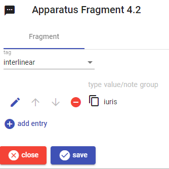
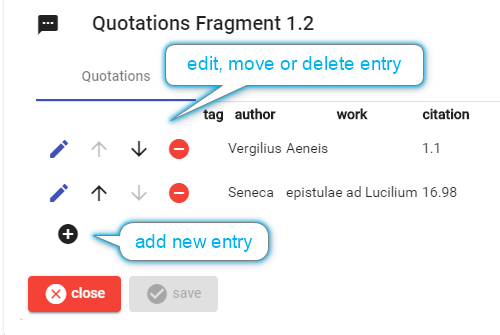

# Philology Parts

- [Philology Parts](#philology-parts)
  - [Layer Fragments](#layer-fragments)
    - [Apparatus](#apparatus)
      - [Apparatus Model](#apparatus-model)
      - [Apparatus Editor](#apparatus-editor)
    - [Chronology](#chronology)
      - [Chronology Model](#chronology-model)
      - [Chronology Editor](#chronology-editor)
    - [Ligature](#ligature)
    - [Metrics](#metrics)
      - [Metrics Model](#metrics-model)
    - [Orthography](#orthography)
      - [Orthography Model](#orthography-model)
      - [Orthography Editor](#orthography-editor)
    - [Quotations](#quotations)
      - [Quotations Model](#quotations-model)
      - [Quotations Editor](#quotations-editor)
    - [Witnesses](#witnesses)

Here you find a short description of the most relevant philologic parts. Some of them are derived from legacy projects, and might be refactored.

As for any part editor, the general part editors share a common UI at their top and bottom regions. On the top, you can find some information about the parent item; on the bottom, you find a `close` and a `save` button. The former button closes the editor without saving (you will be prompted for confirmation if you have edited data); the latter saves the data and goes back to the items list. The `save` button is disabled when data are not valid, or are unchanged.

## Layer Fragments

### Apparatus

- ID: `fr.it.vedph.apparatus`
- thesauri: `apparatus-tags`, `apparatus-witnesses`, `apparatus-authors` (all optional)
- pins: for every distinct variant, witness, or author:
  - `fr.variant`=variant (in its normalized form if stored, else just the variant).
  - `fr.witness`=witness.
  - `fr.author`=author.

#### Apparatus Model

The apparatus fragment can include 1 or more entries. These mostly represent variants, but can also be mere annotations.

Each apparatus fragment has these properties:

- `tag`: an optional arbitrary string representing a categorization of some sort for that fragment, e.g. "margin", "interlinear", etc. This can be overridden by variants `tag`.

- `entries`: 1 or more variants/notes, each with these properties:

  - `type`: an enumerated constant to be chosen among replacement (0), addition before (1), addition after (2), note (3).
  - `value`: the variant's value. May be zero (empty or null) for deletions. Is optional (because not used) when `type` is note.
  - `tag`: an optional arbitrary string representing a categorization of some sort for that fragment, e.g. "margin", "interlinear", etc. It overrides the fragment's `tag`.
  - `normValue`: an optional normalized form derived from `value`. Normalization details are up to each single project, and the model makes no assumptions about it.
  - `note`: an optional annotation. When `type` is _note_, `value` has no meaning, and this property contains the note's text. Otherwise, this can be an additional note, side to side with the variant's value.
  - `witnesses`: optional array of annotated witnesses. Each has a `value` (e.g. `O`) and an optional note (e.g. `manus altera`).
  - `authors`: optional array of annotated authors. Each has a `value` (e.g. `Verg.` or `Wilamowitz`) and optional `tag` (e.g. `ancient` or `modern`), `location` (e.g. `Kleine Schriften p.12` or `Aen. 1.23`), and `note` (e.g. `exempli gratia`).
  - `isAccepted`: boolean, true if the variant represents the accepted text (=lemma).
  - `groupId`: an optional arbitrary ID to be used for grouping fragments in the layer together.

If required, notes can be Markdown to include some minimal formatting. This should anyway be limited to very basic formatting, e.g. italic and bold.

#### Apparatus Editor



The apparatus fragment editor shows the list of all the entries in the fragment.

Each entry can be edited, moved up or down, or deleted. When there is an entry representing an accepted variant, it is highlighted.

Also, the whole fragment can receive a tag, which can be typed or selected in the control above the list.

Each entry is edited in the entry editor:


You can select the entry type, and fill its controls as needed. Witnesses and authors appear below, with their lists in two expandable regions, each having its title and count.

Each of these lists has buttons to move or delete each item, which can be edited in-place for its value and optional note. The value is either a text box, or a dropdown list if using a thesaurus with a closed list of witnesses or authors.

Once done, you can either save the entry with the round checkmark button, or discard all the changes with the red cancel button next to it.

### Chronology

- ID: `fr.it.vedph.chronology`
- thesauri: `chronology-tags` (to use a closed set of tags)
- pins:
  - `fr.date-value`: date sort value.
  - `fr.tag`: tag (optional).

The chronology layer fragment contains a chronological indication linked to a specific portion of text where this indication is explicit or can be inferred.

#### Chronology Model

The fragment contains a date, modeled as the date in the [historical date part](General-Parts.md#historical-date), a label (e.g. "battle of Marathon"), and an optional tag, representing some sort of classification for the chronological indication (e.g. "battle", "treatise", "priesthood", etc.). Also, an optional event ID is provided to allow linking this date to an external reference (e.g. an events ontology).

#### Chronology Editor


The editor couples essential data about the event (a classification tag and a label) with a datation, edited as in the [historical date part](General-Parts.md#historical-date-editor).

### Ligature

- ID: `fr.it.vedph.ligature`
- pins:
  - `fr.ligature`=ligature type letter.

Epigraphical letters ligatures, according to the classification by Manzella 1987 149-151: ligature (abbreviation: `L`), inversion ("inversione", `I`), overlap ("sovrapposizione", `O`), replacement ("sostituzione", `R`), graft ("innesto", `G`), inclusion ("inclusione", `N`), connection ("nesso", `C`), complex (`X`).

TODO:

### Metrics

- ID: `fr.it.vedph.metrics`
- pins:
  - `fr.metre`=metre, suffixed with * when imperfect.

Metrics layer fragment, used to mark the text as part of a metrical verse.

#### Metrics Model

- `metre`: the metre ID.
- `number`: the number for the portion of the base text this fragment refers to. This might be a simple verse number like `1`, or a more structured numbering like `11.3` (e.g. for strophe 11, line 3). Should the base text include several metrical compositions (e.g. a prose text including 2 epigrams), the first number might represent the composition number, and the others the structure of each composition. At any rate, you should adopt a convention which allows sorting the fragments by their number value, treated as a raw string.
- `isImperfect`: a boolean value indicating whether this verse is imperfectly or incompletely implemented.
- `note`: an optional note.

### Orthography

- ID: `fr.it.vedph.orthography`
- pins: if operations have tags, the operations with tags are grouped by them, and a pin is returned for each group, with its name equal to `fr.msp` + the grouped operations tag, and its value equal to the count of such operations. These pins are sorted by their name. Also, if item is received and it has a base text part and an orthography layer part, two additional pins are returned: `fr.orthography-txt` with the original orthography got from the base text, and `fr.orthography-std` with the Standard orthography from this fragment.

#### Orthography Model

The orthography fragment contains the *standard* orthography corresponding to the base text form, and additionally a set of operations which describe the transformation from the original to the standard form.

These *operations* are used to provide further details on the mapping between the two forms, together with the information about the underlying linguistic phenomena.

Each transform operation is expressed in a mini-syntax with a form like `"A"@NxC="B"`, where:

- `"A"` is the original text.
- `@NxC` is the coordinate of the input text: `N`=character ID (normally its ordinal number) and `C`=characters count.
- `=` is the operator; here it is an equal operator, which given count=1 represents a replacement.
- `"B"` is the new text.

Thus, for instance `"b"@1x1="v"` means that the letter `b` in `bixit` gets replaced by the letter `v` (whence the standard `vixit` orthography).

Each character in the original text form gets an ID, which is just its ordinal number. For instance, in `bixit` `b`=1, `i`=2, etc.

It should be remarked that, even if this ID is generated from the position of each character in the original form, the ID has no intrisic positional meaning; it is just a label, which uniquely identifies the character.

For instance, if we later insert a character, e.g. `e` before `bixit` whence `ebixit`, the newly inserted character would rather be identified by the next free numeric value in the natural order, e.g. 6 (as `bixit` counts 5 characters); yet, it would appear as first. At the misspelling level usually we are not required to assign new IDs, as most of the operations refer to the initial form; yet, this is how we would refer to newly added character(s).

The operators are:

- *delete*: `"A"@NxN=` where `"A"` is optional: e.g. `@2x1=`, with an A-range (whose length is always greater than 0), without a B-value (which by definition is zero). The A-value can optionally be provided; it is recommended to provide it, for a better readability of the operation outside of its context.
- *insert*: `@NxN="B"`: e.g. `@2x0="b"`, with an A-range (whose length is always 0) with a B-value. The A-value is zero by definition.
- *replace*: `"A"@NxN="B"`, where `"A"` is optional: e.g. `"b"@1x1="v"`, with an A-range (whose length is always greater than 0) and a B-value. The A-value is optional but recommended.
- *move*: `"A"@NxN>@N` where `"A"` is optional, e.g. `"r"@2x1>@4`, with an A-range (whose length is always greater than 0) and a B-range (whose length is always 0). The A-value is optional but recommended.
- *swap*: `"A"@NxN~"B"@NxN` where both `"A"` and `"B"` are optional, e.g. `"r"@2x1~"s"@4x1`, with an A-range (whose length is always greater than 0) and a B-range (whose length is always greater than 0). The A and B values are optional but recommended.

Further, all the operations may optionally have a classification tag (in `[]`), which is useful also for indexing purposes, and a short note (in `{}`).

Tto account for the underlying linguistic phenomenon, often user intervention is required. In the case of `BIXIT` for `VIXIT`, we just have a replacement accounting for the hypercorrection due to the spirantization of `B`. Thus:

```txt
BIXIT -> VIXIT
12345

"b"@1x1="v"
```

This operation can automatically be provided by diffing.

Yet, consider another case, like `PENA` for `POENA`. Here, we want to best represent the monophthongization; so we do not describe the operation in term of an insert (which is what would come out from diffing these two forms); but rather in terms of a replace. This better encodes the linguistic phenomenon by which `OE` gets written as `E`:

```txt
PENA -> POENA
1234

"e"@2x1="oe"
```

Again, consider `ACCERSO` for `ARCESSO`. Here, 3 operations are joined together. The starting point is the mobility of liquids, by which `R` is moved earlier in the word. This triggers the degemination of `C`, and the complementary gemination of `S`, which preserves the prosodical profile of the word after the initial consonantic change. All this evolution is summarized by these 3 operations, which in turn underly the non-standard orthography registered in the layer:

```txt
ACCERSO -> ARCESSO
1234567

"r"@5x1>@2x0
"cc"@2x2="c"
"s"@6x1="ss"
```

#### Orthography Editor


In its simplest form, the editor allows you to enter the standard orthography next to the original form.

You can then add more granular data by specifying the operations by which the original form can be transformed into the standard one. This should be done in such a way that the underlying linguistic phenomena are best reflected, so it usually requires human intervention.

Yet, in many cases you can just let the editor compare the two forms, and automatically list the transform operations required to get from the original form to the standard one. This can be either used as a starting point for manual editing, or just be accepted as it is. To do this, just enter the standard orthography and click the square `+` button.

To manually add an operation, click the round `+` button and type it.

If you prefer to visually edit an operation, rather than using this syntax, you can click the pen button next to each operation to expand it in the `Visual` editor; then, fill the controls as needed and click the round checkmark button to save, or the red cancel button next to it to discard changes.

### Quotations

- ID: `fr.it.vedph.quotations`
- thesauri: `quotation-works` (optional), `quotation-tags` (optional). The quotation works thesaurus is assumed to provide both author IDs and work IDs; in the latter type, the author and work ID are separated by a dot. For instance, `verg`=`Vergilius` for the author, and `verg.ecl`=`eclogae`. The editor extracts authors and works from the thesaurus and displays them in separated controls.
- pins: for each entry (omitting duplicates):
  - `fr.author`: author (filtered)
  - `fr.work`: work (filtered)
  - `fr.citation-uri`: optional citation URI
  - `fr.tag`: optional tag

Quotations layer fragment, used to mark literary quotations in the text.

#### Quotations Model

The quotations fragment includes any number of quotation entries. Each entry has these properties:

- `author` and `work` (usually IDs drawn from a thesaurus).
- `citation`: the work's passage citation (e.g. `3.24`).
- `citation URI`: an optional URI used to identify the quotation's citation in a reference citational system.
- `variant`: the optional modified quotation text, when the text this layer fragment refers to is different from the quoted text.
- `tag`: tag to group quotations in any meaningful way.
- `note`: an optional note.

#### Quotations Editor

The quotation editor shows a list of quotations.



To edit, delete, or move any entry just click the buttons next to it. To add a new entry, click the plus button below the list.

When you edit a new or existing entry, the entry editor is shown.


The tag can either be a free text or a selectable option, when the corresponding thesaurus is defined.

The author and work are selected from closed lists when the corresponding thesaurus is defined; otherwise, they are just typed freely. In the former case, the works list gets filled with the works belonging to the selected author.

### Witnesses

- ID: `fr.it.vedph.witnesses`

Witnesses layer fragment. This collects 1 or more witnesses which represent the source for the base text. Each witness has an ID which uniquely identifies the source (e.g. `Fest.` for *Festus grammaticus*), a citation (e.g. `p.236`), a Markdown text, and an optional short note.

In contrast with the literary quotations fragment, this is a lightweight legacy model which just records the quotation's source.

TODO:
